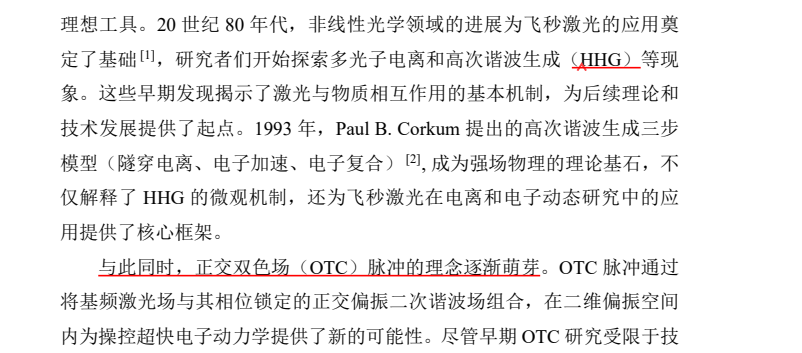
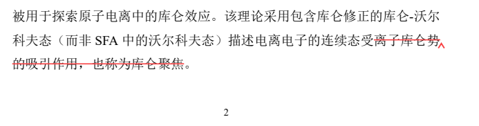
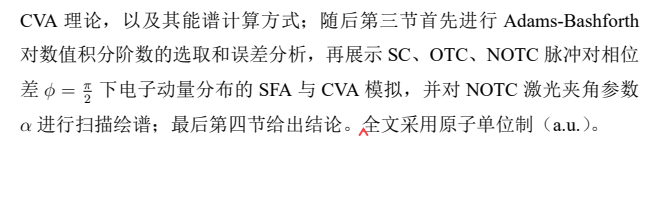

老师我仔细看了您那个鞍点近似的代码，我原来以为只要改改积分函数表达式就可以了，现在发现整套下来找鞍点什么的还是有一点麻烦的，应该要明天或者今天半夜才可以写完，所以我先给您反馈其他的。

**然后您标批注有四个地方我不太明白什么意思或者需要向什么方向修改：**

除此之外补充了图的序号，箭头，刻度调整。提高了图像精度。

引言部分的参考文献当时写的时候是根据写的话找的，基本没怎么看，在开题之前我会一直看的，所以引言会有朝向参考文献具体内容的不断改动。

谢谢老师！