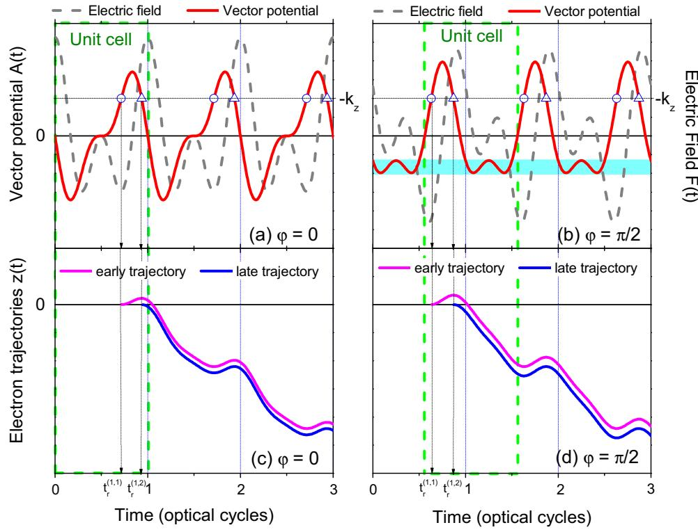
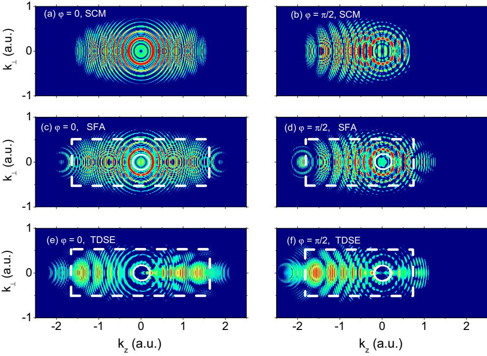
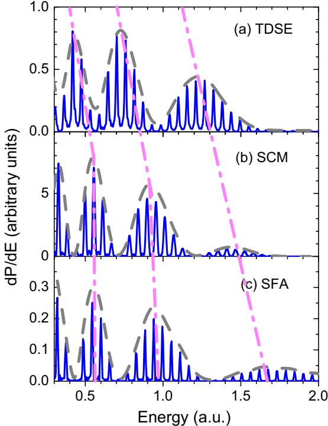
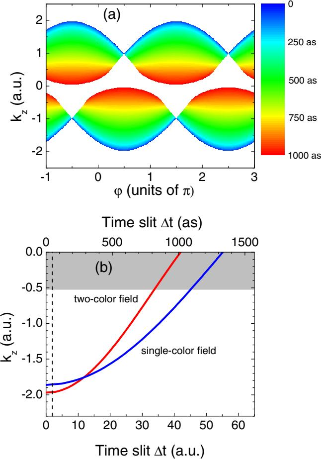
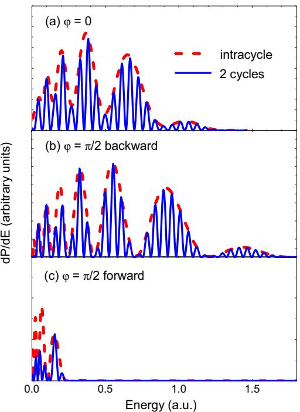
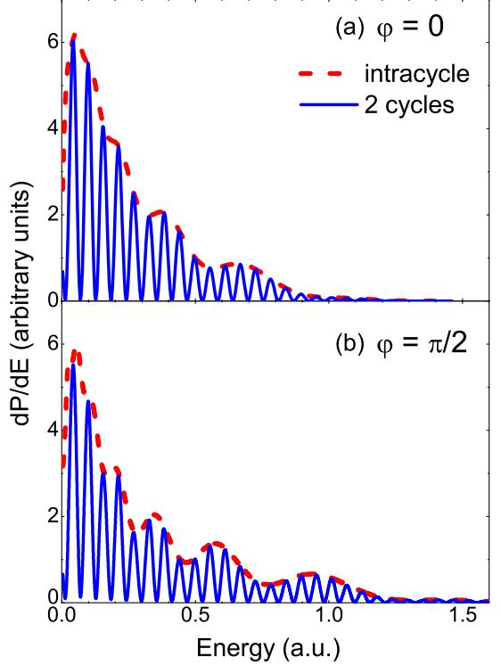
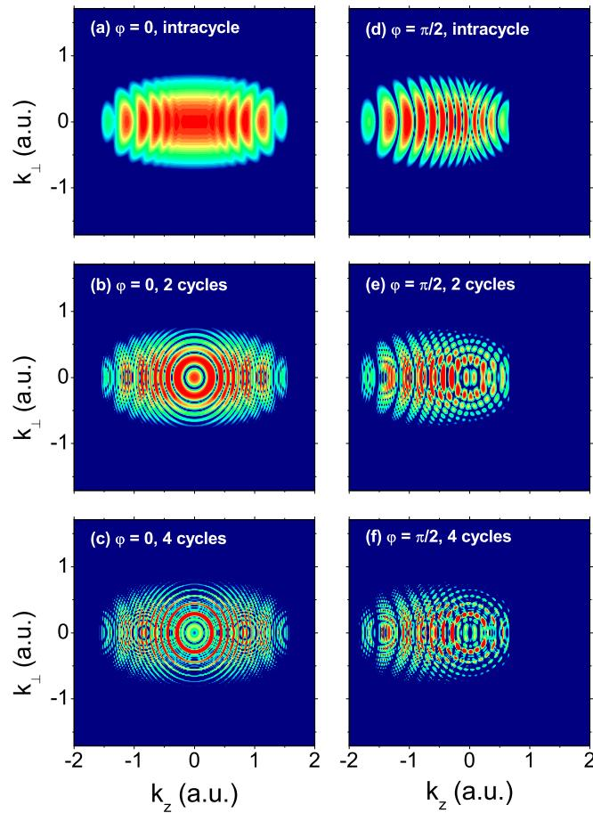
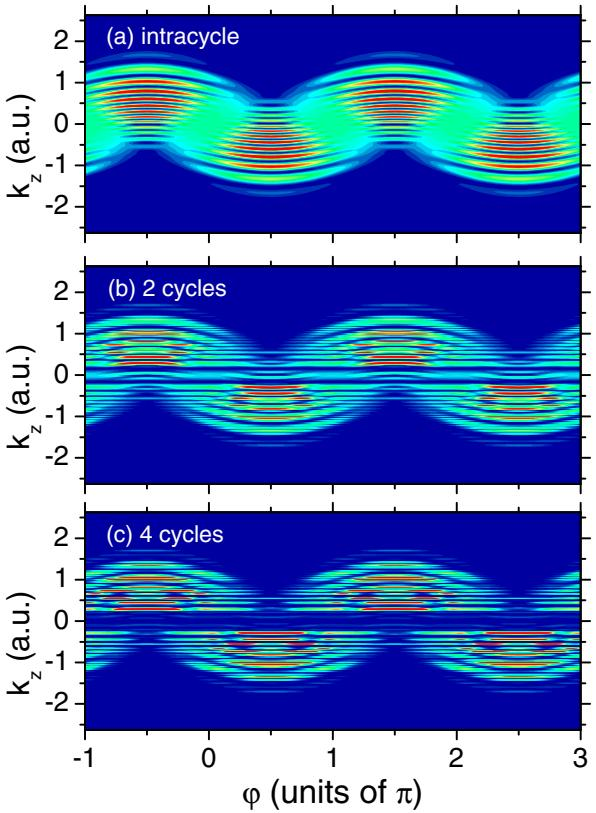

# **Interference of electron wave packets in atomic ionization by subcycle sculpted laser pulses**

Diego G. Arbo, ´ 1,\* Stefan Nagele,2 Xiao-Min Tong,3 Xinhua Xie,4 Markus Kitzler,4 and Joachim Burgdorfer ¨ 2

1*Institute for Astronomy and Space Physics, IAFE (CONICET-UBA), CC 67, Suc. 28 (1428) Buenos Aires, Argentina*

2*Institute for Theoretical Physics, Vienna University of Technology, Wiedner Hauptstrasse 8-10/136, A-1040 Vienna, Austria, EU*

3*Graduate School of Pure and Applied Sciences, and Center for Computational Sciences, University of Tsukuba, Tsukuba 305-8577, Japan*

4*Photonics Institute, Vienna University of Technology, Gusshausstrasse 27/387, A-1040 Vienna, Austria, EU*

(Received 16 January 2014; published 16 April 2014)

We present a theoretical analysis of the atomic photoelectron emission spectra produced by a linearly polarized sculpted laser pulse of two colors with frequencies *ω* and 2*ω*. The spectrum of the "direct" electrons with intermediate energies prominently features both *intracycle* and *intercycle* interferences. We derive a simple analytic expression for this spectral range based on a semiclassical approximation of the time-dependent distorted wave strong-field approximation generalized to strong-field ionization by a two-color pulse. We verify its applicability to approximately represent the intricate interference patterns by comparison with the exact solutions of the time-dependent Schrodinger equation and with the strong-field approximation. We show that the ¨ interference patterns can be tuned and its contrast enhanced by the additional "knob" available, the relative phase between the two frequency components. The present results confirm that two-color ionization allows resolving interference structures originating from trajectories launched within a time interval of less than 100 as [X. Xie *et al.*, [Phys. Rev. Lett.](http://dx.doi.org/10.1103/PhysRevLett.108.193004) **[108](http://dx.doi.org/10.1103/PhysRevLett.108.193004)**, [193004](http://dx.doi.org/10.1103/PhysRevLett.108.193004) [\(2012\)](http://dx.doi.org/10.1103/PhysRevLett.108.193004)].

DOI: [10.1103/PhysRevA.89.043414](http://dx.doi.org/10.1103/PhysRevA.89.043414) PACS number(s): 32*.*80*.*Rm*,* 32*.*80*.*Fb*,* 03*.*65*.*Sq

#### **I. INTRODUCTION**

Above-threshold ionization (ATI) and high-order-harmonic generation (HHG) are highly nonlinear quantum-mechanical phenomena induced by intense laser pulses. Electrons are emitted by tunneling through the potential barrier formed by the combination of the atomic potential and the external strong field. Tunneling occurs within each optical cycle predominantly around the maxima of the absolute value of the electric field. According to the three-step model, photoelectrons can be classified into *direct* and *rescattered* electrons [\[1\]](#page-8-0). After detachment from the atom, direct electrons can escape without rescattering at the residual core. A small fraction of the released electrons, however, is driven back to the ionic core ("rescattering") and is accelerated to high energies by the combined ionic and laser fields. Classical trajectories play a crucial role in analyzing the formation of interference patterns in photoelectron spectra [\[2,3\]](#page-8-0). A temporal double-slit interference pattern was studied in near-single-cycle pulses both experimentally [\[4,5\]](#page-8-0) and theoretically [\[6\]](#page-8-0), and a time-energy analysis of ATI has been presented recently [\[7\]](#page-8-0). Near-threshold oscillations in angular distributions were explained as interferences of electron trajectories [\[8–](#page-8-0)[10\]](#page-9-0) and recently measured by Marchencko *et al.* [\[11\]](#page-9-0). Diffraction fringes have been experimentally observed in photoionization of He atoms [\[5\]](#page-8-0) and photodetachment of F− ions by femtosecond pulses for fixed frequency [\[12\]](#page-9-0). The latter process has been theoretically analyzed in [\[13\]](#page-9-0). The interference pattern in multicycle photoelectron spectra can be identified as a diffraction pattern for a time grating composed of *intracycle* (or subcycle) and *intercycle* interferences [\[2,](#page-8-0)3,13[,14\]](#page-9-0). While the latter give rise to the well-known ATI peaks, the former lead to a modulation of the ATI spectrum offering information on the subcycle ionization dynamics [\[2,](#page-8-0)3[,14\]](#page-9-0). For single-color laser fields, this analysis was based on the widely used semiclassical approximation [\[15\]](#page-9-0) of the strong-field approximation (SFA) [\[16–23\]](#page-9-0). Similar modulation patterns were found in spectra of laser-assisted Auger decay where the gross structure of sidebands was explained as the interference between electrons emitted within one period [\[24\]](#page-9-0).

Recently, two-color fields with commensurate frequencies, usually consisting of a fundamental component and one of its low harmonics, have been applied to study ATI [\[25–27\]](#page-9-0), control of ionization [\[28\]](#page-9-0), dichroism [\[29,30\]](#page-9-0), and orientation of molecules [\[31\]](#page-9-0), as well as to control interference fringes in electron momentum distribution [\[32\]](#page-9-0). The shape of the pulse is determined by the relative phase *ϕ* between the two frequency components enabling a *coherent phase control* of these atomic processes [\[25\]](#page-9-0). The experimental observation of subcycle ionization dynamics by sculpted laser pulses became accessible for multicycle pulses and in low-resolution spectra [\[32\]](#page-9-0). To the best of our knowledge, a thorough semiclassical analysis of the interference patterns found in atomic ionization by two-color lasers [\[32\]](#page-9-0) has not yet been presented.

In the present paper, we focus on the direct photoelectrons, which dominate the total ionization yield and the differential momentum spectrum at low energies. The contribution of the photoelectrons that are driven back to the ionic core by the near-infrared (NIR) laser field and subsequently rescatter at the remaining ion is comparably small and will be neglected for the analysis of the intra- and intercycle interferences. We extend the previous semiclassical analysis for one-color fields in terms of a time grating [\[2,](#page-8-0)3,13[,14\]](#page-9-0) to the case of a two-color pulse containing the first and second harmonic (*ω*-2*ω*). In the following, we will refer to this description as the semiclassical model (SCM). We gauge the results of the *analytical* SCM by comparison with a (essentially exact) numerically obtained full solution of the time-dependent Schrodinger equation (TDSE) ¨ and with numerical results of the SFA. While the SCM cannot accurately reproduce the TDSE results, it provides detailed

\*diego@iafe.uba.ar

insight into the interference of wave packets released at different emission times that underlie the interference pattern.

We analyze the dependence of intracycle and intercycle interferences on the relative phase *ϕ*. A key finding is that for a particular value of the relative phase, electron emission becomes very asymmetric along the polarization axis extending the distribution to high kinetic energies and thus favoring the measurement of the intracycle interference pattern and maximizing the contrast of intracycle interference fringes. The goal of this paper is to stress the role of interferences stemming from the superposition of wave packets released at different emission times. For our analysis, we will rely mostly on the SCM, which allows for an analytical treatment of the problem and, unlike the direct solution of the TDSE, enables an explicit decomposition of the different contributions to the interference patterns, which greatly facilitates the theoretical understanding of the process.

The paper is organized as follows. In Sec. II, we summarize the methods used to calculate the photoelectron emission from an atom by a two-color multicycle laser pulse: (i) the TDSE, (ii) the time-dependent distorted-wave SFA [\[16–23\]](#page-9-0), and (iii) a semiclassical simplification of the SFA which we call the SCM, often also referred to as the "simple man's model" [\[15\]](#page-9-0). In Sec. [III,](#page-3-0) we compare the TDSE, SFA, and SCM calculations showing that the SCM is capable of qualitatively reproducing the complex interference fringes. In Sec. [IV,](#page-4-0) we employ the SCM to analyze the interplay of intracycle and intercycle interferences, and we show that the relative phase between the harmonics can serve as a knob to tune and enhance the contrast of the interference fringes.

#### **II. THEORETICAL METHODS**

We consider the interaction of a target atom with a twocolor laser pulse with frequencies *ω* and 2*ω*. The pulse is described through a time-dependent electric field *F*-(*t*) along the *z*ˆ direction, which reads

$$\ddot{F}(t) = f(t) \left[ \cos(\omega t) + \cos(2\omega t + \varphi) \right] \hat{z},\tag{1}$$

where *ω* is the fundamental laser frequency, *ϕ* is the relative phase, and *f* (*t*) is the envelope function of the sculpted laser pulse. We assume in Eq. (1) that the amplitudes of the two harmonics are equal, thereby maximizing specific two-color effects, and we consider the relative phase *ϕ* between the two harmonics as a control parameter for the subcycle time structure of the field *F*(*t*) (see Fig. 1).

The Hamiltonian of the system in the length gauge is

$$H = H\_0 + z \, F\left(t\right),\tag{2}$$

where *H*0 is the unperturbed atomic Hamiltonian,

$$H\_0 = \frac{\vec{p}\,^2}{2} + V(r) \,, \tag{3}$$

with the central atomic core potential *V* (*r*) taken to be a Coulomb potential (−1*/r*), the canonical momentum *p* of the electron, and the position of the electron *r*-. The transition of the electron from the initial bound state |*φi*, which fulfills

FIG. 1. (Color online) (a) and (b) Electric field (dashed gray line) and vector potential (thick solid red line) of a sculpted *ω*-2*ω* laser pulse as a function of time for relative two-color phases *ϕ* = 0 (a) and *ϕ* = *π/*2 (b). Each optical cycle can be viewed as a "unit cell" of the time lattice. In (b), the cyan rectangle shows the momentum region with four ionization times per unit cell. (c) and (d) Classical electron trajectories *z*(*t*) released at early ionization times *t*(1*,*1) *r* [circle in (a) and (b)] and late ionization times *t*(1*,*2) *r* [triangle in (a) and (b)] calculated by the SCM.

the time-independent Schrodinger equation ¨

$$H\_0|\phi\_i\rangle = E|\phi\_i\rangle\tag{4}$$

with the energy *E* = −*Ip* (*Ip* is the ionization potential), to the final unperturbed state |*φf* after the pulse, is determined by the solution of TDSE

$$i\frac{\partial}{\partial t}|\psi(t)\rangle = H|\psi(t)\rangle\tag{5}$$

for the Hamiltonian of Eq. [\(2\)](#page-1-0).

The electron is emitted with final momentum *k* and energy *εf* = *k*2*/*2 (*k* = |*k*-|), and electron momentum distributions can be calculated from the transition matrix as

$$\frac{d\,P}{d\vec{k}} = |T\_{if}|^2,\tag{6}$$

where *Tif* is the *T* -matrix element corresponding to the transition |*φi*→|*φf* . The energy spectrum can be written as *dP dE* = 2*π* - 1 −1 *d*(cos *θ*) √2*E* |*Tif* | 2, where *θ* is the angle between *k* and the direction of polarization *z*ˆ. The longitudinal momentum distribution is given by *dP dkz* = 2*π* - ∞ 0 *dkρ kρ*|*Tif* | 2, with *kρ* being the absolute value of the final momentum in the direction perpendicular to the polarization axis. In this work, *Tif* will be computed (i) by solving the TDSE and within the strong-field approximation using both (ii) a time-dependent distorted-wave method and (iii) a semiclassical approximation.

#### **A. Time-dependent Schrodinger equation ¨**

We numerically solve the TDSE [Eq. (5)] in the dipole approximation using the length form of the dipole operator [Eq. [\(2\)](#page-1-0)] as well as using the velocity form by replacing *z*- · *F*-(*t*) with *p*- · *A*-(*t*) [\[33\]](#page-9-0). The wave function is expanded in spherical harmonics (partial wave expansion) where the radial part is represented using a pseudospectral grid. The real space is divided into an inner region, *R<Rc*, and an outer region, *Rc <R<R*max. The time-dependent wave function is propagated using the pseudospectral split-operator approach (as described in [\[34\]](#page-9-0)). In the outer region, the continuum states are expanded into continuum Coulomb wave functions and then further propagated analytically as Volkov momentum states [\[35\]](#page-9-0). We have verified that the results for the electron spectra are gauge-independent.

#### **B. Time-dependent distorted-wave strong-field approximation**

Within the time-dependent distorted wave theory [\[36\]](#page-9-0), the transition amplitude in the *post* form is expressed as

$$T\_{if} = -i \int\_{-\infty}^{+\infty} dt \,\left< \chi\_f^-(t) | z \, F(t) \, | \phi\_i(t) \right> \,,\tag{7}$$

where *χ*− *f* (*t*) is the final distorted-wave function and the time evolution of the initial state |*φi*(*t*) is governed by Eq. (5) with the unperturbed atomic Hamiltonian Eq. [\(3\)](#page-1-0). In the present paper, we choose |*χ*− *f* to be the solutions of the Hamiltonian in the length gauge *Hf* = *p*-2 2 + *z F* (*t*), corresponding to a free electron in the time-dependent electric field (exit-channel distorted Hamiltonian), i.e.,

$$i\frac{\partial}{\partial t}|\chi\_f^-(t)\rangle = H\_f|\chi\_f^-(t)\rangle = \frac{k^2}{2}|\chi\_f^-(t)\rangle. \tag{8}$$

The solutions of Eq. (8) are the Volkov states [\[37\]](#page-9-0)

$$\chi\_{\vec{k}}^{(V)-}(\vec{r},t) = \frac{\exp(i\vec{k}\cdot\vec{r})}{(2\pi)^{3/2}} \ e^{-i\epsilon t} \exp[i\,D^{-}(\vec{k},\vec{r},t)] \qquad (9)$$

with the Volkov phase

$$D^{-}(\vec{k}, \vec{r}, t) = \vec{A}^{-}(t) \cdot \vec{r} - \vec{k} \int\_{+\infty}^{t} dt^{\top} \, \vec{A}^{-}(t^{\top})$$

$$-\frac{1}{2} \int\_{+\infty}^{t} dt^{\top} \, [\vec{A}^{-}(t^{\top})]^{2},\tag{10}$$

where *A*-−(*t*) = − *t* +∞ *dt*- *F*-(*t*- ) is the vector potential of the field multiplied by the speed of light. In this SFA, the influence of the atomic core potential on the continuum state of the receding electron is neglected and, therefore, the momentum is a constant of motion after conclusion of the laser pulse. It is well known that the SFA fails to describe ionization for moderately weak fields as well as for slow electrons [\[38\]](#page-9-0). Agreement with the TDSE solution is therefore expected only for strong fields and intermediate to high electron energies.

# **C. The semiclassical model**

The starting point for the derivation of the SCM [\[15\]](#page-9-0) is the saddle-point approximation of the SFA [\[1,](#page-8-0)21[–23\]](#page-9-0), Eq. (7), which leads to a transition amplitude to the continuum state of the form [\[21\]](#page-9-0)

$$T\_{if}(\vec{k}) = -\sum\_{i=1}^{M} G\left(t\_r^{(i)}, \vec{k}\right) e^{iS\left(t\_r^{(i)}\right)}.\tag{11}$$

Here, *M* is the number of classical trajectories reaching a given final momentum *k*-, and *G*(*t*(*i*) *r ,k*-) is the ionization amplitude

$$G\left(t\_r^{(i)},\vec{k}\right) = \frac{\pi}{2\sqrt{\tilde{I}\_p} \left|F\left(t\_r^{(i)}\right)\right|} \exp\left[-\frac{(2\tilde{I}\_p)^{3/2}}{3\left|F\left(t\_r^{(i)}\right)\right|}\right].\tag{12}$$

where ˜ *Ip* = *Ip* + *k*2 *ρ/*2. A similar expression has been derived from the semiclassical ADK theory [\[39,40\]](#page-9-0), and variations of it have been extensively used in the literature (for example, in [\[22\]](#page-9-0)). Equation (12) is derived in the length gauge. In Eq. (11), *S* is given by the classical action [\[37\]](#page-9-0)

$$S(t) = -\int\_{t}^{\infty} dt' \left[ \frac{[\vec{k} + \vec{A}(t')]^2}{2} + I\_p \right],\tag{13}$$

where *A*-(*t*) = − *t* −∞ *dt F*-(*t* ) coincides with *A*-−(*t*) for a propagating wave which fulfills - ∞ −∞ *F*-(*t*) = 0. From Eq. (13), the semiclassical action along one electron trajectory with release time *t*(*i*) *r* is, up to a constant, given by

$$S(t\_r^{(i)}) = \frac{k^2}{2}t\_r^{(i)} - \vec{k} \cdot \vec{\alpha}(t\_r^{(i)}) - \frac{\beta(t)}{2} + \tilde{I}\_p t\_r^{(i)},\qquad(14)$$

where

$$
\vec{\alpha}(t) = \int\_{-\infty}^{t} dt' \vec{A}(t') \tag{15}
$$

is the quiver amplitude of the classical electron and,

$$\beta(t) = \int\_{-\infty}^{t} dt' A^2(t') \tag{16}$$

is related to the ponderomotive energy of the classical.

The release time *t*(*i*) *r* of trajectory *i* is determined by the saddle-point equation [\[41–43\]](#page-9-0),

$$\left. \frac{\partial S(t')}{\partial t'} \right|\_{t'=t\_r^{(i)}} = \frac{\left[\vec{k} + \vec{A}\left(t\_r^{(i)}\right)\right]^2}{2} + I\_p = 0 \,, \qquad (17)$$

which yields complex release times *t*(*i*) *r* since *Ip >* 0. Within the SCM, we approximate them by real values by setting *Ip* = 0 and *kρ* = 0, arriving at

$$\left(k\_z + A\left(t\_r^{(i)}\right) = 0\right) \tag{18}$$

Classical trajectories originating from different release times *t*(*i*) *r* (*i* = 1*,*2*,...* ) can give rise to semiclassical interferences provided they satisfy the condition [Eq. (18)] for reaching the same final momentum *k*-.

For reasons of simplicity, we consider in the following a flat-top pulse with *f* (*t*) = *F*0 in the central region of the pulse with an adiabatic switch on and off at its beginning and end. In the special case of an infinitely long two-color pulse,

$$\ddot{F}(t) = F\_0 \left[ \cos(\alpha t) + \cos(2\alpha t + \varphi) \right] \hat{z},\tag{19}$$

the vector potential, the quiver amplitude [Eq. [\(15\)](#page-2-0)], and the ponderomotive energy term [Eq. (16)] which enter Eq. [\(14\)](#page-2-0) have analytical forms,

$$\vec{A}(t) = -\frac{F\_0}{\omega} \left[ \sin(\omega t) + \frac{1}{2} \sin(2\omega t + \varphi) \right] \hat{\varepsilon},\tag{20a}$$

$$\vec{\alpha}(t) = \frac{F\_0}{\omega^2} \left[ \cos(\omega t) + \frac{1}{4} \cos(2\omega t + \varphi) \right] \hat{z},\tag{20b}$$

$$\beta(t) = \frac{F\_0^2}{\omega^2} \left[ -\frac{t}{2} - \frac{2\alpha t + \varphi}{16\omega} + \frac{1}{4\omega}\sin(2\omega t) - \frac{1}{2\omega}\sin(\omega t + \varphi) \right]$$

$$+ \frac{1}{32\omega}\sin[2(2\omega t + \varphi)] + \frac{1}{6\omega}\sin(3\omega t + \varphi) \Big]. \text{ (20c)}$$

The kinetic energy at time *t* for electron trajectories released at time *t*(*i*) *r* can be calculated from the velocity,

$$\dot{z}\left(t\_r^{(i)},t\right) = A(t) - A\left(t\_r^{(i)}\right). \tag{21}$$

The cycle-averaged kinetic energy *E*kin = *z*˙(*t*(*i*) *r ,t*) 2*/*2 of the two-color flat-top pulse can be written as

$$E\_{\rm kin} = U\_p + E\_{\rm drift} \tag{22}$$

with the ponderomotive energy given by

$$U\_p = \langle A(t)^2 \rangle / 2 = U\_p(\omega) + U\_p(2\omega) = \mathfrak{F}/4(F\_0/2\omega)^2 \quad (23)$$

and the drift energy

$$\begin{split} E\_{\text{drift}} &= A \left( t\_r^{(i)} \right)^2 / 2 \\ &= \left( F\_0^2 / 2\omega^2 \right) \Big[ \sin \left( \omega t\_r^{(i)} \right) + \frac{1}{2} \sin \left( 2\omega t\_r^{(i)} + \varphi \right) \Big]^2. \end{split} (24)$$

The ponderomotive energy of a two-color pulse is the sum of the ponderomotive energy of each color [Eq. (23)]. For a multicycle pulse that is adiabatically switched off, the ponderomotive contribution vanishes and *E*kin = *E*drift. Unlike *Up*, the two-color drift energy is not additive because of the cross term in Eq. (24). Accordingly, the maximum final kinetic energy depends on the relative phase *ϕ*; the highest values are reached at relative phases equal to *ϕ* = (*j* + 1*/*2)*π,* whereas the lowest are reached at *ϕ* = *jπ* , with *j* an integer number. The maximum drift energy is (9*/*2)(*F*2 0 */*4*ω*2) = (18*/*5)*Up*, thus it considerably exceeds the ponderomotive energy.

Within the SCM, the trajectory of the emitted electron at time *t*(*i*) *r* can be directly derived from Eq. (21),

$$z(t\_r^{(i)}, t) = \alpha(t) - \alpha\left(t\_r^{(i)}\right) - A\left(t\_r^{(i)}\right)\left(t - t\_r^{(i)}\right), \qquad (25)$$

where we have used the initial condition *z*(*t*(*i*) *r ,t*(*i*) *r* ) = 0*,* i.e., the electron is released with zero velocity at the nucleus. Typically, there are two values of *t* within the *j* th optical cycle which fulfill Eq. (18), namely the so-called early release time *t* (*j,*1) *r* and the late release time *t* (*j,*2) *r* [see Figs. [1\(a\)](#page-1-0) and [1\(b\)\]](#page-1-0). The corresponding electron trajectories *z*(*t*(1*,*1) *r ,t*) and *z*(*t*(1*,*2) *r ,t*) are (within the strong-field approximation) parallel to each other [Figs. [1\(c\)](#page-1-0) and [1\(d\)\]](#page-1-0). We note that for the two-color pulse with *ϕ* = *π/*2 there is a range of final momenta [gray shaded area in Fig. [4\(b\)\]](#page-6-0) where the number of release times reaching the same final momenta is larger than 2, i.e., 3 or 4. Their emission probabilities are, however, small since the electric field (and thus the ionization amplitude) is, in general, small compared to the momentum regions where only two solutions contribute. While for a one-color pulse maximum ionization takes place for zero final momentum [\[2,](#page-8-0)3[,14\]](#page-9-0), i.e., near threshold, this is not the case for two-color pulses [Fig. [1\(b\)](#page-1-0) for *ϕ* = *π/*2], where the maxima of the electric field do not coincide with the zeros of the vector potential. This property of nonmonochromatic fields helps to improve the visibility of path interferences.

# **III. PROBING THE SEMICLASSICAL MODEL**

To test and validate the predictions of the SCM, we compare its results with those of the essentially exact numerical TDSE solutions as well as those of the time-dependent distorted wave SFA [Eq. [\(7\)](#page-2-0)], from which the SCM is derived. This allows us to assess the effect of the stationary-phase approximation [Eq. [\(11\)](#page-2-0)] and the neglect of the imaginary component of the emission times [Eq. (18)], the two approximations reducing the SFA to the SCM. Furthermore, the contribution of rescattered electrons and the effects of the Coulomb potential on the dynamics of the ejected electron, both of which are neglected in the SCM, can be scrutinized.

We compare these three different models using a finite pulse with an envelope function that consists of an *N*-cycle flat-top pulse with a smooth sinusoidal *m*-cycle ramp-on and -off,

$$f(t) = F\_0 \begin{cases} \sin^2\left(\frac{\omega}{4m}t\right) & \text{if } \quad 0 \le t < \frac{2m\pi}{\omega},\\ 1 & \text{if } \quad \frac{2m\pi}{\omega} \le t < \pi - \frac{2m\pi}{\omega},\\ \sin^2\left[\frac{\omega}{4m}(\pi - t)\right] & \text{if } \quad \pi - \frac{2m\pi}{\omega} \le t \le \pi, \end{cases} \tag{26}$$

where we have chosen *m* = 2 for our calculations. This particular choice is motivated by the fact that for a total pulse duration equal to a multiple of the laser period and

FIG. 2. (Color online) Doubly differential momentum distributions. (a) and (b) SCM, (c) and (d) SFA, (e) and (f) TDSE. In (a), (c), and (e), the relative phase is *ϕ* = 0, while in (b), (d), and (f), the relative phase is *ϕ* = *π/*2. The laser parameters are *F*0 = 0*.*075 and *ω* = 0*.*057 with a total duration of eight optical cycles consisting of a square-sine two-cycle ramp-on and two-cycle ramp-off, with a four-cycle flat-top region in between. The white-dashed boxes and the white circles at the center delimit the region in the (*kz*,*k*⊥) momentum plane within which the SCM is expected to account for the key features of the photoelectron spectrum.

an integer number of optical cycles involved in the ramp-on and -off, the vector potential in the flat-top region given by Eq. [\(20a\)](#page-3-0) is equivalent to the case of an infinitely long pulse. In this case, the ionization times in the flat-top region of the pulse [calculated from either Eq. [\(18\)](#page-3-0) or Eq. [\(17\)](#page-3-0)] are given by the analytic solution for the SCM. The envelope function introduced in Eq. [\(26\)](#page-3-0) guarantees not only a smooth switch-on and -off, but also the independence of the intracycle interference pattern for multicycle pulses from the pulse duration, since the field periodically repeats itself in the flat-top region and is not modulated by the envelope, which would lead to variations of the ionization amplitude. The doubly differential momentum distributions calculated within SCM, SFA, and the TDSE for the relative phases *ϕ* = 0 and *ϕ* = *π/*2 between the two colors are shown in Fig. 2. The most prominent structural features are reproduced by all three methods: The intercycle interferences (or ATI-like peaks) arise as concentric rings of radii *kn* = 2(*nω* − *Ip* − *Up*)*,* whereas the intracycle interference pattern is observed as an amplitude modulation of the former, in analogy to the one-color case [\[2,](#page-8-0)3[,14\]](#page-9-0). The agreement is particularly good at intermediate energies or momenta (highlighted in Fig. 2). The SCM distributions are restricted to the classically allowed energy region determined by Eq. [\(18\)](#page-3-0), while both the SFA and TDSE distributions go beyond this limit. For example, for *ϕ* = 0*,* the classical limit is *E*cl = 2*.*7*Up* 1*.*46 (*k*cl 1*.*71), whereas for *ϕ* = *π/*2, the maximum classical kinetic energy is *E*cl = 18*/*5*Up* = 1*.*95 (*k*cl = 1*.*97). The longitudinal momentum *kz* in the SCM distributions of Fig. 2 is confined within these limits, whereas the corresponding quantum SFA and TDSE distributions are not. This is a consequence of the neglect of the imaginary part of the saddle-point value for the release time [Eqs. [\(17\)](#page-3-0) and [\(18\)](#page-3-0)], and it leads in turn to an energy (momentum) shift of the intracycle interference pattern.

In detail, in the energy spectrum in the backward direction (corresponding to the negative momenta in Fig. 2 for *ϕ* = *π/*2), the modulations (i.e., envelopes) of the equally spaced intercycle (or multiphoton) interference peaks are shifted relative to each other (see Fig. [3\)](#page-5-0). As compared to the SCM, the SFA leads to a shift of the high-energy envelopes to slightly higher energies [since the approximation Eq. [\(18\)](#page-3-0) is not invoked within SFA], while the TDSE results exhibit a systematic shift toward lower energies due to the Coulomb interaction of the free electron with the core as well as the ac Stark shift of the ground-state energy. Overall and on a qualitative level, the SCM reproduces the structures of the fairly complex interference fringes over a broad range of energies remarkably well.

# **IV. ANALYSIS OF THE SEMICLASSICAL INTERFERENCE PATTERN**

One key advantage of the SCM is that it allows for an analytic treatment of the intra- and intercycle interferences in the electron spectra for a two-color field. We focus in the following on the region where only two interfering trajectories per cycle contribute (see Fig. [1\)](#page-1-0). Here, the total number of interfering trajectories in Eq. [\(11\)](#page-2-0) is *M* = 2*N*, with *N* being the number of cycles involved. The sum over

FIG. 3. (Color online) Photoelectron energy distribution in "the backward direction" (for an opening angle of 10◦) along the polarization axis for *ϕ* = *π/*2. (a) TDSE, (b) SCM, and (c) SFA. Same pulse parameters as in Fig. [2.](#page-4-0) Gray dashed line: envelope of the intracycle interference. The pink dash-dotted lines connecting the panels (a), (b), and (c) visualize the shift of the envelope between the three approaches.

interfering trajectories [Eq. [\(11\)](#page-2-0)] can now be decomposed into those associated with the two release times within the same cycle and those associated with release times in different cycles [\[2\]](#page-8-0),

$$\begin{split} T\_{if}(\vec{k}) &= -\sum\_{i=1}^{2N} G\left(t\_r^{(i)}, \vec{k}\right) e^{iS(t\_r^{(i)})} \\ &= -\sum\_{j=1}^{N} \sum\_{a=1}^{2} G\left(t\_r^{(j,a)}, \vec{k}\right) e^{iS(t\_r^{(j,a)})} \\ &= -\sum\_{j=1}^{N} e^{i\vec{S}\_j} \left[ \left[ G\left(t\_r^{(j,1)}, \vec{k}\right) - G\left(t\_r^{(j,2)}, \vec{k}\right) \right] e^{i\frac{\Delta S\_j}{2}} \right] \\ &\quad + 2G\left(t\_r^{(j,2)}, \vec{k}\right) \cos\left(\frac{\Delta S\_j}{2}\right) \bigg], \end{split} \tag{27}$$

where *S*¯ *j* = [*S*(*t* (*j,*1) *r* ) + *S*(*t* (*j,*2) *r* )]*/*2 is the average action of the two trajectories released in cycle *j,* and *Sj* = *S*(*t* (*j,*1) *r* ) − *S*(*t* (*j,*2) *r* ) is the accumulated action between the two release times *t* (*j,*1) *r* and *t* (*j,*2) *r* within the same *j* th cycle. Neglecting for simplicity the depletion of the initial state, the ionization amplitude *G*(*t* (*j,α*) *r ,k*-) in Eq. (27) is independent of the optical cycle (or temporal unit cell), and we can drop the label *j* in the superindex of *t* (*j,α*) *r* . The average action depends linearly on the cycle number *j* ,

$$
\bar{\mathcal{S}}\_j = \mathcal{S}\_0 + j\tilde{\mathcal{S}},\tag{28}
$$

where *S*0 is a constant that cancels out when the absolute value of Eq. (27) is taken, and *S*˜ = (2*π/ω*)(*E* + *Up* + *Ip*). In turn, the difference of the action *Sj* is a constant independent of the cycle number *j* , *Sj* = *S*.

The transition amplitude Eq. (27) becomes

$$\begin{split} T\_{if}(\vec{k}) &= -2 \left[ \frac{G\left(t\_r^{(1)}, \vec{k}\right) + G\left(t\_r^{(2)}, \vec{k}\right)}{2} \cos\left(\frac{\Delta S}{2}\right) \right. \\ &\left. + i \frac{G\left(t\_r^{(1)}, \vec{k}\right) - G\left(t\_r^{(2)}, \vec{k}\right)}{2} \sin\left(\frac{\Delta S}{2}\right) \right] e^{iS\_0} \sum\_{j=1}^{N} e^{ij\vec{S}} . \end{split} \tag{29}$$

Accordingly, the transition probability Eq. [\(6\)](#page-2-0) from the initial state to a final state with momentum *k*can be written as

$$\begin{split} \frac{d\bar{P}}{d\bar{k}} \\ &= 4\Gamma(\bar{k}) \underbrace{\left| \cos\left(\frac{\Delta S}{2}\right) + i \frac{G\left(t\_r^{(1)}, \bar{k}\right) - G\left(t\_r^{(2)}, \bar{k}\right)}{G\left(t\_r^{(1)}, \bar{k}\right) + G\left(t\_r^{(2)}, \bar{k}\right)} \sin\left(\frac{\Delta S}{2}\right) \right|^2}\_{F(\bar{k})} \\ &\times \underbrace{\left[ \frac{\sin(N\tilde{S}/2)}{\sin(\tilde{S}/2)} \right]^2}\_{B(k)}, \end{split} \tag{30}$$

with (*k*-) = | *G*(*t* (1) *r ,k*-)+*G*(*t* (2) *r ,k*-) 2 | 2. In the limit of an infinite number of cycles (*N* → ∞), the factor *B*(*k*) describing intercycle interferences,

$$B(k) = \left[\frac{\sin(N\tilde{S}/2)}{\sin(\tilde{S}/2)}\right]^2 \to \sum\_n \delta(E - \varepsilon\_n),\qquad(31)$$

with *εn* = *nω* − *Ip* − *Up*, yields the multiphoton spectrum, which is broadened with width *E* = *ω/N* for finite pulse lengths. The factor *F*(*k*-) describes the intracycle interferences. Equation (30) is structurally equivalent to the expression for the intensity in crystal diffraction: The factor *F*(*k*) represents the form (or structure) factor accounting for interference modulations due to the internal structure within the unit cell, while the factor *B*(*k*) gives rise to Bragg peaks due to the periodicity of the crystal. Therefore, *B*(*k*) in Eq. (30) may be viewed as the interference of *N* slits in the time domain and *F*(*k*) as the diffraction or form factor for each slit. Now, it is of interest to compare Eq. (30) for the two-color field with the corresponding expression for the single-color pulse. If the relative phase between the two colors equals *ϕ* = *π/*2, then one obtains *G*(*t*(1) *r ,k*-) = *G*(*t*(2) *r ,k*-), and consequently *F*(*k*-) = cos2( *S* 2 ), identical to the intracycle interference (or form) factor for the single-color field [\[2,](#page-8-0)3[,14\]](#page-9-0). However, for any other phase *ϕ* = (*j* + 1*/*2)*π*, *F*(*k*-) has no zeros and yields a different interference pattern, typically with lower contrast. Compared to the single-color case, the relative phase between the two colors now serves as an additional control knob for the time slit in the interference process. An analog expression can be derived employing the velocity gauge. While the prefactors are different and the SCM is not gauge-invariant, the interference pattern remains unchanged due to the structure factors *F*(*k*-) and *B*(*k*). Therefore, the resulting interference fringes are largely gauge-invariant.

The intracycle interference arises from the superposition of pairs of classical trajectories separated by a time slit *t* = *t* (*j,*1) *r* − *t* (*j,*2) *r* of the order of less than half a period of the laser pulse, i.e., *t < π/ω*, facilitating a temporal resolution in the emission of electron wave packets of 1 fs (for NIR pulses). The width of the accessible time slit *t* sensitively depends on the final longitudinal momentum *kz* and the relative phase *ϕ* (Fig. 4). Regions in the longitudinal momentum spectrum where the electric field is small, and where more than two solutions for the release time exist, can be neglected because of the exponential suppression of the ionization probability. Likewise, when one ionization event strongly dominates,

FIG. 4. (Color online) (a) Time slit *t* (difference between the release times of the two interfering electronic trajectories) as a function of the longitudinal momentum *kz* and relative phase *ϕ* of the two-color pulse within the SCM. The white region indicates momenta where no pair of wave packets reaches this momentum. (b) The longitudinal momentum *kz* as a function of the time slit *t* for *ϕ* = *π/*2 for a two-color (red) and a single-color (blue) field within the SCM. The peak field of the single-color pulse was adjusted to *F*0 = 0*.*106 in order to match that of the two-color pulse. The frequency is *ω* = 0*.*057 and the peak electric field of the two-color pulse is *F*0 = 0*.*075. Pairs of trajectories with comparable emission probability, 1*/*2 *<* |*F*(*t*(*j,*1) *r* )*/F*(*t*(*j,*2) *r* )| *<* 2, are included.

interference effects will be negligible. Thus, only in the region where two solutions of Eq. [\(18\)](#page-3-0) with comparable ionization probability exist does the time slit *t* become resolvable [Fig. 4(a)].

The maximum extension to high longitudinal momenta *kz* for *ϕ* = (*j* + 1*/*2)*π* coincides with maximum forward-backward asymmetry, and with the broadest range of the accessible time window from ∼1 fs down to about 50 as. The lower limit is determined by the suppression of ionization at small fields. The upper limit of the time window (1 fs) follows from the requirement that the final momenta should be sufficiently large such that the strong Coulomb distortion near threshold (not considered in the SCM) does not significantly contribute. A cut through the distribution shown in Fig. 4(a) at *ϕ* = *π/*2 displays the dependence of *kz* on *t* [Fig. 4(b)]. For comparison, we also show this relation for the case of a one-color laser field with the same frequency *ω* = 0*.*057 and peak field *F*0 = 0*.*106 in order to match the intensity of the two-color pulse. The gray shaded area indicates momentum regions where the influence of the Coulomb potential becomes significant. Delays smaller than ≈50 as (marked by the dashed line) are effectively inaccessible due to suppression of ionization at small field strengths. The slope of the mapping function *kz*(*t*) is considerably steeper for the two-color pulse than the single-color case, indicating superior temporal resolution achievable with a two-color pulse.

We have calculated the photoelectron spectrum along the polarization axis for the two-color laser pulse of Eq. [\(1\)](#page-1-0) with a flat-top envelope, i.e., *f* (*t*) = *F*0 = 0*.*075, a fundamental

FIG. 5. (Color online) SCM photoelectron spectrum along the polarization axis for a two-cycle (solid line) and a one-cycle pulse (intracycle, dashed line) for the backward-forward symmetric pulse *ϕ* = 0 (a), and the asymmetric *ϕ* = *π/*2 in the forward (b) and backward direction (c). The contrast of intracycle interference fringes for *ϕ* = *π/*2 in (b) is sharper than for *ϕ* = 0 in (a). The laser parameters are *F*0 = 0*.*075 and *ω* = 0*.*057.

frequency *ω* = 0*.*057*,* and a duration of two optical cycles, within the SCM making use of Eq. [\(6\)](#page-2-0) together with Eq. [\(11\)](#page-2-0). The photoelectron spectrum along the polarization axis for *ϕ* = 0 [Fig. [5\(a\)\]](#page-6-0) is forward-backward symmetric [\[38\]](#page-9-0).

The maximum forward-backward asymmetry in the energy spectrum appears for relative phases that are multiples of semiinteger values of *π,* i.e., *ϕ* = (*j* + 1*/*2)*π* [Figs. [5\(b\)](#page-6-0) and [5\(c\)\]](#page-6-0), where electrons are mostly emitted backward. All energy spectra clearly exhibit the multiphoton peaks stemming from the intercycle factor *B*(*k*) in Eq. [\(30\)](#page-5-0), which in the present case reduces to the two-slit Young interference expression *B*(*k*) = 4 cos2[*π/ω*(*E* + *Up* + *Ip*)] due to the coherent superposition of just two optical cycles. This peak structure is modulated by the intracycle factor *F*(*k*-) in Eq. [\(30\)](#page-5-0), corresponding to the contribution of only one cycle.

Whereas for a relative phase of *ϕ* = *π/*2 the local minima of the intracycle pattern are zero, since *F*(*k*-) = cos2( *S* 2 )*,* for *ϕ* = 0 the local minima of the intracycle pattern remain at finite values [Eq. [\(30\)](#page-5-0)]. This reduced contrast explains the reduced visibility of intracycle interferences in two-color experiments for *ϕ* = 0 [\[32,44\]](#page-9-0). The variation of the contrast with *ϕ* is also observable for the angle-integrated photoelectron spectrum (Fig. 6). However, the difference between *ϕ* = 0 and *ϕ* = *π/*2 is reduced when distributions from the forward and backward hemisphere are added up.

The buildup of the interference fringes in the doubly differential momentum distributions as a function of the longitudinal

FIG. 6. (Color online) Angle-integrated SCM photoelectron distribution for a two-cycle (solid line) and a one-cycle pulse (intracycle, dashed line) with *ϕ* = 0 (a) and *ϕ* = *π/*2 (b). The contrast of the intracycle interference fringes is reduced compared to the angularresolved spectrum (see Fig. [5\)](#page-6-0). The laser parameters are *F*0 = 0*.*075 and *ω* = 0*.*057*.*

FIG. 7. (Color online) Variation of the SCM doubly differential momentum distribution with the length of the pulse (number *N* of cycles). The left column [(a), (b), and (c)] corresponds to *ϕ* = 0, and the right column [(d), (e), and (f)] to *ϕ* = *π/*2. The first row [(a) and (d)] shows the intracycle pattern only, the second row is calculated for two-cycle laser pulses [(b) and (e)], and the third row [(c) and (f)] for four-cycle laser pulses. Intracycle interference fringes exhibit a clearer contrast for *ϕ* = *π/*2 than for *ϕ* = 0. The laser parameters are *F*0 = 0*.*075 and *ω* = 0*.*057*.*

momentum *kz* and the transverse momentum *k*⊥ with increasing number of cycles in the flat-top part of the pulse is shown in Fig. 7. While for *N* = 1 only the intracycle pattern given by *F*(*k*) appears, with *N* = 2*,*4 increasingly sharp fine-scale patterns due to the Bragg factor *B*(*k*) that describes intercycle interferences appear. For all pulse lengths, the *ϕ* = 0 pattern is forward-backward symmetric, while for *ϕ* = *π/*2 the "center of mass" of the distribution is shifted to the left. The same behavior can also be observed, albeit less clearly, in the TDSE spectra [Figs. [2\(e\)](#page-4-0) and [2\(f\)\]](#page-4-0). Experimentally, often only the longitudinal momentum distribution *P*(*kz*) is recorded [\[44\]](#page-9-0). The SCM predictions for the variation of *P*(*kz*) with *ϕ* (Fig. [8\)](#page-8-0) display the characteristic difference between intercycle and intracycle interference fringes. Intercycle interferences give rise to *ϕ*-independent fringes, while intracycle fringes display a pronounced sinusoidal variation with *ϕ* [Fig. [8\(a\)\]](#page-8-0). One key observation is that the modulation of the intracycle pattern is readily visible when a lack of energy resolution does not permit the multiphoton fringes to be resolved. This is beneficial

FIG. 8. (Color online) SCM longitudinal momentum distribution *P*(*kz*) along the polarization axis as a function of the relative phase *ϕ.* (a) Pure intracycle pattern (for a one-cycle pulse), (b) two-cycle pulse, and (c) four-cycle pulse. The laser parameters are *F*0 = 0*.*075 and *ω* = 0*.*057*.*

for experiments with a low-resolution that do not allow the multiphoton feature of the ionization process to be resolved, as an attosecond time resolution associated with the release time intervals between subcycle photoemission events can still be obtained from the wider intracycle interference pattern.

In the velocity gauge, the ionization amplitude *G*(*t*(*i*) *r ,k*-) has the same exponential factor as in the length gauge [see Eq. [\(12\)](#page-2-0)], but the prefactors are different. As expected, the SCM is not gauge-invariant as is any strong-field approximation. For example, Bauer *et al.* show that for ionization of negative ions with a ground state of odd parity, the predictions of the two gauges differ qualitatively [\[45\]](#page-9-0). In the envelope of the angular-resolved energy spectrum, dips in one gauge correspond to humps in the other. This is not so in our case, where the ground state of the hydrogen atom is

- [1] P. B. Corkum, N. H. Burnett, and M. Y. Ivanov, [Opt. Lett.](http://dx.doi.org/10.1364/OL.19.001870) **[19](http://dx.doi.org/10.1364/OL.19.001870)**, [1870](http://dx.doi.org/10.1364/OL.19.001870) [\(1994\)](http://dx.doi.org/10.1364/OL.19.001870).
- [2] D. G. Arbo, K. L. Ishikawa, K. Schiessl, E. Persson, and ´ J. Burgdorfer, ¨ [Phys. Rev. A](http://dx.doi.org/10.1103/PhysRevA.81.021403) **[81](http://dx.doi.org/10.1103/PhysRevA.81.021403)**, [021403](http://dx.doi.org/10.1103/PhysRevA.81.021403) [\(2010\)](http://dx.doi.org/10.1103/PhysRevA.81.021403).
- [3] D. G. Arbo, K. L. Ishikawa, K. Schiessl, E. Persson, and ´ J. Burgdorfer, ¨ [Phys. Rev. A](http://dx.doi.org/10.1103/PhysRevA.82.043426) **[82](http://dx.doi.org/10.1103/PhysRevA.82.043426)**, [043426](http://dx.doi.org/10.1103/PhysRevA.82.043426) [\(2010\)](http://dx.doi.org/10.1103/PhysRevA.82.043426).
- [4] F. Lindner, M. G. Schatzel, H. Walther, A. Baltu ¨ ska, ˇ E. Goulielmakis, F. Krausz, D. B. Milosevi ˇ c, D. Bauer, ´ W. Becker, and G. G. Paulus, [Phys. Rev. Lett.](http://dx.doi.org/10.1103/PhysRevLett.95.040401) **[95](http://dx.doi.org/10.1103/PhysRevLett.95.040401)**, [040401](http://dx.doi.org/10.1103/PhysRevLett.95.040401) [\(2005\)](http://dx.doi.org/10.1103/PhysRevLett.95.040401).

of even parity, and ATI peaks coincide in both gauges. In the present case, the factorization of the momentum distribution in the intracycle and intercycle factors remains valid in the velocity gauge since the transition amplitude possesses the form of Eq. [\(11\)](#page-2-0) in both length and velocity gauges. We have performed numerical calculations within the SCM in the velocity gauge (not shown) corroborating this conclusion.

# **V. CONCLUSIONS**

We have presented a semiclassical analysis of interference effects observed in the direct atomic ionization spectrum resulting from the interaction with high-intensity *ω*-2*ω* twocolor laser pulses. The SCM allows for an analytical treatment and successfully explains the complex diffraction patterns observed in the exact solution of the TDSE in the SFA, and in the experiment [\[32\]](#page-9-0). The observed interference fringes result from the superposition of intracycle and intercycle path interferences.

Intracycle interferences result from the coherent superposition of electron wave packets released within the same optical cycle, whereas intercycle interferences correspond to the well-known multiphoton peaks of the photoelectron spectrum arising from the superposition of wave packets periodically released during different optical cycles. The intracycle interference modulation is most pronounced when the relative phase between the two colors is *ϕ* = *π/*2*,* with a perfect contrast of the intracycle interference pattern in the SCM and SFA, and with good, though not perfect, contrast in the TDSE results. We have shown that the intracycle modulation is independent of the total number of optical cycles involved in the laser field for a flat-top pulse. This implies that the observation of subcycle interferences of wave packets released within time intervals of *t* ≈ 100 as is easily possible for long two-color pulses subtending many optical cycles. Moreover, these intracycle interference patterns are fairly robust and should also be visible in low-resolution photoelectron spectra.

### **ACKNOWLEDGMENTS**

This work was supported by CONICET PIP11220090100552 Austrian-Argentina collaboration AU/12/02 and PICT2010-1084 of ANPCyT (Argentina), University of Buenos Aires UBACyT691, and also partly financed by the Austrian Science Fund (FWF) P23359-N16, P25615-N27, P21463-N22, and SFB-049 NEXTLITE. The computational results presented have been achieved in part using the Vienna Scientific Cluster (VSC).

- [5] R. Gopal *et al.*, [Phys. Rev. Lett.](http://dx.doi.org/10.1103/PhysRevLett.103.053001) **[103](http://dx.doi.org/10.1103/PhysRevLett.103.053001)**, [053001](http://dx.doi.org/10.1103/PhysRevLett.103.053001) [\(2009\)](http://dx.doi.org/10.1103/PhysRevLett.103.053001).
- [6] D. G. Arbo, E. Persson, and J. Burgd ´ orfer, ¨ [Phys. Rev. A](http://dx.doi.org/10.1103/PhysRevA.74.063407) **[74](http://dx.doi.org/10.1103/PhysRevA.74.063407)**, [063407](http://dx.doi.org/10.1103/PhysRevA.74.063407) [\(2006\)](http://dx.doi.org/10.1103/PhysRevA.74.063407); D. G. Arbo, S. Yoshida, E. Persson, K. I. ´ Dimitriou, and J. Burgdorfer, ¨ [J. Phys.: Conf. Ser.](http://dx.doi.org/10.1088/1742-6596/88/1/012054) **[88](http://dx.doi.org/10.1088/1742-6596/88/1/012054)**, [012054](http://dx.doi.org/10.1088/1742-6596/88/1/012054) [\(2007\)](http://dx.doi.org/10.1088/1742-6596/88/1/012054).
- [7] L. Guo, S. S. Han, and J. Chen, [Opt. Express](http://dx.doi.org/10.1364/OE.18.001240) **[18](http://dx.doi.org/10.1364/OE.18.001240)**, [1240](http://dx.doi.org/10.1364/OE.18.001240) [\(2010\)](http://dx.doi.org/10.1364/OE.18.001240).
- [8] D. G. Arbo, S. Yoshida, E. Persson, K. I. Dimitriou, and ´ J. Burgdorfer, ¨ [Phys. Rev. Lett.](http://dx.doi.org/10.1103/PhysRevLett.96.143003) **[96](http://dx.doi.org/10.1103/PhysRevLett.96.143003)**, [143003](http://dx.doi.org/10.1103/PhysRevLett.96.143003) [\(2006\)](http://dx.doi.org/10.1103/PhysRevLett.96.143003); D. G. Arbo, ´

K. I. Dimitriou, E. Persson, and J. Burgdorfer, ¨ [Phys. Rev. A](http://dx.doi.org/10.1103/PhysRevA.78.013406) **[78](http://dx.doi.org/10.1103/PhysRevA.78.013406)**, [013406](http://dx.doi.org/10.1103/PhysRevA.78.013406) [\(2008\)](http://dx.doi.org/10.1103/PhysRevA.78.013406).

- [9] A. Rudenko, K. Zrost, C. D. Schroter, V. L. B. de Jesus, ¨ B. Feuerstein, R. Moshammer, and J. Ullrich, [J. Phys. B](http://dx.doi.org/10.1088/0953-4075/37/24/L03) **[37](http://dx.doi.org/10.1088/0953-4075/37/24/L03)**, [L407](http://dx.doi.org/10.1088/0953-4075/37/24/L03) [\(2004\)](http://dx.doi.org/10.1088/0953-4075/37/24/L03).
- [10] C. M. Maharjan, A. S. Alnaser, I. Litvinyuk, P. Ranitovic, and C. L. Cocke, [J. Phys. B](http://dx.doi.org/10.1088/0953-4075/39/8/013) **[39](http://dx.doi.org/10.1088/0953-4075/39/8/013)**, [1955](http://dx.doi.org/10.1088/0953-4075/39/8/013) [\(2006\)](http://dx.doi.org/10.1088/0953-4075/39/8/013).
- [11] T. Marchenko, H. G. Muller, K. J. Schafer, and M. J. J. Vrakking, [J. Phys. B](http://dx.doi.org/10.1088/0953-4075/43/9/095601) **[43](http://dx.doi.org/10.1088/0953-4075/43/9/095601)**, [095601](http://dx.doi.org/10.1088/0953-4075/43/9/095601) [\(2010\)](http://dx.doi.org/10.1088/0953-4075/43/9/095601).
- [12] [B. Bergues, Z. Ansari, D. Hanstorp, and I. Y. Kiyan,](http://dx.doi.org/10.1103/PhysRevA.75.063415) Phys. Rev. A **[75](http://dx.doi.org/10.1103/PhysRevA.75.063415)**, [063415](http://dx.doi.org/10.1103/PhysRevA.75.063415) [\(2007\)](http://dx.doi.org/10.1103/PhysRevA.75.063415).
- [13] S. Bivona, G. Bonanno, R. Burlon, D. Gurrera, and C. Leone, [Phys. Rev. A](http://dx.doi.org/10.1103/PhysRevA.77.051404) **[77](http://dx.doi.org/10.1103/PhysRevA.77.051404)**, [051404](http://dx.doi.org/10.1103/PhysRevA.77.051404) [\(2008\)](http://dx.doi.org/10.1103/PhysRevA.77.051404); S. Bivona, G. Bonanno, R. Burlon, and C. Leone, *[ibid.](http://dx.doi.org/10.1103/PhysRevA.79.035403)* **[79](http://dx.doi.org/10.1103/PhysRevA.79.035403)**, [035403](http://dx.doi.org/10.1103/PhysRevA.79.035403) [\(2009\)](http://dx.doi.org/10.1103/PhysRevA.79.035403).
- [14] [D. G. Arbo, K. L. Ishikawa, E. Persson, and J. Burgd](http://dx.doi.org/10.1016/j.nimb.2011.10.030) ´ orfer, ¨ Nucl. Instrum. Methods B **[279](http://dx.doi.org/10.1016/j.nimb.2011.10.030)**, [24](http://dx.doi.org/10.1016/j.nimb.2011.10.030) [\(2012\)](http://dx.doi.org/10.1016/j.nimb.2011.10.030).
- [15] See H. B. van Linden van den Heuvell and H. G. Muller, in *Multiphoton Processes*, edited by S. J. Smith and P. L. Knight (Cambridge University Press, Cambridge, 1988), pp. 25-34, where they give the name "Simpleman theory" to this classical description.
- [16] V. Keldysh, Zh. Eksp. Teor. Fiz. **47**, 1945 (1964) ,[Sov. Phys. JETP **20**, 1307 (1965)].
- [17] F. H. M. Faisal, [J. Phys. B](http://dx.doi.org/10.1088/0022-3700/6/4/011) **[6](http://dx.doi.org/10.1088/0022-3700/6/4/011)**, [L89](http://dx.doi.org/10.1088/0022-3700/6/4/011) [\(1973\)](http://dx.doi.org/10.1088/0022-3700/6/4/011).
- [18] H. R. Reiss, [Phys. Rev. A](http://dx.doi.org/10.1103/PhysRevA.22.1786) **[22](http://dx.doi.org/10.1103/PhysRevA.22.1786)**, [1786](http://dx.doi.org/10.1103/PhysRevA.22.1786) [\(1980\)](http://dx.doi.org/10.1103/PhysRevA.22.1786).
- [19] [P. A. Macri, J. E. Miraglia, and M. S. Gravielle,](http://dx.doi.org/10.1364/JOSAB.20.001801) J. Opt. Soc. Am. B **[20](http://dx.doi.org/10.1364/JOSAB.20.001801)**, [1801](http://dx.doi.org/10.1364/JOSAB.20.001801) [\(2003\)](http://dx.doi.org/10.1364/JOSAB.20.001801).
- [20] V. D. Rodriguez, E. Cormier, and R. Gayet, [Phys. Rev. A](http://dx.doi.org/10.1103/PhysRevA.69.053402) **[69](http://dx.doi.org/10.1103/PhysRevA.69.053402)**, [053402](http://dx.doi.org/10.1103/PhysRevA.69.053402) [\(2004\)](http://dx.doi.org/10.1103/PhysRevA.69.053402); V. D. Rodriguez, P. A. Macri, and D. G. Arbo, ´ [Nucl. Instrum. Methods B](http://dx.doi.org/10.1016/j.nimb.2008.10.066) **[267](http://dx.doi.org/10.1016/j.nimb.2008.10.066)**, [334](http://dx.doi.org/10.1016/j.nimb.2008.10.066) [\(2009\)](http://dx.doi.org/10.1016/j.nimb.2008.10.066).
- [21] M. Lewenstein, K. C. Kulander, K. J. Schafer, and P. H. Bucksbaum, [Phys. Rev. A](http://dx.doi.org/10.1103/PhysRevA.51.1495) **[51](http://dx.doi.org/10.1103/PhysRevA.51.1495)**, [1495](http://dx.doi.org/10.1103/PhysRevA.51.1495) [\(1995\)](http://dx.doi.org/10.1103/PhysRevA.51.1495); M. Lewenstein, Ph. Balcou, M. Yu. Ivanov, A. L'Huillier, and P. B. Corkum, *[ibid.](http://dx.doi.org/10.1103/PhysRevA.49.2117)* **[49](http://dx.doi.org/10.1103/PhysRevA.49.2117)**, [2117](http://dx.doi.org/10.1103/PhysRevA.49.2117) [\(1994\)](http://dx.doi.org/10.1103/PhysRevA.49.2117).
- [22] C. C. Chirila and R. M. Potvliege, [Phys. Rev. A](http://dx.doi.org/10.1103/PhysRevA.71.021402) **[71](http://dx.doi.org/10.1103/PhysRevA.71.021402)**, [021402\(](http://dx.doi.org/10.1103/PhysRevA.71.021402)R) [\(2005\)](http://dx.doi.org/10.1103/PhysRevA.71.021402).
- [23] [M. Ivanov, P. B. Corkum, T. Zuo, and A. Bandrauk,](http://dx.doi.org/10.1103/PhysRevLett.74.2933) Phys. Rev. Lett. **[74](http://dx.doi.org/10.1103/PhysRevLett.74.2933)**, [2933](http://dx.doi.org/10.1103/PhysRevLett.74.2933) [\(1995\)](http://dx.doi.org/10.1103/PhysRevLett.74.2933).
- [24] A. K. Kazansky and N. M. Kabachnik, [J. Phys. B](http://dx.doi.org/10.1088/0953-4075/43/3/035601) **[43](http://dx.doi.org/10.1088/0953-4075/43/3/035601)**, [035601](http://dx.doi.org/10.1088/0953-4075/43/3/035601) [\(2010\)](http://dx.doi.org/10.1088/0953-4075/43/3/035601).
- [25] F. Ehlotzky, [Phys. Rep.](http://dx.doi.org/10.1016/S0370-1573(00)00100-9) **[345](http://dx.doi.org/10.1016/S0370-1573(00)00100-9)**, [175](http://dx.doi.org/10.1016/S0370-1573(00)00100-9) [\(2001\)](http://dx.doi.org/10.1016/S0370-1573(00)00100-9).
- [26] D. W. Schumacher, F. Weihe, H. G. Muller, and P. H. Bucksbaum, [Phys. Rev. Lett.](http://dx.doi.org/10.1103/PhysRevLett.73.1344) **[73](http://dx.doi.org/10.1103/PhysRevLett.73.1344)**, [1344](http://dx.doi.org/10.1103/PhysRevLett.73.1344) [\(1994\)](http://dx.doi.org/10.1103/PhysRevLett.73.1344).
- [27] H. G. Muller, P. H. Bucksbaum, D. W. Schumacher, and A. Zavriyev, [J. Phys. B](http://dx.doi.org/10.1088/0953-4075/23/16/018) **[23](http://dx.doi.org/10.1088/0953-4075/23/16/018)**, [2761](http://dx.doi.org/10.1088/0953-4075/23/16/018) [\(1990\)](http://dx.doi.org/10.1088/0953-4075/23/16/018).
- [28] H. Ohmura, T. Nakanaga, and M. Tachiya, [Phys. Rev. Lett.](http://dx.doi.org/10.1103/PhysRevLett.92.113002) **[92](http://dx.doi.org/10.1103/PhysRevLett.92.113002)**, [113002](http://dx.doi.org/10.1103/PhysRevLett.92.113002) [\(2004\)](http://dx.doi.org/10.1103/PhysRevLett.92.113002).
- [29] M. Fifrig, A. Cionga, and F. Ehlotzky, [Eur. Phys. J. D](http://dx.doi.org/10.1140/epjd/e2003-00097-5) **[23](http://dx.doi.org/10.1140/epjd/e2003-00097-5)**, [333](http://dx.doi.org/10.1140/epjd/e2003-00097-5) [\(2003\)](http://dx.doi.org/10.1140/epjd/e2003-00097-5).
- [30] A. Cionga, M. Fifrig, and F. Ehlotzky, [J. Mod. Opt.](http://dx.doi.org/10.1080/09500340308233554) **[50](http://dx.doi.org/10.1080/09500340308233554)**, [615](http://dx.doi.org/10.1080/09500340308233554) [\(2003\)](http://dx.doi.org/10.1080/09500340308233554).
- [31] S. De, I. Znakovskaya, D. Ray, F. Anis, N. G. Johnson, I. A. Bocharova, M. Magrakvelidze, B. D. Esry, C. L. Cocke, I. V. Litvinyuk, and M. F. Kling, [Phys. Rev. Lett.](http://dx.doi.org/10.1103/PhysRevLett.103.153002) **[103](http://dx.doi.org/10.1103/PhysRevLett.103.153002)**, [153002](http://dx.doi.org/10.1103/PhysRevLett.103.153002) [\(2009\)](http://dx.doi.org/10.1103/PhysRevLett.103.153002).
- [32] X. Xie, S. Roither, D. Kartashov, E. Persson, D. G. Arbo, ´ L. Zhang, S. Grafe, M. S. Sch ¨ offler, J. Burgd ¨ orfer, A. Baltu ¨ ska, ˇ and M. Kitzler, [Phys. Rev. Lett.](http://dx.doi.org/10.1103/PhysRevLett.108.193004) **[108](http://dx.doi.org/10.1103/PhysRevLett.108.193004)**, [193004](http://dx.doi.org/10.1103/PhysRevLett.108.193004) [\(2012\)](http://dx.doi.org/10.1103/PhysRevLett.108.193004).
- [33] X. M. Tong, P. Ranitovic, D. D. Hickstein, M. Murnane, H. Kateyn, and J. Toshima, [Phys. Rev. A](http://dx.doi.org/10.1103/PhysRevA.88.013410) **[88](http://dx.doi.org/10.1103/PhysRevA.88.013410)**, [013410](http://dx.doi.org/10.1103/PhysRevA.88.013410) [\(2013\)](http://dx.doi.org/10.1103/PhysRevA.88.013410).
- [34] X. M. Tong and S. I. Chu, [Chem. Phys.](http://dx.doi.org/10.1016/S0301-0104(97)00063-3) **[217](http://dx.doi.org/10.1016/S0301-0104(97)00063-3)**, [119](http://dx.doi.org/10.1016/S0301-0104(97)00063-3) [\(1997\)](http://dx.doi.org/10.1016/S0301-0104(97)00063-3).
- [35] X. M. Tong, K. Hino, and N. Toshima, [Phys. Rev. A](http://dx.doi.org/10.1103/PhysRevA.74.031405) **[74](http://dx.doi.org/10.1103/PhysRevA.74.031405)**, [031405\(](http://dx.doi.org/10.1103/PhysRevA.74.031405)R) [\(2006\)](http://dx.doi.org/10.1103/PhysRevA.74.031405).
- [36] D. P. Dewangan and J. Eichler, [Phys. Rep.](http://dx.doi.org/10.1016/0370-1573(94)90012-4) **[247](http://dx.doi.org/10.1016/0370-1573(94)90012-4)**, [59](http://dx.doi.org/10.1016/0370-1573(94)90012-4) [\(1997\)](http://dx.doi.org/10.1016/0370-1573(94)90012-4).
- [37] D. M. Volkov, [Z. Phys.](http://dx.doi.org/10.1007/BF01331022) **[94](http://dx.doi.org/10.1007/BF01331022)**, [250](http://dx.doi.org/10.1007/BF01331022) [\(1935\)](http://dx.doi.org/10.1007/BF01331022).
- [38] D. G. Arbo, J. E. Miraglia, M. S. Gravielle, K. Schiessl, ´ E. Persson, and J. Burgdorfer, ¨ [Phys. Rev. A](http://dx.doi.org/10.1103/PhysRevA.77.013401) **[77](http://dx.doi.org/10.1103/PhysRevA.77.013401)**, [013401](http://dx.doi.org/10.1103/PhysRevA.77.013401) [\(2008\)](http://dx.doi.org/10.1103/PhysRevA.77.013401).
- [39] M. V. Ammosov, N. B. Delone, and V. P. Krainov, Zh. Eksp. Teor. Fiz. **91**, 2008 (1986) [Sov. Phys. JETP **64**, 1191 (1986)].
- [40] N. B. Delone and V. P. Krainov, [J. Opt. Soc. Am. B](http://dx.doi.org/10.1364/JOSAB.8.001207) **[8](http://dx.doi.org/10.1364/JOSAB.8.001207)**, [1207](http://dx.doi.org/10.1364/JOSAB.8.001207) [\(1991\)](http://dx.doi.org/10.1364/JOSAB.8.001207).
- [41] D. B. Milosevi ˇ c, E. Hasovi ´ c, S. Od ´ zak, M. Busulad ˇ ziˇ c,´ A. Gazibegovic-Busulad ´ ziˇ c, and W. Becker, ´ [J. Mod. Opt.](http://dx.doi.org/10.1080/09500340802192464) **[55](http://dx.doi.org/10.1080/09500340802192464)**, [2653](http://dx.doi.org/10.1080/09500340802192464) [\(2008\)](http://dx.doi.org/10.1080/09500340802192464).
- [42] D. B. Milosevi ˇ c and W. Becker, ´ [Phys. Rev. A](http://dx.doi.org/10.1103/PhysRevA.66.063417) **[66](http://dx.doi.org/10.1103/PhysRevA.66.063417)**, [063417](http://dx.doi.org/10.1103/PhysRevA.66.063417) [\(2002\)](http://dx.doi.org/10.1103/PhysRevA.66.063417).
- [43] D. B. Milosevi ˇ c, E. Hasovic, M. Busuladzic, A. Gazibegovic- ´ Busuladzic, and W. Becker, [Phys. Rev. A](http://dx.doi.org/10.1103/PhysRevA.76.053410) **[76](http://dx.doi.org/10.1103/PhysRevA.76.053410)**, [053410](http://dx.doi.org/10.1103/PhysRevA.76.053410) [\(2007\)](http://dx.doi.org/10.1103/PhysRevA.76.053410).
- [44] X. Xie, S. Roither, S. Grafe, D. Kartashov, E. Persson, ¨ C. Lemell, L. Zhang, M. S. Schoffler, A. Baltuska, J. Burgd ¨ orfer, ¨ and M. Kitzler, [New J. Phys.](http://dx.doi.org/10.1088/1367-2630/15/4/043050) **[15](http://dx.doi.org/10.1088/1367-2630/15/4/043050)**, [043050](http://dx.doi.org/10.1088/1367-2630/15/4/043050) [\(2013\)](http://dx.doi.org/10.1088/1367-2630/15/4/043050).
- [45] D. Bauer, D. B. Milosevic, and W. Becker, [Phys. Rev. A](http://dx.doi.org/10.1103/PhysRevA.72.023415) **[72](http://dx.doi.org/10.1103/PhysRevA.72.023415)**, [023415](http://dx.doi.org/10.1103/PhysRevA.72.023415) [\(2005\)](http://dx.doi.org/10.1103/PhysRevA.72.023415).