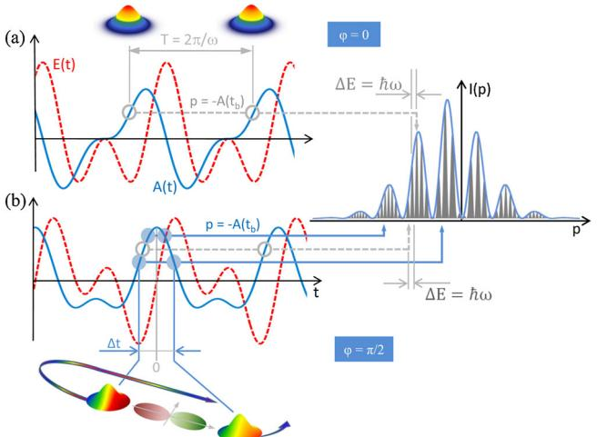
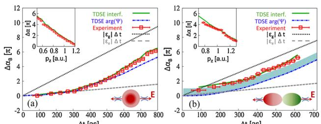

## Attosecond Probe of Valence-Electron Wave Packets by Subcycle Sculpted Laser Fields

Xinhua Xie,1 Stefan Roither,1 Daniil Kartashov,1 Emil Persson,2 Diego G. Arbo´, 2,3 Li Zhang,1 Stefanie Gra¨fe,2

Markus S. Scho¨ffler,1 Joachim Burgdo¨rfer,2 Andrius Baltusˇka,1 and Markus Kitzler1,[\\*](#page-4-0)

1 Photonics Institute, Vienna University of Technology, A-1040 Vienna, Austria, EU 2

Institute for Theoretical Physics, Vienna University of Technology, A-1040 Vienna, Austria, EU 3

Institute for Astronomy and Space Physics - IAFE (FCEN-UBA Conicet), Buenos Aires, Argentina

(Received 29 November 2011; published 9 May 2012)

We experimentally and theoretically demonstrate a self-referenced wave-function retrieval of a valenceelectron wave packet during its creation by strong-field ionization with a sculpted laser field. Key is the control over interferences arising at different time scales. Our work shows that the measurement of subcycle electron wave-packet interference patterns can serve as a tool to retrieve the structure and dynamics of the valence-electron cloud in atoms on a sub-10-as time scale.

DOI: [10.1103/PhysRevLett.108.193004](http://dx.doi.org/10.1103/PhysRevLett.108.193004) PACS numbers: 32.80.Rm, 33.20.Xx, 42.50.Hz

Interferometry is a powerful optical technique providing access to a relative phase of interfering waves which can be extended to coherent matter waves [[1–](#page-4-1)[6](#page-4-2)]. Although interferences of photoelectron wave packets have been recorded [\[4–](#page-4-3)[6](#page-4-2)], interferometric determination of a wave-function phase remains an elusive quest because of the problem in establishing a reference for phase retrieval. Here, we experimentally and theoretically demonstrate a selfreferenced wave-function retrieval of a valence-electron wave packet created by moderately strong-field ionization with a cycle-sculpted two-color laser pulse. Shaping the laser field permits the separation of interferences arising at different time scales. Our work shows that the measurement of subcycle electron wave-packet interference patterns can serve as a tool to extract structure and dynamics of the valence-electron cloud in atoms and molecules on a sub-10-as time scale, providing a complementary approach to higher-order harmonic spectroscopy [[7–](#page-4-4)[9](#page-4-5)] and single attosecond pulse spectroscopy [\[10,](#page-4-6)[11\]](#page-4-7).

Attosecond electronic dynamics in atoms takes place via bound wave packets formed by the coherent superposition of two or more electronic states. A complete characterization of this wave packet necessitates the measurement of the evolution of the relative phases of all states involved. Several methods, e.g., [[8](#page-4-8),[9,](#page-4-5)[12](#page-4-9),[13](#page-4-10)], capable of gaining access to the relative phases have been developed using the soft-x-ray radiation emitted by the process of high-harmonic generation during electron wave-packet recollision [\[14\]](#page-4-11) in strong laser fields. However, since the generated signal consists of the contributions from the two steps of wave-packet creation and recollision they need to be disentangled, e.g., by an independent gauge measurement [[9](#page-4-5)[,15\]](#page-4-12). Here, we develop an alternative approach based on the interference of pairs of electronic wave packets [\[2](#page-4-13),[4](#page-4-3),[5](#page-4-14)].

Two distinct time scales control interferences of wave packets created and driven by a strong laser field (see Fig. [1\)](#page-1-0): (1) the interferences arising within a single period of the optical field [\[16](#page-4-15)[–19\]](#page-4-16) (subcycle or intracycle interferences), and (2) interferences resulting from a repetitive wave-packet release, spaced in time by the fundamental cycle period T giving rise to fringes separated by the photon energy @! ¼ 2@=T. These intercycle interferences are also referred to as above-threshold ionization (ATI) peaks [[20](#page-4-17)]. We refer to this structure in the following as intercycle interferences since ATI is often used synonymously with the entire strong-field photoelectron spectrum. We exploit sculpted laser fields to isolate and control subcycle interferences in threedimensional electron momentum spectra measured for helium and neon. These subcycle interferograms encode the quantum phase difference of pairs of electron wave packets that are timed to each other with attosecond precision. As a result, we are able to extract the subcycle phase evolution of the laser-driven complex bound-state wave function during ionization in moderately strong fields. We find a dramatic deviation from the usually assumed linear rise [[14](#page-4-11)], which we attribute to a minute (< 1%) but significant transient population of excited states. Thus, our experiment characterizes the formation of a bound electronic wave packet as it occurs.

In our experiments we use a two-color laser field, generated by coherently superimposing a linearly polarized 30 fs (FWHM) 790 nm laser pulse from a Ti:sapphire amplifier system with its roughly twice as long second harmonic pulse with an adjustable relative phase ' and parallel polarization directions in a collinear inline geometry. The peak field strength of the two pulses at the focus was adjusted to be equal, yielding laser electric fields Eðt; 'Þ ¼ E^ 1f1ðtÞ cosð!tÞ þ E^ 2f2ðtÞ cosð2!t þ 'Þ, where fiðtÞ and E^ i ði ¼ 1; 2Þ are Gaussian envelopes and peak field strengths, respectively, and ! is the fundamental laser frequency. The peak intensities E^2 i were 1 - 1014 W=cm2 for each color and all measurements. Varying the relative phase ' of the two colors allows us to sculpt the ionizing field (Fig. [1](#page-1-0)) and hence to control the emission times and

FIG. 1 (color online). Intercycle (gray circles and dashed arrows) and subcycle (blue dots and full arrows) interferences of electron wave packets created and driven by sculpted !-2! laser pulses for relative two-color phases ' ¼ 0 (a) and ' ¼ =2 (b).

motion of the interfering wave packets on an attosecond time scale. The two-color pulses, delivered at a repetition rate of 5 kHz and propagating along the y direction, were focused onto a supersonic cold jet ( 170 m in diameter, propagating along the x direction) of helium or neon atoms in an ultrahigh vacuum chamber (1:3 - 1010 mbar) using a spherical Ag mirror with a 60 mm focal length. The three-dimensional momentum vector of electrons and ions created by the field-ionization of a single atom were measured in coincidence by cold target recoil ion momentum spectroscopy [\[21](#page-4-18)] using weak homogenous magnetic (6.4 G) and electric fields (2:5 V=cm) for guiding the charged particles along the spectrometer with its axis parallel to the polarization direction of the laser fields z to two opposing time and position sensitive detectors (see Supplemental Material [[22](#page-4-19)] for details).

The interference patterns extracted from measured electron momentum spectra (Fig. [2\)](#page-1-1) sensitively depend on the relative phase ' between the two colors. The simulated spectra, also shown in Fig. [2](#page-1-1), result from a numerical solution of the time-dependent Schro¨dinger equation (TDSE) in three spatial dimensions in cylindrical coordinates in the velocity gauge within the singleactive electron approximation for a model potential [\[23\]](#page-4-20) of helium. All spectra feature a strong ionization signal in the central stripe (jpyj & 0:2 a:u:) and weaker fingerlike structures for jpyj \* 0:2 a:u:. The latter have been previously analyzed in terms of a holographic image of the ionic potential [\[24](#page-4-21)[,25\]](#page-4-22). Here we focus on interference structures encoded in the central stripe of small perpendicular momenta. The ion spectra equivalent to electron spectra for single ionization (see Supplemental Material [[22](#page-4-19)]) integrated over jpyj & 0:2 a:u: as a

FIG. 2 (color online). (a)–(c) Measured two-dimensional interferograms extracted from electron momentum spectra for the single ionization of helium atoms by subtracting an overall Gaussian shape for various relative phases ' of the two-color laser field polarized along pz. The gray bars blank out regions where our detector has no resolution for electrons. (d)–(f ) Solutions of the TDSE for a single-cycle pulse for the same values of ' as in (a)–(c). In the lower halves of (d) and (f ) we also show the TDSE results for a multicycle pulse for which also intercycle fringes appear. The white dashed lines and arrows in (a) and (c) indicate the integration range used for the correlated ion spectra in Fig. [3\(a\)](#page-2-0) and [3\(b\).](#page-2-0)

function of pz [Figs. [3\(a\)](#page-2-0) and [3\(b\)\]](#page-2-0) display interference peaks of a different origin and their position and shape strongly depend on '. While at small jpzj, i.e., small energies, they coincide with the position of intercycle interference peaks equispaced in @! [\[19,](#page-4-16)[20\]](#page-4-17); for larger momenta jpzj \* 1 a:u:, the experimental resolution is insufficient to resolve them [see spectra for ' ¼ 0 and in Fig. [3\(a\)](#page-2-0)]. Instead, the spectrum for ' ¼ =2 [Figs. [3\(b\)](#page-2-0) and [3\(e\)\]](#page-2-0) features a pronounced modulation with spacing obviously different from those for the intercycle interferences. These peaks are the subcycle interference fringes which can be described as an interferogram of the form

$$P(p\_z) \propto \cos^2[\Delta\alpha(p\_z)/2].\tag{1}$$

The phase-difference ðpzÞ between two electron wave packets released at different times within a single laser cycle carries information of both the bound-state evolution in the laser field as well as the continuum propagation in the fields of the laser and the residual ion.

Subcycle and intercycle interferences can be easily distinguished by their disparate time scales: The much shorter spacing (& 800 as) between the two release times for subcycle interference leads to much larger spacings of the fringes in pz than of the intercycle peaks resulting from interferences between packets spaced in time by T ¼ 2:6 fs. Consequently, subcycle interferences

FIG. 3 (color online). Control of subcycle interference patterns with a sculpted laser field. (a) Measured ion momentum spectra of Heþ along the laser polarization direction for ' ¼ 0 (blue full arrow) and (red dashed arrow). The thin vertical lines mark the position of the intercycle peaks. (b) Same as (a) but for ' ¼ =2. The shaded dots mark the subcycle interference patterns. (c) Intercycle and subcycle interference fringes extracted from the measured ion momentum spectra as a function of the longitudinal momentum pz and the relative phase '. (d) Same as (c) but calculated using the TDSE. The upper half of the diagram (pz &gt; 0) shows the simulated spectrum for a single-cycle pulse, the lower half (pz &lt; 0) for a multicycle pulse. (e) Comparison of normalized spectra for ' ¼ =2, calculated using the TDSE for a multicycle pulse (gray thin full line) and single-cycle pulse (red thick dashed line) with the measured spectrum (blue thick full line), obtained from (b) by subtracting a Gaussian fit with its amplitude multiplied by 0.6.

are still present at the limited momentum resolution when intercycle interferences are already washed out. Likewise, by reducing the duration of the pulse to a single cycle T, [see the TDSE result in Fig. [3\(d\),](#page-2-0) upper part], the intercycle interference can be numerically switched off, while the subcycle interference remains intact. Moreover, since subcycle interferences strongly depend on ' while intercycle interference fringes are nearly independent of ', sculpting the two-color laser field by varying ' allows us to control and enhance the visibility of the subcycle fringes in the longitudinal spectrum Pðpz; 'Þ [Fig. [3\(c\)\]](#page-2-0). The subcycle fringes appear as bowlike structures whose positions vary strongly with '. The strong asymmetry of the spectra relative to pz ¼ 0, resulting from the two-color field with ' ¼ =2, allows us to detect them well apart from low-energy resonances [[26](#page-4-23)] and leads to a broad spectral

FIG. 4 (color online). (a) Phase of the bound-state wave function of helium as a function of the subcycle time difference t between the emission bursts extracted from the interferometrically measured phase difference (red open squares) in comparison with the TDSE interferogram (green full lines). Error bars in time reflect the experimental momentum uncertainty p & 0:05 a:u:. Inset upper left: Dependence of on pz. Also shown is the phase of the wave function near the tunnel exit obtained from the TDSE (blue dashed-dotted line), Eq. [\(5\)](#page-3-0), and the unperturbed phase evolution in the ground state (dotted black line), and the first excited state (dashed gray line) with binding energies "g and "e, respectively. (b) Same as (a) but for neon (p & 0:08 a:u:). The shaded area shows the phase shift due to the odd parity of the neon ground state that is not present for the even parity of the helium ground state (see insets lower right).

detection range and improved time resolution (see Supplemental Material [\[22\]](#page-4-19) for details).

The interference phase ðpzÞ [Fig. [4](#page-2-1), inset] retrieved from the interferogram Pðpz; ' ¼ =2Þ [Fig. [3\(c\)](#page-2-0)], can be related to the time delay, t, between the emission of the two wave packets within the same cycle via the semiclassical connection [[14\]](#page-4-11) between the momentum pz and the time of birth of the wave packet, yielding ðtÞ. For the present two-color sculpted pulse with ' ¼ =2, delay times between 50 as & t & 800 as can be probed with an estimated precision of less than 10 as at the longest delay times. Here and in the following, we choose t ¼ 0 to coincide with the extremum of the vector potential or the zero of the laser field for ' ¼ =2 (see Fig. [1](#page-1-0)). Delay times below 50 as are effectively inaccessible since ionization is suppressed at small fields around t ¼ 0. Moreover, the useful time window is limited to reasonably high momenta \* 0:3 a:u: or, equivalently, t & 800 as, for which the influence of the Coulomb potential and low-energy resonances can be neglected. The mapping of momentum to time can be improved by including the influence of the Coulomb potential via an iterative numerical solution.

The phase difference BðtÞ accumulated by the bound wave packet in between the two release times at t ¼ t=2 and t ¼ t=2 can now be extracted by subtracting from the interferometrically determined phase the contributions collected by the wave packet in the continuum,

$$
\Delta \alpha\_B(\Delta t) = \Delta \alpha(\Delta t) - \Delta \alpha\_V(\Delta t) - \Delta \alpha\_C(\Delta t), \quad (2)
$$

where VðtÞ is the Volkov phase of the interaction of the free electron with the laser field and CðtÞ is the Coulomb eikonal phase due to the interaction with the Coulomb field [\[27\]](#page-4-24). The application of Eq. ([2](#page-2-2)) is greatly facilitated by the fact that at moderately strong fields and the near-adiabatic switching on and off of the multicycle pulse, the wave-packet interference becomes self-referencing, i.e.,

$$
\alpha(\Delta t/2) \iff -\alpha(-\Delta t/2). \tag{3}
$$

Consequently, ðtÞ ¼ 2ðt=2Þ and a single phase measurement is sufficient. Equation ([3\)](#page-3-1) follows from the fact that the coherent superposition of the ground state (g) and excited states (e) of the bound wave packet

$$|\Psi\_B(t)\rangle = a\_\lg(t)|\phi\_\lg\rangle + \sum\_{e\geq 0} b\_e(t)|\phi\_e\rangle \tag{4}$$

follows nearly adiabatically and reversibly, i.e., beðt ! 1Þ ! 0, the driving field with agðtÞ ¼ agðEðtÞÞ ¼ a gðEðtÞÞ and beðtÞ ¼ b eðtÞ for EðtÞ ¼ EðtÞ. The approximate validity of Eqs. [\(3](#page-3-1)) and [\(4\)](#page-3-2) has been explicitly verified by TDSE simulations. The small yet significant deviation from adiabatic following becomes visible for the smallest resolvable t (for details, see Supplemental Material [[22](#page-4-19)]).

From the measured BðtÞ [Fig. [4](#page-2-1)] detailed insight into the bound-state dynamics during its subcycle evolution can be gained. It is markedly different from an unperturbed linear evolution B j"gjt of the groundstate amplitude agðtÞ ¼ ei"gt (with "g the ground-state binding energy). The latter is assumed, for example, in the widely used strong-field approximation for negligible ground-state depletion [[14](#page-4-11)]. The deviation of the measured phase evolution from a linear behavior with slope "g reflects the dynamical polarization of the valence-electron wave function or, equivalently, the transient population of excited states with lower binding energies. The smallest slope appears for small t consistent with an ionization dynamics where, at low-field strengths (or small t), only the portion of the bound-state wave packet transiently residing in excited states can be ionized. At higher field strengths (longer delay times) ionization can also occur from the ground state with a much higher binding energy and, correspondingly, larger slope of BðtÞ.

The notion of probing the bound wave packet [Eq. ([4](#page-3-2))] by tunneling ionization bursts at t ¼ t=2 suggests that its phase should be given by the local phase of the wave function near the tunnel exit,

$$
\Delta\alpha\_B(\Delta t) \simeq 2 \arg \lbrack \Psi(\vec{r}\_0, \Delta t/2) \rbrack. \tag{5}
$$

Indeed, the local phase [Eq. ([5](#page-3-0))] evaluated from the TDSE solution at r~0 ¼ ð0; 0; 8Þ a:u: agrees amazingly well with the interferometrically determined phase BðtÞ, extracted via Eq. ([1](#page-1-2)) from the TDSE simulation and from the experimental data for both helium and neon (Fig. [4\)](#page-2-1). The local TDSE phase is only weakly dependent on the precise position of r~0 along the laser polarization axis within the range 6 & jr~0j & 16 a:u: where the tunneling exit for transiently excited bound states is expected (see Supplemental Material [[22](#page-4-19)] for details). For example, at the smallest resolved time in our experiment of 50 as, the field strength is 0:02 a:u:, which results in a tunneling exit point of roughly 8 a.u. for the first excited state.

One remarkable consequence of these findings is that the subcycle interferences give unprecedented access to the minute laser-field induced transient excited-state admixtures (well below 1%) to the bound-state population. For example, deviations of transient and reversible excitations from a perfect adiabatic following of the field, 0 &lt; jbeðt ¼ 0Þj j ! " j 1, (! is the spectral width due to the finite switch-on (off ) time, and " is the excitation energy) at vanishing field Eðt ¼ 0Þ ¼ 0 manifest themselves by the near-vanishing slope of the phase at the smallest resolved evolution time (Fig. [4,](#page-2-1) see also Supplemental Material [\[22\]](#page-4-19)).

The bound-state phase, B, also contains, in addition to the information on the dynamical evolution on the subcycle scale, structural information on the state to be ionized. Because the two interfering wave packets are released during different half-cycles with the opposite sign of the laser electric field EðtÞ and into opposite directions z in configuration space (see the sketch at the bottom of Fig. [1\)](#page-1-0), and additionally beðtÞ follows EðtÞ nearly adiabatically, the parity information carried by them for ionization from any excited state equals the one for ionization from the initial ground state. Consequently, the subcycle interference reveals direct information on the ground-state parity, despite the admixture of excited states, as clearly seen in the comparison between helium and neon, Fig. [4\(a\)](#page-2-3) vs [4\(b\)](#page-2-3). For the even parity of the helium ground state (1s) the relative phase inherited by the two wave packets is zero, while the odd parity of the neon ground state (2p) introduces an offset of on top of the dynamical phase evolution.

In summary, we have experimentally and theoretically demonstrated for the first time the retrieval of the phase of a transiently excited bound wave packet created by two-color laser induced excitations, interferometrically monitored by tunnel ionization with attosecond precision. Subcycle interferometry with sculpted laser pulses thus offers novel opportunities to record a phase-sensitive movie of the valence-electron cloud as it undergoes dynamics using cycle-sculpted laser pulses, thereby complementing high-harmonic spectroscopy [[8](#page-4-8),[9](#page-4-5)]. In our present analysis we have focused on the interferograms contained in a narrow section of the three-dimensional momentum spectra for small momenta perpendicular to the laser polarization (jpyj & 0:2 a:u:). Phase information is, however, also encoded in the fingerlike structures for jpyj \* 0:2 a:u: (Fig. [2\)](#page-1-1). As the interfering pairs of wave packets that build up these details sample different regions in configuration space, these fringes offer further opportunities to extend subcycle interferometry to probing intramolecular restructuring processes. The sensitivity of subcycle interferograms on both attosecond-scale dynamical and structural information has the potential to become a useful tool when applied to more complex systems and the investigation of multielectron effects [\[8](#page-4-8)].

This work was partly financed by the Austrian Science Fund (FWF), Grants No. P21463-N22, No. P21141-N16, No. P23359-N16, No. SFB-016, No. V193-N16, and a grant from the University of Buenos Aires FCEN (No. 20020090200169).

[\\*C](#page-0-0)orresponding author.

markus.kitzler@tuwien.ac.at

- [1] T. C. Weinacht, J. Ahn, and P. H. Bucksbaum, [Phys. Rev.](http://dx.doi.org/10.1103/PhysRevLett.80.5508) Lett. 80[, 5508 \(1998\).](http://dx.doi.org/10.1103/PhysRevLett.80.5508)
- [2] F. Que´re´, J. Itatani, G. Yudin, and P. B. Corkum, [Phys.](http://dx.doi.org/10.1103/PhysRevLett.90.073902) Rev. Lett. 90[, 073902 \(2003\)](http://dx.doi.org/10.1103/PhysRevLett.90.073902).
- [3] P. Johnsson, J. Mauritsson, T. Remetter, A. L'Huillier, and K. Schafer, Phys. Rev. Lett. 99[, 233001 \(2007\)](http://dx.doi.org/10.1103/PhysRevLett.99.233001).
- [4] M. Wollenhaupt, A. Assion, D. Liese, Ch. Sarpe-Tudoran, T. Baumert, S. Zamith, M. A. Bouchene, B. Girard, A. Flettner, U. Weichmann, and G. Gerber, [Phys. Rev. Lett.](http://dx.doi.org/10.1103/PhysRevLett.89.173001) 89[, 173001 \(2002\)](http://dx.doi.org/10.1103/PhysRevLett.89.173001).
- [5] T. Remetter, P. Johnsson, J. Mauritsson, K. Varju´, Y. Ni, F. Le´pine, E. Gustafsson, M. Kling, J. Khan, R. Lo´pez-Martens, K. J. Schafer, M. J. J. Vrakking, and A. L'Huillier, [Nature Phys.](http://dx.doi.org/10.1038/nphys290) 2, 323 (2006).
- [6] J. Mauritsson, T. Remetter, M. Swoboda, K. Klu¨nder, A. L'Huillier, K. Schafer, O. Ghafur, F. Kelkensberg, W. Siu, P. Johnsson, M. Vrakking, I. Znakovskaya, T. Uphues, S. Zherebtsov, M. Kling, F. Le´pine, E. Benedetti, F. Ferrari, G. Sansone, and M. Nisoli, [Phys. Rev. Lett.](http://dx.doi.org/10.1103/PhysRevLett.105.053001) 105, 053001 [\(2010\)](http://dx.doi.org/10.1103/PhysRevLett.105.053001).
- [7] W. Li, X. Zhou, R. Lock, S. Patchkovskii, A. Stolow, H. C. Kapteyn, and M. M. Murnane, Science 322[, 1207 \(2008\).](http://dx.doi.org/10.1126/science.1163077)
- [8] O. Smirnova, Y. Mairesse, S. Patchkovskii, N. Dudovich, D. Villeneuve, P. Corkum, and M. Y. Ivanov, [Nature](http://dx.doi.org/10.1038/nature08253) (London) 460[, 972 \(2009\).](http://dx.doi.org/10.1038/nature08253)
- [9] S. Haessler, J. Caillat, W. Boutu, C. Giovanetti-Teixeira, T. Ruchon, T. Auguste, Z. Diveki, P. Breger, A. Maquet, B. Carre´, R. Taı¨eb, and P. Salie`res, [Nature Phys.](http://dx.doi.org/10.1038/nphys1511) 6, 200 [\(2010\)](http://dx.doi.org/10.1038/nphys1511).
- [10] E. Goulielmakis, Z.-H. Loh, A. Wirth, R. Santra, N. Rohringer, V. S. Yakovlev, S. Zherebtsov, T. Pfeifer, A. M. Azzeer, M. F. Kling, S. R. Leone, and F. Krausz, [Nature \(London\)](http://dx.doi.org/10.1038/nature09212) 466, 739 (2010).
- [11] M. Uiberacker, T. Uphues, M. Schultze, A. J. Verhoef, V. Yakovlev, M. F. Kling, J. Rauschenberger, N. M. Kabachnik, H. Schro¨der, M. Lezius, K. L. Kompa, H.-G.

Muller, M. J. J. Vrakking, S. Hendel, U. Kleineberg, U. Heinzmann, M. Drescher, and F. Krausz, [Nature \(London\)](http://dx.doi.org/10.1038/nature05648) 446[, 627 \(2007\).](http://dx.doi.org/10.1038/nature05648)

- [12] X. Zhou, R. Lock, W. Li, N. Wagner, M. M. Murnane, and H. C. Kapteyn, [Phys. Rev. Lett.](http://dx.doi.org/10.1103/PhysRevLett.100.073902) 100, 073902 [\(2008\)](http://dx.doi.org/10.1103/PhysRevLett.100.073902).
- [13] H. J. Wo¨rner, J. B. Bertrand, D. V. Kartashov, P. B. Corkum, and D. M. Villeneuve, [Nature \(London\)](http://dx.doi.org/10.1038/nature09185) 466, [604 \(2010\)](http://dx.doi.org/10.1038/nature09185).
- [14] M. Lewenstein, K. C. Kulander, K. J. Schafer, and P. H. Bucksbaum, Phys. Rev. A 51[, 1495 \(1995\).](http://dx.doi.org/10.1103/PhysRevA.51.1495)
- [15] J. Itatani, J. Levesque, D. Zeidler, H. Niikura, H. Pepin, J. Kieffer, P. Corkum, and D. Villeneuve, [Nature \(London\)](http://dx.doi.org/10.1038/nature03183) 432[, 867 \(2004\).](http://dx.doi.org/10.1038/nature03183)
- [16] F. Lindner, M. G. Scha¨tzel, H. Walther, A. Baltusˇka, E. Goulielmakis, F. Krausz, D. Milosˇevic´, D. Bauer, W. Becker, and G. G. Paulus, [Phys. Rev. Lett.](http://dx.doi.org/10.1103/PhysRevLett.95.040401) 95, 040401 [\(2005\)](http://dx.doi.org/10.1103/PhysRevLett.95.040401).
- [17] R. Gopal, K. Simeonidis, R. Moshammer, T. Ergler, M. Du¨rr, M. Kurka, K.-U. Ku¨hnel, S. Tschuch, C.-D. Schro¨ter, D. Bauer, J. Ullrich, A. Rudenko, O. Herrwerth, Th. Uphues, M. Schultze, E. Goulielmakis, M. Uiberacker, M. Lezius, and M. F. Kling, [Phys. Rev.](http://dx.doi.org/10.1103/PhysRevLett.103.053001) Lett. 103[, 053001 \(2009\).](http://dx.doi.org/10.1103/PhysRevLett.103.053001)
- [18] D. G. Arbo´, E. Persson, and J. Burgdo¨rfer, [Phys. Rev. A](http://dx.doi.org/10.1103/PhysRevA.74.063407) 74[, 063407 \(2006\)](http://dx.doi.org/10.1103/PhysRevA.74.063407).
- [19] D. G. Arbo´, K. L. Ishikawa, K. Schiessl, E. Persson, and J. Burgdo¨rfer, [Phys. Rev. A](http://dx.doi.org/10.1103/PhysRevA.81.021403) 81, 021403 [\(2010\)](http://dx.doi.org/10.1103/PhysRevA.81.021403).
- [20] P. Agostini, F. Fabre, G. Mainfray, G. Petite, and N. K. Rahman, [Phys. Rev. Lett.](http://dx.doi.org/10.1103/PhysRevLett.42.1127) 42, 1127 (1979).
- [21] R. Do¨rner, V. Mergel, O. Jagutzki, L. Spielberger, J. Ullrich, R. Moshammer, and H. Schmidt- Bo¨cking, Phys. Rep. 330[, 95 \(2000\).](http://dx.doi.org/10.1016/S0370-1573(99)00109-X)
- [22] See Supplemental Material at [http://link.aps.org/](http://link.aps.org/supplemental/10.1103/PhysRevLett.108.193004) [supplemental/10.1103/PhysRevLett.108.193004](http://link.aps.org/supplemental/10.1103/PhysRevLett.108.193004) for details of the experiment and its theoretical interpretation.
- [23] X. M. Tong and C. D. Lin, [J. Phys. B](http://dx.doi.org/10.1088/0953-4075/38/15/001) 38, 2593 [\(2005\)](http://dx.doi.org/10.1088/0953-4075/38/15/001).
- [24] M. Spanner, O. Smirnova, P. B. Corkum, and M. Y. Ivanov, J. Phys. B 37[, L243 \(2004\)](http://dx.doi.org/10.1088/0953-4075/37/12/L02).
- [25] Y. Huismans, A. Rouze´e, A. Gijsbertsen, J. H. Jungmann, A. S. Smolkowska, P. S. W. M. Logman, F. Le´pine, C. Cauchy, S. Zamith, T. Marchenko, J. M. Bakker, G. Berden, B. Redlich, A. F. G. van der Meer, H. G. Muller, W. Vermin, K. J. Schafer, M. Spanner, M. Y. Ivanov, O. Smirnova, D. Bauer, S. V. Popruzhenko, and M. J. J. Vrakking, Science 331[, 61 \(2010\).](http://dx.doi.org/10.1126/science.1198450)
- [26] R. R. Freeman, P. H. Bucksbaum, H. Milchberg, S. Darack, D. Schumacher, and M. E. Geusic, [Phys. Rev.](http://dx.doi.org/10.1103/PhysRevLett.59.1092) Lett. 59[, 1092 \(1987\).](http://dx.doi.org/10.1103/PhysRevLett.59.1092)
- [27] D. G. Arbo´, K. L. Ishikawa, K. Schiessl, E. Persson, and J. Burgdo¨rfer, Phys. Rev. A 82[, 043426 \(2010\).](http://dx.doi.org/10.1103/PhysRevA.82.043426)