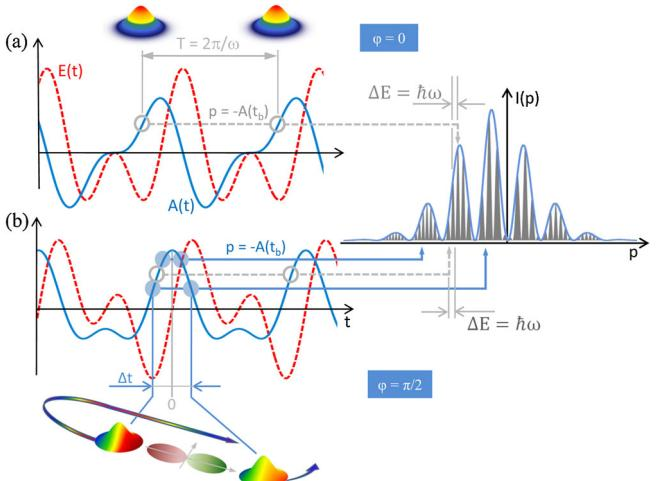
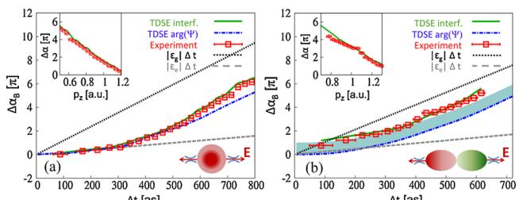

## 通过亚周期整形激光场对价电子波包进行阿秒探测

谢新华,1 斯蒂芬·罗伊特,1 丹尼尔·卡尔塔绍夫,1 埃米尔·佩尔松,2 迭戈·G·阿尔博,2,3 张丽,1 斯蒂芬妮·格雷夫,2  
马库斯·S·舍夫勒,1 约阿希姆·布格多费尔,2 安德里乌斯·巴尔图什卡,1 马库斯·基茨勒1,[\\*](#page-4-0)  

1 维也纳理工大学光子学研究所, 奥地利维也纳A-1040, 欧盟 2  
维也纳理工大学理论物理研究所, 奥地利维也纳A-1040, 欧盟 3  
天文学与空间物理研究所-IAFE (FCEN-UBA Conicet), 阿根廷布宜诺斯艾利斯  

(2011年11月29日收稿; 2012年5月9日发表)  

我们通过实验和理论证明，利用整形激光场在强场电离过程中，可以对价电子波包的创建过程进行自参考波函数重构。关键在于控制不同时间尺度产生的干涉效应。研究表明，测量亚周期电子波包干涉图样可作为工具，在小于10阿秒时间尺度上获取原子中价电子云的结构和动力学信息。  

DOI: [10.1103/PhysRevLett.108.193004](http://dx.doi.org/10.1103/PhysRevLett.108.193004) PACS编号: 32.80.Rm, 33.20.Xx, 42.50.Hz  

干涉测量是一种强大的光学技术，可获取干涉波的相对相位，该技术已扩展至相干物质波领域[[1–](#page-4-1)[6](#page-4-2)]。虽然光电子波包干涉已被记录[4–6]，但由于相位参考基准难以建立，波函数相位的干涉测量仍具挑战性。本文通过实验和理论证明，利用双色循环整形激光脉冲的中等强度强场电离，可实现价电子波包的自参考波函数重构。激光场整形实现了不同时间尺度干涉效应的分离。研究表明，测量亚周期电子波包干涉图样可作为工具，在亚10阿秒时间尺度上提取原子和分子中价电子云的结构和动力学信息，为高阶谐波光谱[7–9]和单阿秒脉冲光谱[10,11]提供了互补性研究方法。  

原子中的阿秒电子动力学通过两个或多个电子态相干叠加形成的束缚波包实现。完整表征该波包需要测量所有参与态的相对相位演化。目前已发展出多种方法[8,9,12,13]，利用强激光场中电子波包重碰撞产生的高次谐波软X射线辐射[14]获取相对相位信息。但由于生成信号包含波包创建和重碰撞两个步骤的贡献，需通过独立规范测量进行解耦[9,15]。本文提出基于电子波包对干涉的替代方案[2,4,5]。  

强激光场创建和驱动的波包干涉受两个时间尺度控制（图1）：(1)光学场单周期内产生的干涉[16–19]（亚周期或周期内干涉）；(2)由基本周期T时间间隔重复释放波包产生的干涉，形成光子能量@! = 2@/T间隔的条纹。这种周期间干涉又称阈上电离(ATI)峰[20]。下文统称为周期间干涉，因ATI常与整个强场光电子谱混用。我们利用整形激光场分离并控制氦和氖三维电子动量谱中的亚周期干涉。这些亚周期干涉图编码了阿秒精度定时电子波包对的量子相位差，从而能够提取中等强度场中激光驱动复杂束缚态波函数在电离过程中的亚周期相位演化。研究发现其显著偏离通常假设的线性增长[14]，这归因于激发态微小（<1%）但显著的瞬态布居。因此，本实验表征了束缚电子波包的形成过程。  

实验中采用双色激光场，由线偏振30 fs（半高宽）790 nm钛宝石放大器激光脉冲与其两倍长的二次谐波脉冲（可调相对相位'，平行偏振方向）通过共线几何结构相干叠加产生。两束光在焦点处的峰值场强调整为相等，形成激光电场E(t,') = E^1f1(t)cos(!t) + E^2f2(t)cos(2!t + ')，其中fi(t)和E^i（i=1,2）分别为高斯包络和峰值场强，!为基频激光频率。各色光峰值强度E^i^2为1×10^14 W/cm^2。通过改变双色相对相位'可对电离场进行整形（图1），从而以阿秒精度控制干涉波包的发射时间和运动。  

5 kHz重复频率的双色脉冲沿y方向传播，经60 mm焦距球面银镜聚焦到超音速冷原子束（直径约170 μm，沿x方向传播）上，靶室为1.3×10^-10 mbar超高真空环境，采用冷靶反冲离子动量谱技术[21]测量单原子场致电离产生的电子和离子三维动量矢量。  

  

图1（彩色在线）：整形!-2!激光脉冲在不同双色相对相位下产生的周期间（灰色圆圈和虚线箭头）与亚周期（蓝色圆点和实线箭头）电子波包干涉：(a)'=0；(b)'=π/2。我们使用弱均匀磁场（6.4 G）和电场（2.5 V/cm）引导带电粒子沿光谱仪轴线（与激光场偏振方向z平行）运动，最终抵达两个相对放置的时间和位置灵敏探测器（详见补充材料[22]）。

从测量得到的电子动量谱（图[2](#page-1-1)）中提取的干涉图案对双色激光场的相对相位φ极为敏感。图[2](#page-1-1)同时展示了通过数值求解三维柱坐标下含时薛定谔方程（TDSE）的模拟结果，其中采用氦原子单活性电子近似模型势[23]并在速度规范下计算。所有谱图在中心条纹区域（|py| ≤ 0.2 a.u.）均呈现强电离信号，而在|py| ≥ 0.2 a.u.区域则出现较弱的指状结构——后者曾被解释为离子势的全息图像[24,25]。本文重点研究小垂直动量（|py| ≤ 0.2 a.u.）中心条纹中编码的干涉结构。与单电离电子谱对应的离子谱（见补充材料[22]）按pz函数积分后[图3(a)(b)]显示出不同起源的干涉峰，其位置和形状强烈依赖于φ：在|pz</sub|较小（低能区）时，这些峰与间隔为ℏω的周期间干涉峰重合[19,20]；而在|pz| ≥ 1 a.u.的高动量区（如φ=0时的谱图），实验分辨率不足以分辨它们。值得注意的是，φ=π/2时的谱图[图3(b)(e)]呈现出明显不同于周期间干涉的调制结构——这正是亚周期干涉条纹，其强度分布可表述为：

$$P(p_z) \propto \cos^2[\Delta\alpha(p_z)/2].\tag{1}$$

相位差Δα(pz)承载着单激光周期内不同时刻释放的两个电子波包的演化信息，既包含束缚态在激光场中的演化，也包含连续态在激光场和剩余离子场中的传播。

亚周期与周期间干涉可通过时间尺度区分：亚周期干涉对应约800阿秒的释放时间间隔，导致其动量空间条纹间距远大于周期间干涉（时间间隔T=2.6 fs）。因此当周期间干涉因动量分辨率限制而模糊时，亚周期干涉仍清晰可辨。通过将脉冲压缩至单周期（图3(d)上半部TDSE结果），可数值模拟关闭周期间干涉而保留亚周期干涉。更重要的是，由于亚周期干涉强烈依赖φ而周期间干涉几乎与φ无关，通过调控双色场相位φ可增强纵向谱P(pz,φ)中亚周期条纹的可见度（图3(c)）。这些条纹呈现弓形结构，其位置随φ剧烈变化。φ=π/2时双色场产生的谱图不对称性（相对于pz=0）使亚周期干涉能远离低能共振区[26]，从而形成宽谱带。

图4（彩色在线）：(a) 通过干涉测量提取的氦原子束缚态波函数相位随亚周期发射时间差t的变化（红色方框），与TDSE干涉图（绿色实线）对比。时间误差条反映实验动量不确定度Δp≈0.05 a.u.。左上插图：Δα对pz的依赖关系，同时展示TDSE计算的隧道出口附近波函数相位（蓝色点划线）、基态（黑色虚线）和第一激发态（灰色虚线）在未扰动情况下的相位演化。(b) 氖原子的对应结果（Δp≈0.08 a.u.），阴影区域显示基态奇宇称导致的相位偏移。氦原子基态偶宇称所不具备的特性（见右下角插图）。

探测范围和更高的时间分辨率（详见补充材料[\[22\]](#page-4-19)）。

从干涉图样P(pz; φ=π/2)（图[3(c)](#page-2-0)）中提取的干涉相位Δφ(pz)（图[4](#page-2-1)插图），可通过半经典关联[\[14\]](#page-4-11)将动量pz与波包诞生时间联系起来，进而推导出时间延迟Δt与相位的关系φ(Δt)。对于当前φ=π/2的双色整形脉冲，可探测50阿秒至800阿秒的时间延迟，其中最长延迟时间的测量精度估计优于10阿秒。本文及后续分析中，定义Δt=0时刻对应矢量势极值点或φ=π/2时的激光场零点（见图[1](#page-1-0)）。由于Δt≈0附近弱场区域电离被抑制，小于50阿秒的延迟时间实际上无法探测。此外，有效时间窗口限于动量较高范围（≥0.3原子单位）或等效的Δt≤800阿秒，此时库仑势和低能共振的影响可忽略。通过迭代数值解法纳入库仑势作用，可优化动量到时间的映射关系。

束缚波包在Δt/2和-Δt/2两个释放时刻之间积累的相位差Δφ_B(Δt)，可通过从干涉测量相位中扣除波包在连续态收集的贡献得到：

$$
\Delta \phi_B(\Delta t) = \Delta \phi(\Delta t) - \Delta \phi_V(\Delta t) - \Delta \phi_C(\Delta t), \quad (2)
$$

其中Δφ_V(Δt)是自由电子与激光场作用的Volkov相位，Δφ_C(Δt)是库仑场作用的程函相位[\[27\]](#page-4-24)。方程(2)的应用得益于多周期脉冲近绝热开关条件下波包干涉的自参照特性：

$$
\phi(\Delta t/2) \iff -\phi(-\Delta t/2). \tag{3}
$$

因此φ(Δt)=2φ(Δt/2)，单次相位测量即可确定。方程(3)源于束缚波包的基态(g)与激发态(e)相干叠加：

$$|\Psi_B(t)\rangle = a_g(t)|\phi_g\rangle + \sum_{e\geq 0} b_e(t)|\phi_e\rangle \tag{4}$$

近乎绝热且可逆地跟随驱动场演化，即当t→±∞时b_e(t)→0，且a_g(t)=a_g(E(t))=a_g(-E(t))，b_e(t)=-b_e(-t)。TDSE模拟已明确验证方程(3)(4)的近似有效性。对于最小可分辨Δt，可观察到与绝热跟随的微小但显著偏差（详见补充材料[\[22\]](#page-4-19)）。

通过测量Δφ_B(Δt)（图[4](#page-2-1)），可深入理解亚周期演化中的束缚态动力学。其显著区别于未受扰动的线性演化Δφ_B=|ε_g|Δt（基态振幅a_g(t)=e^(-iε_g t)，ε_g为基态结合能）。后者被广泛使用的强场近似在基态耗尽可忽略时采用[\[14\]](#page-4-11)]。测量相位演化对线性行为的偏离反映了价电子波函数的动态极化，即瞬态布居低结合能激发态。最小斜率出现在小Δt处，符合电离动力学：弱场（小Δt）下仅瞬态激发态部分可被电离；强场（大Δt）下基态也可电离，对应Δφ_B(Δt)更大斜率。

通过t=±Δt/2时刻隧穿电离爆发探测束缚波包（方程(4)）的概念表明，其相位应由隧道出口处波函数的局域相位决定：

$$
\Delta\phi_B(\Delta t) \simeq 2 \arg \lbrack \Psi(\vec{r}_0, \Delta t/2) \rbrack. \tag{5}
$$

确实，在r~0=(0,0,±8)原子单位处由TDSE解计算的局域相位（方程(5)）与干涉测量相位Δφ_B(Δt)惊人一致——后者通过方程(1)从TDSE模拟及氦/氖实验数据中提取（图[4](#page-2-1)）。局域TDSE相位在6≤|r~0|≤16原子单位范围内对隧道出口位置弱依赖（详见补充材料[\[22\]](#page-4-19)）。例如本实验最小分辨时间50阿秒对应场强0.02原子单位，第一激发态的隧道出口约8原子单位。

这些发现的重要推论是：亚周期干涉为激光场诱导的瞬态激发态混入（远低于1%）提供了前所未有的探测手段。例如，当电场E(t=0)=0时，瞬态可逆激发与完美绝热跟随的偏差（0<|b_e(t=0)|≪1，ω为有限开关时间导致的谱宽，ε为激发能）表现为最小演化时间处相位斜率的近零值（图[4](#page-2-1)，另见补充材料[\[22\]](#page-4-19)）。

束缚态相位Δφ_B除包含亚周期尺度动态演化信息外，还携带被电离态的结构信息。由于两个干涉波包在电场反向的半周期内释放（E(t)符号相反），且在构型空间沿相反方向z传播（见图[1](#page-1-0)底部示意图），加之b_e(t)近乎绝热地跟随E(t)变化，它们从任意激发态电离携带的宇称信息等同于...（后续原文未提供完整译文）一个是来自初始基态的电离过程。因此，尽管存在激发态的混合，亚周期干涉仍能直接揭示基态宇称信息——这在氦与氖的对比中尤为明显（图[4(a)](#page-2-3)与[4(b)](#page-2-3)）。氦基态（1s）的偶宇称使两个波包继承的相位差为零，而氖基态（2p）的奇宇称则在动力学相位演化基础上引入了π的相位偏移。

总之，我们首次通过实验与理论证实：利用阿秒精度的隧穿电离干涉测量，可以重构由双色激光激发产生的瞬态束缚波包相位。这种基于波形调控激光脉冲的亚周期干涉术，为记录价电子云在激光周期调控下的相位敏感动态影像提供了新方法，从而与高次谐波光谱技术形成互补[[8](#page-4-8),[9](#page-4-5)]。当前分析聚焦于三维动量谱中垂直于激光偏振方向小动量区（|py| ≤ 0.2 a.u.）的干涉图样。但相位信息同样编码在|py| ≥ 0.2 a.u.的指状结构中（图[2](#page-1-1)）。由于构成这些结构的干涉波包对采样了位形空间的不同区域，这些条纹为将亚周期干涉术拓展至分子内重构过程探测提供了可能。亚周期干涉图对阿秒尺度动力学与结构信息的双重敏感性，有望成为研究复杂体系及多电子效应的有力工具[[8](#page-4-8)]。

本工作部分获奥地利科学基金（FWF）资助（项目号P21463-N22、P21141-N16、P23359-N16、SFB-016、V193-N16）及布宜诺斯艾利斯大学FCEN基金（20020090200169）。

[※](#page-0-0)通讯作者  
markus.kitzler@tuwien.ac.at  

- [1] T. C. Weinacht等, [物理评论快报](http://dx.doi.org/10.1103/PhysRevLett.80.5508) 80[, 5508 (1998)](http://dx.doi.org/10.1103/PhysRevLett.80.5508)  
- [2] F. Que´re´等, [物理评论快报](http://dx.doi.org/10.1103/PhysRevLett.90.073902) 90[, 073902 (2003)](http://dx.doi.org/10.1103/PhysRevLett.90.073902)  
- [3] P. Johnsson等, 物理评论快报 99[, 233001 (2007)](http://dx.doi.org/10.1103/PhysRevLett.99.233001)  
- [4] M. Wollenhaupt等, [物理评论快报](http://dx.doi.org/10.1103/PhysRevLett.89.173001) 89[, 173001 (2002)](http://dx.doi.org/10.1103/PhysRevLett.89.173001)  
- [5] T. Remetter等, [自然·物理](http://dx.doi.org/10.1038/nphys290) 2, 323 (2006)  
- [6] J. Mauritsson等, [物理评论快报](http://dx.doi.org/10.1103/PhysRevLett.105.053001) 105, 053001 [(2010)](http://dx.doi.org/10.1103/PhysRevLett.105.053001)  
- [7] W. Li等, 科学 322[, 1207 (2008)](http://dx.doi.org/10.1126/science.1163077)  
- [8] O. Smirnova等, [自然](http://dx.doi.org/10.1038/nature08253)(伦敦) 460[, 972 (2009)](http://dx.doi.org/10.1038/nature08253)  
- [9] S. Haessler等, [自然·物理](http://dx.doi.org/10.1038/nphys1511) 6, 200 [(2010)](http://dx.doi.org/10.1038/nphys1511)  
- [10] E. Goulielmakis等, [自然](http://dx.doi.org/10.1038/nature09212)(伦敦) 466, 739 (2010)  
- [11] M. Uiberacker等, [自然](http://dx.doi.org/10.1038/nature05648)(伦敦) 446[, 627 (2007)](http://dx.doi.org/10.1038/nature05648)  
- [12] X. Zhou等, [物理评论快报](http://dx.doi.org/10.1103/PhysRevLett.100.073902) 100, 073902 [(2008)](http://dx.doi.org/10.1103/PhysRevLett.100.073902)  
- [13] H. J. Wo¨rner等, [自然](http://dx.doi.org/10.1038/nature09185)(伦敦) 466, [604 (2010)](http://dx.doi.org/10.1038/nature09185)  
- [14] M. Lewenstein等, 物理评论A 51[, 1495 (1995)](http://dx.doi.org/10.1103/PhysRevA.51.1495)  
- [15] J. Itatani等, [自然](http://dx.doi.org/10.1038/nature03183)(伦敦) 432[, 867 (2004)](http://dx.doi.org/10.1038/nature03183)  
- [16] F. Lindner等, [物理评论快报](http://dx.doi.org/10.1103/PhysRevLett.95.040401) 95, 040401 [(2005)](http://dx.doi.org/10.1103/PhysRevLett.95.040401)  
- [17] R. Gopal等, [物理评论快报](http://dx.doi.org/10.1103/PhysRevLett.103.053001) 103[, 053001 (2009)](http://dx.doi.org/10.1103/PhysRevLett.103.053001)  
- [18] D. G. Arbo´等