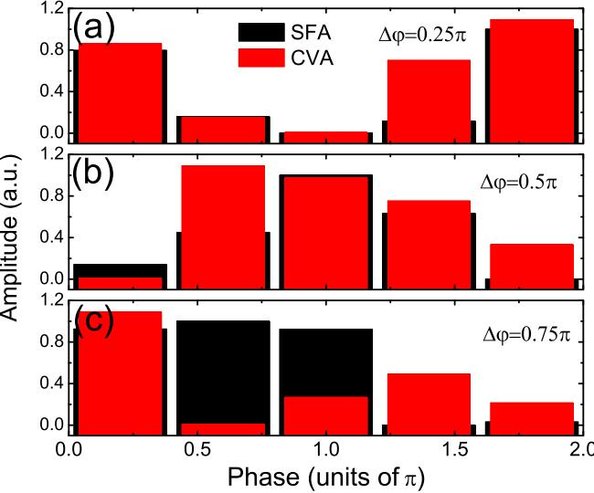

# **Coulomb effect on photoelectron momentum distributions in orthogonal two-color laser fields**

ShaoGang Yu,1,2 YanLan Wang,1,2 XuanYang Lai,1,* YiYi Huang,1,2 Wei Quan,1 and XiaoJun Liu1,†

1*State Key Laboratory of Magnetic Resonance and Atomic and Molecular Physics, Wuhan Institute of Physics and Mathematics,*

*Chinese Academy of Sciences, Wuhan 430071, China*

2*University of Chinese Academy of Sciences, Beijing 100049, China*

(Received 4 May 2016; published 21 September 2016)

We theoretically investigate the electron momentum distributions in orthogonally polarized two-color pulses with the Coulomb-Volkov distorted-wave approximation (CVA) theory and focus on the role of the Coulomb potential in the electron momentum distributions by comparing the CVA results with the strong-field approximation (SFA) simulations. Our results show that in comparison with the SFA simulations, the electron momentum distributions in CVA are in better agreement with the experimental observations and the time-dependent Schrodinger equation calculations. By analyzing the phase of the dipole moment, we find that ¨ the change of the electron momentum distributions in CVA can be ascribed to the different Coulomb corrections of the phases, which give rise to an enhanced contribution from the forward-rescattering electron and, on the other hand, a decrease of the contribution from the direct electron in the presence of the Coulomb potential.

DOI: [10.1103/PhysRevA.94.033418](http://dx.doi.org/10.1103/PhysRevA.94.033418)

#### **I. INTRODUCTION**

Great advances in intense femtosecond laser technology have offered new insights into light-matter interaction. When an atom or a molecule is exposed to a strong laser field, its outmost bound electron may be ionized by tunneling [\[1,2\]](#page-5-0). The measured photoelectron momentum distributions can be used to explore the structure and the dynamics of the atoms and molecules with attosecond temporal resolution and angstrom spatial resolution [\[3\]](#page-5-0). Moreover, the electron wave packets emitted at different tunneling ionization times interfere with each other [\[4\]](#page-5-0), resulting in rich interference patterns in the photoelectron momentum distributions. One example is the hologram from the interference of the electron wave packets [\[5,6\]](#page-5-0), which can be used in extracting the structural and dynamical information about the atomic or molecular medium.

Recently, the control of the atomic ionization via the modulation of the laser fields, e.g., by the use of orthogonally polarized two-color (OTC) laser fields, has attracted increasing attention in the strong-field physics community. The OTC pulses [\[7\]](#page-5-0) with a fundamental laser field and its phase-locked orthogonally polarized second harmonic field allow one to resolve and control the ultrafast electron dynamics in the two-dimensional polarization space. For example, the OTC laser pulses have been used to switch short and long quantum trajectories [\[8\]](#page-5-0), to probe the atomic wave functions [\[9\]](#page-5-0) and molecular orbits [\[10,11\]](#page-5-0) by analyzing the high-order harmonics spectra, to control electron-electron correlation dynamics in nonsequential double ionization (NSDI) [\[12,13\]](#page-5-0), and to generate a single attosecond pulse [\[14,15\]](#page-5-0) and elliptically polarized high harmonics [\[16\]](#page-5-0). Very recently, the OTC laser pulses have also been proposed to control interference fringes in the photoelectron momentum spectra [\[17\]](#page-5-0). For example, Richter *et al.* [\[18\]](#page-5-0) experimentally showed that by changing the relative phase of the OTC laser pulses, the trajectories of the electron wave packets released at different times can

be streaked in the same (opposite) directions, leading to the appearance (absence) of interference fringes in the electron momentum distributions.

It is worthy to note that for the traditional OTC pulses, the intensity of the second harmonic field is usually much weaker than that of the fundamental field. Thus, the atomic ionization rate is mainly determined by the fundamental field, while the additional second harmonic field mildly controls dynamics of the electron wave packets in the two-dimensional polarization space. Recently, the OTC laser fields with equal peak intensities have attracted great attention in the study of the strong-field ionization. For example, Zhang *et al.* [\[19\]](#page-5-0) experimentally showed that the electron momentum distributions generated by the OTC pulses with equal intensities are noticeably varied with the relative phase of the OTC pulses. Furthermore, Xie [\[20\]](#page-5-0) theoretically studied the rich interference patterns in the electron momentum distributions to obtain the precise information on the valence electron dynamics of the atom. Very recently, Geng *et al.* [\[21\]](#page-5-0) theoretically investigated the nonadiabatic subcycle electron dynamics in the OTC pulses with comparable intensities.

Qualitatively, the electron momentum distributions generated by the OTC pulses with equal intensities can be explained with strong-field approximation (SFA) theory, which neglects the influence of the ionic Coulomb potential on the photoionized electron [\[22,23\]](#page-5-0). But a more careful inspection reveals that there are some significant differences between the SFA simulations and the experimental observations at some relative phases of the OTC pulses. For example, an X-shaped central structure shown in the SFA simulation at a relative phase becomes a specific V-shaped structure in experiment and in the numerical solution of the time-dependent Schrodinger ¨ equation (TDSE) [\[19\]](#page-5-0). In terms of the semiclassical method, the change of the electron momentum distributions is ascribed to the influence of the Coulomb field on the dynamics of the electron in the laser fields [\[19,24,25\]](#page-5-0). However, it is still unknown how the Coulomb potential leads to the change of the photoelectron momentum spectra in the OTC pulses.

Recently, a modified SFA theory, i.e., Coulomb-Volkov distorted-wave approximation (CVA) theory [\[26\]](#page-5-0), in which

*xylai@wipm.ac.cn

† xjliu@wipm.ac.cn

the continuum state of the ionized electron is described with a Coulomb-Volkov state rather than the Volkov state in SFA, was employed to explore the ionic Coulomb effect in the atomic ionization. For example, the CVA simulation of a bouquetshaped structure near threshold region of the two-dimensional photoelectron angular distribution is in good agreement with the TDSE calculation [\[27\]](#page-5-0), indicating the importance of the Coulomb correction in CVA related to the emission angle of the photoelectron. Moreover, a cusp structure in the transverse electron momentum distribution is also well reproduced in the CVA simulation [\[27\]](#page-5-0), which is attributed to the attraction of the ionic Coulomb potential, also called Coulomb focusing.

In this paper, we theoretically investigate the electron momentum distributions generated by the OTC pulses with equal intensities with CVA theory, and the focus of the paper is to elucidate the role of the Coulomb potential in the electron momentum distributions. Our results show that in comparison with the SFA simulations, the CVA simulations of the electron momentum distributions are in better agreement with the experimental observations and the TDSE calculations. For example, the V-shaped structure in the photoelectron momentum distribution at the relative phase *ϕ* = 0 of the OTC pulse is well reproduced by the CVA simulations [\[19\]](#page-5-0). By analyzing the phase of the dipole moment, we find that the change of the electron momentum distributions in CVA can be attributed to the different Coulomb corrections of the phases for the forward-rescattering electron and the direct electron [\[22,23\]](#page-5-0). These Coulomb corrections of the phases give rise to an enhanced contribution from the forward-rescattering electron and, on the other hand, a decrease of the contribution from the direct electron in the presence of the Coulomb potential.

This paper is organized as follows. In Sec. II, we briefly introduce the SFA and CVA theories. Subsequently, we present the SFA and CVA simulations of the electron momentum distributions at different relative phases of the OTC pulses and furthermore, reveal the underlying physics of the Coulomb effect on the electron momentum distributions by analyzing the phase of the dipole moment. Finally, in Sec. [IV](#page-5-0) our conclusions are given. Atomic units (a.u.) are used throughout unless otherwise indicated.

#### **II. THEORETICAL METHODS**

#### **A. SFA theory**

In the SFA theory, the transition amplitude of the bound electron from the initial bound state |*ψ*0 of the target atom to the Volkov state |*ψ*V **p** with the final momentum **p** is written as [\[28–31\]](#page-5-0)

$$M_{\mathbf{p}} = -i \int_{-\infty}^{\infty} dt \langle \psi_{\mathbf{p}}^{\mathrm{V}}(t) | \mathbf{r} \cdot \mathbf{E}(t) | \psi_{0}(t) \rangle \tag{1}$$

where

$$\begin{split} \psi_{\mathbf{p}}^{\mathrm{V}}(t) &= \frac{\exp\left\{i[\mathbf{p} + \mathbf{A}(t)] \cdot \mathbf{r}\right\}}{(2\pi)^{3/2}} \\ &\times \exp\left\{-i \int_{t}^{\infty} dt' \frac{[\mathbf{p} + \mathbf{A}(t')]^2}{2}\right\}, \end{split} \tag{2}$$

**A**(*t*) denotes the vector potential of the laser field, and **r** · **E**(*t*) is the laser-field-electron interaction in the length gauge. Inserting Eq. (2) into Eq. (1), the transition amplitude is rewritten as

$$M_{\mathbf{p}} = -i \int_{-\infty}^{\infty} dt \, \exp\left[i S(\mathbf{p}, t)\right] \langle \mathbf{p} + \mathbf{A}(t)|\mathbf{r} \cdot \mathbf{E}(t)|\psi_0(r)\rangle,\quad(3)$$

where

$$S(\mathbf{p}, t) = -\frac{1}{2} \int_{t}^{\infty} dt' [\mathbf{p} + \mathbf{A}(t')]^2 + I_p t$$

$$= \left(\frac{\mathbf{p}^2}{2} + I_p\right) t - \mathbf{p} \cdot \int_{t}^{\infty} dt' \mathbf{A}(t')$$

$$-\frac{1}{2} \int_{t}^{\infty} dt' [\mathbf{A}(t')]^2 \tag{4}$$

is the semiclassical action and *Ip* denotes the ionization potential of the atom.

In this work, we study the ionization of the hydrogen atom in the OTC laser pulses with equal intensities. For the hydrogen atom, the ground state *ψ*0(*r*) = *e*−*r/* √4*π* and *Ip* = 0*.*5 a.u. In this case, the form factor in Eq. (3) can be written as [\[32\]](#page-5-0)

$$i\langle \mathbf{p} + \mathbf{A}(t) | \mathbf{r} \cdot \mathbf{E}(t) | \psi_0(r) \rangle = -i \frac{2^{7/2} (2I_p)^{5/4} [\mathbf{p} + \mathbf{A}(t)] \cdot \mathbf{E}(t)}{\pi \{ [\mathbf{p} + \mathbf{A}(t)]^2 + 2I_p \}^3} \,. \tag{5}$$

Note that the form factor in Eq. (5) is purely imaginary. The final doubly differential momentum distribution of the photoelectron in the polarization plane of the OTC driving fields is then given by

$$\frac{d^2P(p_x, p_y)}{dp_x dp_y} = |M_\mathbf{p}|^2,\tag{6}$$

where *px* and *py* represent the final momenta along the polarization directions of the fundamental field and the second harmonic field, respectively.

## **B. CVA theory**

In the CVA theory [\[26\]](#page-5-0), a Coulomb-Volkov state is employed to replace the Volkov state used in Eq. (1),

$$M_{\mathbf{p}}^{\rm CVA} = -i \int_{-\infty}^{\infty} dt \langle \psi_{\mathbf{p}}^{\rm CV}(t) | \mathbf{r} \cdot \mathbf{E}(t) | \psi_0(t) \rangle,\tag{7}$$

where the Coulomb-Volkov state consists of a Coulomb wave multiplied by the Volkov-type state [\[33–35\]](#page-5-0),

$$\psi_{\mathbf{p}}^{\rm CV}(\mathbf{r},t) = D_c(Z_T, \mathbf{p}, \mathbf{r}) \times \frac{\exp\left\{i[\mathbf{p} + \mathbf{A}(t)] \cdot \mathbf{r}\right\}}{(2\pi)^{3/2}}$$

$$\times \exp\left\{-i \int_t^\infty dt' \frac{[\mathbf{p} + \mathbf{A}(t')]^2}{2}\right\}. \qquad (8)$$

The Coulomb wave is defined for the outgoing wave as

$$D_c(Z_T, \mathbf{p}, \mathbf{r}) = N_T^-(p)_1 F_1(-iZ_T, 1, -ipr - i\mathbf{p} \cdot \mathbf{r}), \quad (9)$$

where *N*− *T* (*p*) = exp (*πZT /*2*p*)(1 + *iZT /p*) is the Coulomb normalization factor with the Euler gamma function (*x*), 1*F*1 denotes the confluent hypergeometric function, and *ZT*

FIG. 1. Schematic diagram of the electric field of the OTC laser pulses with the relative phase *ϕ* = 0*.*5*π* according to Eq. (11). The red and blue curves represent the fundamental field and its second harmonic field, respectively. The total electric field is plotted by the green curve in three-dimensional form.

is the nuclear charge of the atom. It is easy to verify that the Coulomb-Volkov state in Eq. [(8)](#page-1-0) transforms into the Volkov function in Eq. [(2)](#page-1-0) at *ZT* = 0. Inserting Eq. [(8)](#page-1-0) into Eq. [(7)](#page-1-0), the transition amplitude in CVA is rewritten as

$$M_{\mathbf{p}}^{\rm CVA} = -i \int_{-\infty}^{\infty} dt \, \exp\left[i S(\mathbf{p}, t)\right] F(\mathbf{p}, t), \qquad (10)$$

where the form factor *F*(**p***,t*) = **p** + **A**(*t*)|*Dc*(*ZT ,***p***,***r**) × **r** · **E**(*t*)|*ψ*0(*r*). It is worth noting that the formulas of the action in CVA and SFA are the same, while the form factor in CVA is improved by adding the Coulomb wave.

In our calculation, the electric field of the OTC pulses with a sine-square envelope is written as

$$\mathbf{E}(t) = E_0 \sin^2\left(\frac{\omega t}{2N_C}\right) [\cos\omega t \mathbf{\hat{e}}_x + \cos(2\omega t + \Delta\varphi) \mathbf{\hat{e}}_y], \tag{11}$$

where *E*0 is the peak intensity, *ω* is the center frequency of the fundamental laser field, *ϕ* is the relative phase of the OTC pulse, *NC* is the number of the optical cycles in one laser pulse from the time *t* = 0 to *T* with *T* = (2*π/ω*)*NC*, and **e**ˆ*x* and **e**ˆ*y* are the unit polarization vectors of the fundamental field and its second harmonic field, respectively. Figure 1 shows a schematic diagram of the OTC laser pulse with *ϕ* = 0*.*5*π*, *NC* = 6, *ω* = 0*.*05 a.u., and *E*0 = 0*.*054 a.u.

### **III. RESULTS AND DISCUSSION**

Figures 2(a)–2(e) show the two-dimensional photoelectron momentum distributions of the hydrogen atom in the SFA simulations, which are noticeably varied with the relative phase *ϕ* of the OTC pulses with equal intensities. For example, an X-shaped central structure is shown in the electron momentum distribution at *ϕ* = 0. With the increase of the relative phase, the momentum distributions are distorted and are separated into two parts at *ϕ* = 0*.*5*π*. Furthermore, as *ϕ* increases to 0*.*75*π*, the momentum distribution is the same as that at *ϕ* = 0*.*25*π*. When *ϕ* = *π*, the momentum distribution again exhibits an X-shaped central structure. The significant changes of the electron momentum distributions with the relative phases qualitatively agree well with the prediction of the simple man's model: **p** = −**A**(*t*) [\[19\]](#page-5-0) (see color curves in each panel).

On the other hand, Figs. 2(f)–2(j) exhibit the CVA simulations of the corresponding photoelectron momentum

FIG. 2. The two-dimensional photoelectron momentum distributions of the hydrogen atom in the polarization plane of the OTC laser pulses with equal intensities at the relative phases *ϕ* = 0, 0*.*25*π*, 0*.*5*π*, 0*.*75*π*, and *π*, respectively. (a)–(e) SFA simulations, (f)–(j) CVA simulations. The color curves in (a)–(e) denote the vector potential of the laser pulses at the different quarters of the fundamental laser field. The numbers in panel (a) denote the emission directions of the photoelectron with respect to the *py* axis.

distributions at different relative phases. Qualitatively speaking, the photoelectron momentum distributions in CVA are similar to the SFA simulations. But a more careful inspection reveals that there are significant changes at some relative phases of the OTC pulses when the influence of the Coulomb potential is considered in CVA. For example, the X-shaped central structure shown in the SFA simulation at *ϕ* = 0 becomes a specific V-shaped structure in the CVA calculation. At *ϕ* = 0*.*75*π*, a distinct V-shaped structure appears on the left side of the electron momentum distribution. When *ϕ* = *π*, the photoelectron momentum distribution is the same as that at *ϕ* = 0 but with the V-shaped structure on the left side of the electron momentum distribution. The CVA simulations of the electron momentum distributions are well consistent with the experimental observations and TDSE simulations shown in Ref. [\[19\]](#page-5-0), indicating the important role of the Coulomb potential in the atomic ionization.

Obviously, the change of the electron momentum distributions between CVA and SFA is directly related to the different transition amplitudes. In order to understand the influence of the Coulomb potential on the electron momentum distributions, we will analyze the transition amplitudes in CVA and SFA, respectively. According to Eqs. [(1)](#page-1-0) and [(7)](#page-1-0), the transition amplitude contains an integration of the dipole moment *D*(**p***,t*) over time. Physically, it represents that the ionization amplitude of the photoelectron is determined by the coherent superposition of the electron wave packets from the different ionization times [\[2\]](#page-5-0). First of all, we calculate all dipole moments with a very small time step *t* during the laser pulse *D*(**p***,kt*), where *k* = 0*,*1*,*2*,....* Later, these dipole moments are binned according to their phase. Finally, the amplitudes of the dipole moments within the same bin are added together to obtain the distributions of the dipole moments in the phase space. Here we take two photoelectrons with the value of momentum, e.g., *p* = 0*.*15 a.u., as an example: one is emitted along the 45◦ direction with respect to the *py* axis [see the numbers in Fig. [2(a)\]](#page-2-0) and another one is along the opposite direction with an emission angle of *θp* = 225◦. In Fig. 3, we exhibit the distributions of the dipole moments of the two electrons in the phase space of [0*,*2*π*] for the OTC pulse with the relative phase *ϕ* = 0. In comparison with the SFA simulations, the distribution for the electron with *θp* = 45◦ becomes more concentrated in CVA (around the phase of 0*.*2*π*), while it becomes slightly more dispersive for the electron with *θp* = 225◦. Thus, due to the inherent interference effect, the superposition of all dipole moments for the electron with *θp* = 45◦ is enhanced, while the contribution from the electron with *θp* = 225◦ is slightly suppressed, which is consistent with the CVA simulation shown in Fig. [2(f).](#page-2-0) Similar distributions of the dipole moments in the phase space can be also found for the electrons emitted along the 315◦ and 135◦ directions [see the numbers in Fig. [2(a)\]](#page-2-0), indicating that the ionization amplitude of the electron with *θp* = 315◦ is higher than that of the electron with *θp* = 135◦. As a result, the X-shaped central structure shown in the SFA simulation at *ϕ* = 0 becomes the specific V-shaped structure in the CVA simulations of the photoelectron momentum distribution in Fig. [2(f).](#page-2-0)

To shed more light on the different influences of the Coulomb potential on the transition amplitudes of the two

FIG. 3. The distributions of the dipole moments in the phase space of [0*,*2*π*] for the OTC pulse with the relative phase *ϕ* = 0: (a) photoelectron with *p* = 0*.*15 a.u. and *θp* = 45◦, (b) photoelectron with *p* = 0*.*15 a.u. and *θp* = 225◦. The red and black bars correspond to the distributions in CVA and in SFA, respectively. The amplitudes have been normalized to unity. For more details, see the text.

electrons, we will further analyze the dipole moment, *D*(**p***,t*). According to Eq. [(10)](#page-2-0), the dipole moments can be separated into two parts: one is related to the action *S*(**p***,t*) and another one is the form factor *F*(**p***,t*). In the following, we will calculate the action and the form factor, respectively, to reveal the underlying physics of the Coulomb effect on the photoelectron momentum distributions. Note that according to the simple man's model [\[22,23\]](#page-5-0), the photoelectron with *θp* = 225◦ is mainly from the contribution of the electron wave packets with the ionization time around position 1 [see Fig. [4(a)\]](#page-4-0), while for the electron with *θp* = 45◦, the ionization times of the electron wave packets are mainly around position 2. Thus, to more clearly understand the influence of the Coulomb potential on the dipole moment, we will analyze the dipole moments of the electron with *θp* = 225◦ in the time region from the 2.9 optical cycle (O.C.) to 3 O.C., while for the electron with *θp* = 45◦, the time region is from 3 O.C. to 3.1 O.C.

In Figs. [4(b)](#page-4-0) and [4(c),](#page-4-0) we present the action *S*(**p***,t*) as a function of time for the two electrons with the final momentum *p* = 0*.*15 a.u. along 225◦ and 45◦ directions with respect to the *py* axis, respectively. Obviously, the value of the action keeps increasing with time, which is due to the fact that the action *S*(**p***,t*) ≈ ( **p**2 2 + *Ip*)*t* [see Eq. [(4)](#page-1-0)]. Because the formulas of the action in CVA and SFA are the same, the curves from the SFA theory and the CVA theory are overlapping each other. On the other hand, we also show the phase of the form factor as a function of time for the two electrons in Figs. [4(d)](#page-4-0) and [4(e).](#page-4-0) In the SFA theory, the form factor in Eq. [(5)](#page-1-0) is purely imaginary and hence, the phase is a constant, while in the CVA simulations, the phase of the form factor significantly deviates from the SFA simulations and more importantly, the change of the phase in CVA is time dependent. Physically, this can be traced back to the fact that the electron trajectories

FIG. 4. (a) The electric fields of the OTC pulse with the relative laser phase *ϕ* = 0. For the sake of convenience, the two orthogonal components are drawn parallel for better visualization. The color curves denote the electric field of the laser pulses at the different quarters of the fundamental laser field. (b, c) The action *S*(**p***,t*) as a function of the time for the two electrons with *θp* = 225◦ and *θp* = 45◦, respectively. The value of the momentum of the two electrons *p* = 0*.*15 a.u. Note that the curves from the SFA theory (black) and the CVA theory (red) are overlapping each other. (d, e) The phase of the form factor as a function of time for the two electrons.

from the different ionization times accumulate different phase contributions from the Coulomb potential [\[36\]](#page-5-0). Furthermore, a careful inspection reveals that the change of the phase of the form factor in CVA becomes more significant as the time gets close to 3 O.C. The reason might be that when the time is getting close to 3 O.C., the amplitude of the electric field of the laser pulse keeps increasing [see Fig. 4(a)] and thus, the tunneling exit of the electron in the strong laser field gets closer to the core [\[1\]](#page-5-0), leading to the larger Coulomb correction of the phase. Therefore, due to the Coulomb correction of the phase, the final phase of the dipole moment, i.e., the sum of the action and the phase of the form factor, will increase much faster with the time for the electron with *θp* = 225◦. In contrast, for the electron with *θp* = 45◦, the change of the final phase of the dipole moment with time becomes relatively smoother. As a result, the distributions of the dipole moments in the phase space becomes more dispersive for the electron with *θp* = 225◦, while it becomes more concentrated for the electron with *θp* = 45◦, which is qualitatively consistent with the simulations shown in Fig. [3.](#page-3-0) It is worth noting that according to the simple man's model [\[22,23\]](#page-5-0), the electron with *θp* = 45◦ is called the forward-rescattering electron, which returns to the core before being detected by the detector, while the electron

FIG. 5. Same as in Fig. [3](#page-3-0) but for the electron with the momentum *p* = 0*.*5 a.u. along the 120◦ direction with respect to the *py* axis. The relative phases of the OTC pulses are *ϕ* = 0*.*25*π* (a), *ϕ* = 0*.*5*π* (b), and *ϕ* = 0*.*75*π* (c), respectively.

with *θp* = 225◦ is named as the direct electron, which moves to the detector directly. Therefore, our work shows that the contribution from the forward-rescattering is enhanced and, on the other hand, the contribution from the direct electron decreases in the presence of the Coulomb potential, which is well consistent with the previous calculations with different theoretical models in the traditional OTC laser pulses [\[17\]](#page-5-0) and in the long laser pulses [\[36\]](#page-5-0).

Additionally, we also exhibit the distributions of the dipole moments in the phase space for the OTC pulses with the relative phases *ϕ* = 0*.*25*π*, 0*.*5*π*, and 0*.*75*π* in Figs. 5(a)–5(c), respectively. Here, we take the photoelectron with the momentum *p* = 0*.*5 a.u. along 120◦ direction with respect to the *py* axis as an example. Figure 5(c) shows that for *ϕ* = 0*.*75*π*, the distribution of the dipole moment in CVA becomes more concentrated (around the phase of 0*.*2*π*) than that in SFA. The reason is that the electron corresponds to the forward-rescattering electron according to the simple man's model [\[22,23\]](#page-5-0) (not shown here) and thus, due to the Coulomb correction of the phase of the dipole moment, the distributions of the dipole moment of the forward-rescattering electron becomes concentrated in the CVA calculations, resulting in the increase of the ionization amplitude. Figure [2(i)](#page-2-0) shows that a distinct V-shaped structure is found on the left side of the electron momentum distribution, in good agreement with the experimental observations and TDSE simulations [\[19\]](#page-5-0). On the other hand, for *ϕ* = 0*.*25*π* and 0*.*5*π*, the two electron trajectories move to the detector directly according to the simple man's model and thus, the distributions of the dipole moment in CVA in the phase space become relatively dispersive after considering the Coulomb correction of the phase, which is qualitatively consistent with the CVA simulations shown in Figs. 5(a) and 5(b), resulting in the slight decrease of the ionization amplitude in the electron momentum distributions in Figs. [2(g)](#page-2-0) and [2(h).](#page-2-0)

## **IV. CONCLUSION**

In conclusion, we theoretically investigate the electron momentum distributions generated by the OTC pulses with equal intensities with CVA theory and focus on the role of the Coulomb potential in the electron momentum distributions. Our results show that in comparison with the SFA simulations, the electron momentum distributions in CVA are in better agreement with the experimental observations and the TDSE calculations. By analyzing the phase of the dipole moment, we find that the change of the electron momentum distributions in CVA is ascribed to the different Coulomb corrections of the phases. These different Coulomb corrections of the phases result in an enhanced contribution from the forward-rescattering electron and, on the other hand, a decrease of the contribution from the direct electron in the presence of the Coulomb potential. Moreover, our work suggests a convenient approach of qualitative description of the Coulomb effect in the strong-field atomic processes, without the need to solve the TDSE.

## **ACKNOWLEDGMENTS**

We thank Jing Chen and Xuebin Bian for many useful discussions. This work is supported by the National Basic Research Program of China (Grant No. 2013CB922201) and the NNSF of China (Grants No. 11334009, No. 11374329, No. 11304365, and No. 11474321).

- [1] L. V. Keldysh, Zh. Eksp. Teor. Fiz. **47**, 1945 (1964) [Sov. Phys. JETP **20**, 1307 (1965)].
- [2] W. Becker, F. Grasbon, R. Kopold, D. B. Milosevi ˇ c, G. G. ´ Paulus, and H. Walther, [Adv. At. Mol. Phys.](http://dx.doi.org/10.1016/S1049-250X(02)80006-4) **[48](http://dx.doi.org/10.1016/S1049-250X(02)80006-4)**, [35](http://dx.doi.org/10.1016/S1049-250X(02)80006-4) [(2002)](http://dx.doi.org/10.1016/S1049-250X(02)80006-4).
- [3] M. Meckel, D. Comtois, D. Zeidler, A. Staudte, D. Paviciˇ c, H. C. ´ Bandulet, H. Pepin, J. C. Kieffer, R. D ´ orner, D. M. Villeneuve, ¨ and P. B. Corkum, [Science](http://dx.doi.org/10.1126/science.1157980) **[320](http://dx.doi.org/10.1126/science.1157980)**, [1478](http://dx.doi.org/10.1126/science.1157980) [(2008)](http://dx.doi.org/10.1126/science.1157980).
- [4] F. Lindner, M. G. Schatzel, H. Walther, A. Baltu ¨ ska, E. ˇ Goulielmakis, F. Krausz, D. B. Milosevi ˇ c, D. Bauer, W. Becker, ´ and G. G. Paulus, [Phys. Rev. Lett.](http://dx.doi.org/10.1103/PhysRevLett.95.040401) **[95](http://dx.doi.org/10.1103/PhysRevLett.95.040401)**, [040401](http://dx.doi.org/10.1103/PhysRevLett.95.040401) [(2005)](http://dx.doi.org/10.1103/PhysRevLett.95.040401).
- [5] Y. Huismans *et al.*, [Science](http://dx.doi.org/10.1126/science.1198450) **[331](http://dx.doi.org/10.1126/science.1198450)**, [61](http://dx.doi.org/10.1126/science.1198450) [(2011)](http://dx.doi.org/10.1126/science.1198450).
- [6] X. B. Bian and A. D. Bandrauk, [Phys. Rev. Lett.](http://dx.doi.org/10.1103/PhysRevLett.108.263003) **[108](http://dx.doi.org/10.1103/PhysRevLett.108.263003)**, [263003](http://dx.doi.org/10.1103/PhysRevLett.108.263003) [(2012)](http://dx.doi.org/10.1103/PhysRevLett.108.263003).
- [7] M. Kitzler and M. Lezius, [Phys. Rev. Lett.](http://dx.doi.org/10.1103/PhysRevLett.95.253001) **[95](http://dx.doi.org/10.1103/PhysRevLett.95.253001)**, [253001](http://dx.doi.org/10.1103/PhysRevLett.95.253001) [(2005)](http://dx.doi.org/10.1103/PhysRevLett.95.253001).
- [8] L. Brugnera, D. J. Hoffmann, T. Siegel, F. Frank, A. Za¨ır, J. W. G. Tisch, and J. P. Marangos, [Phys. Rev. Lett.](http://dx.doi.org/10.1103/PhysRevLett.107.153902) **[107](http://dx.doi.org/10.1103/PhysRevLett.107.153902)**, [153902](http://dx.doi.org/10.1103/PhysRevLett.107.153902) [(2011)](http://dx.doi.org/10.1103/PhysRevLett.107.153902).
- [9] D. Shafir, Y. Mairesse, D. M. Villeneuve, P. B. Corkum, and N. Dudovich, [Nat. Phys.](http://dx.doi.org/10.1038/nphys1251) **[5](http://dx.doi.org/10.1038/nphys1251)**, [412](http://dx.doi.org/10.1038/nphys1251) [(2009)](http://dx.doi.org/10.1038/nphys1251).
- [10] H. Niikura, N. Dudovich, D. M. Villeneuve, and P. B. Corkum, [Phys. Rev. Lett.](http://dx.doi.org/10.1103/PhysRevLett.105.053003) **[105](http://dx.doi.org/10.1103/PhysRevLett.105.053003)**, [053003](http://dx.doi.org/10.1103/PhysRevLett.105.053003) [(2010)](http://dx.doi.org/10.1103/PhysRevLett.105.053003); H. Niikura, H. J. Worner, ¨ D. M. Villeneuve, and P. B. Corkum, *[ibid.](http://dx.doi.org/10.1103/PhysRevLett.107.093004)* **[107](http://dx.doi.org/10.1103/PhysRevLett.107.093004)**, [093004](http://dx.doi.org/10.1103/PhysRevLett.107.093004) [(2011)](http://dx.doi.org/10.1103/PhysRevLett.107.093004).
- [11] H. Yun, K.-M. Lee, J. H. Sung, K. T. Kim, H. T. Kim, and C. H. Nam, [Phys. Rev. Lett.](http://dx.doi.org/10.1103/PhysRevLett.114.153901) **[114](http://dx.doi.org/10.1103/PhysRevLett.114.153901)**, [153901](http://dx.doi.org/10.1103/PhysRevLett.114.153901) [(2015)](http://dx.doi.org/10.1103/PhysRevLett.114.153901).
- [12] Y. M. Zhou, C. Huang, A. H. Tong, Q. Liao, and P. X. Lu, [Opt. Express](http://dx.doi.org/10.1364/OE.19.002301) **[19](http://dx.doi.org/10.1364/OE.19.002301)**, [2301](http://dx.doi.org/10.1364/OE.19.002301) [(2011)](http://dx.doi.org/10.1364/OE.19.002301).
- [13] L. Zhang, X. H. Xie, S. Roither, Y. M. Zhou, P. X. Lu, D. Kartashov, M. Schoffler, D. Shafir, P. B. Corkum, A. Baltu ¨ ska, ˇ A. Staudte, and M. Kitzler, [Phys. Rev. Lett.](http://dx.doi.org/10.1103/PhysRevLett.112.193002) **[112](http://dx.doi.org/10.1103/PhysRevLett.112.193002)**, [193002](http://dx.doi.org/10.1103/PhysRevLett.112.193002) [(2014)](http://dx.doi.org/10.1103/PhysRevLett.112.193002).
- [14] C. M. Kim, I. J. Kim, and C. H. Nam, [Phys. Rev. A](http://dx.doi.org/10.1103/PhysRevA.72.033817) **[72](http://dx.doi.org/10.1103/PhysRevA.72.033817)**, [033817](http://dx.doi.org/10.1103/PhysRevA.72.033817) [(2005)](http://dx.doi.org/10.1103/PhysRevA.72.033817).
- [15] Y. L. Yu, X. H. Song, Y. X. Fu, R. X. Li, Y. Cheng, and Z. Z. Xu, [Opt. Express](http://dx.doi.org/10.1364/OE.16.000686) **[16](http://dx.doi.org/10.1364/OE.16.000686)**, [686](http://dx.doi.org/10.1364/OE.16.000686) [(2008)](http://dx.doi.org/10.1364/OE.16.000686).
- [16] G. Lambert, B. Vodungbo, J. Gautier, B. Mahieu, V. Malka, S. Sebban, P. Zeitoun, J. Luning, J. Perron, A. Andreev, S. Stremoukhov, F. Ardana-Lamas, A. Dax, C. P. Hauri, A. Sardinha, and M. Fajardo, [Nat. Commun.](http://dx.doi.org/10.1038/ncomms7167) **[6](http://dx.doi.org/10.1038/ncomms7167)**, [6167](http://dx.doi.org/10.1038/ncomms7167) [(2015)](http://dx.doi.org/10.1038/ncomms7167).
- [17] M. Li, J. W. Geng, M. M. Liu, X. Zheng, L. Y. Peng, Q. H. Gong, and Y. Q. Liu, [Phys. Rev. A](http://dx.doi.org/10.1103/PhysRevA.92.013416) **[92](http://dx.doi.org/10.1103/PhysRevA.92.013416)**, [013416](http://dx.doi.org/10.1103/PhysRevA.92.013416) [(2015)](http://dx.doi.org/10.1103/PhysRevA.92.013416).
- [18] M. Richter, M. Kunitski, M. Schoffler, T. Jahnke, L. P. H. ¨ Schmidt, M. Li, Y. Q. Liu, and R. Dorner, ¨ [Phys. Rev. Lett.](http://dx.doi.org/10.1103/PhysRevLett.114.143001) **[114](http://dx.doi.org/10.1103/PhysRevLett.114.143001)**, [143001](http://dx.doi.org/10.1103/PhysRevLett.114.143001) [(2015)](http://dx.doi.org/10.1103/PhysRevLett.114.143001).
- [19] L. Zhang, X. H. Xie, S. Roither, D. Kartashov, Y. L. Wang, C. L. Wang, M. Schoffler, D. Shafir, P. B. Corkum, A. Baltu ¨ ska, ˇ I. Ivanov, A. Kheifets, X. J. Liu, A. Staudte, and M. Kitzler, [Phys. Rev. A](http://dx.doi.org/10.1103/PhysRevA.90.061401) **[90](http://dx.doi.org/10.1103/PhysRevA.90.061401)**, [061401(R)](http://dx.doi.org/10.1103/PhysRevA.90.061401) [(2014)](http://dx.doi.org/10.1103/PhysRevA.90.061401).
- [20] X. H. Xie, [Phys. Rev. Lett.](http://dx.doi.org/10.1103/PhysRevLett.114.173003) **[114](http://dx.doi.org/10.1103/PhysRevLett.114.173003)**, [173003](http://dx.doi.org/10.1103/PhysRevLett.114.173003) [(2015)](http://dx.doi.org/10.1103/PhysRevLett.114.173003).
- [21] J. W. Geng, W. H. Xiong, X. R. Xiao, L. Y. Peng, and Q. H. Gong, [Phys. Rev. Lett.](http://dx.doi.org/10.1103/PhysRevLett.115.193001) **[115](http://dx.doi.org/10.1103/PhysRevLett.115.193001)**, [193001](http://dx.doi.org/10.1103/PhysRevLett.115.193001) [(2015)](http://dx.doi.org/10.1103/PhysRevLett.115.193001).
- [22] P. B. Corkum, [Phys. Rev. Lett.](http://dx.doi.org/10.1103/PhysRevLett.71.1994) **[71](http://dx.doi.org/10.1103/PhysRevLett.71.1994)**, [1994](http://dx.doi.org/10.1103/PhysRevLett.71.1994) [(1993)](http://dx.doi.org/10.1103/PhysRevLett.71.1994).
- [23] K. J. Schafer, B. R. Yang, L. F. DiMauro, and K. C. Kulander, [Phys. Rev. Lett.](http://dx.doi.org/10.1103/PhysRevLett.70.1599) **[70](http://dx.doi.org/10.1103/PhysRevLett.70.1599)**, [1599](http://dx.doi.org/10.1103/PhysRevLett.70.1599) [(1993)](http://dx.doi.org/10.1103/PhysRevLett.70.1599).
- [24] C. I. Blaga, F. Catoire, P. Colosimo, G. G. Paulus, H. G. Muller, P. Agostini, and L. F. Dimauro, [Nat. Phys.](http://dx.doi.org/10.1038/nphys1228) **[5](http://dx.doi.org/10.1038/nphys1228)**, [335](http://dx.doi.org/10.1038/nphys1228) [(2009)](http://dx.doi.org/10.1038/nphys1228).
- [25] W. Quan, Z. Lin, M. Wu, H. Kang, H. Liu, X. Liu, J. Chen, J. Liu, X. T. He, S. G. Chen, H. Xiong, L. Guo, H. Xu, Y. Fu, Y. Cheng, and Z. Z. Xu, [Phys. Rev. Lett.](http://dx.doi.org/10.1103/PhysRevLett.103.093001) **[103](http://dx.doi.org/10.1103/PhysRevLett.103.093001)**, [093001](http://dx.doi.org/10.1103/PhysRevLett.103.093001) [(2009)](http://dx.doi.org/10.1103/PhysRevLett.103.093001).
- [26] M. Jain and N. Tzoar, [Phys. Rev. A](http://dx.doi.org/10.1103/PhysRevA.18.538) **[18](http://dx.doi.org/10.1103/PhysRevA.18.538)**, [538](http://dx.doi.org/10.1103/PhysRevA.18.538) [(1978)](http://dx.doi.org/10.1103/PhysRevA.18.538).
- [27] D. G. Arbo, J. E. Miraglia, M. S. Gravielle, K. Schiessl, E. ´ Persson, and J. Burgdorfer, ¨ [Phys. Rev. A](http://dx.doi.org/10.1103/PhysRevA.77.013401) **[77](http://dx.doi.org/10.1103/PhysRevA.77.013401)**, [013401](http://dx.doi.org/10.1103/PhysRevA.77.013401) [(2008)](http://dx.doi.org/10.1103/PhysRevA.77.013401).
- [28] H. R. Reiss, [Phys. Rev. A](http://dx.doi.org/10.1103/PhysRevA.22.1786) **[22](http://dx.doi.org/10.1103/PhysRevA.22.1786)**, [1786](http://dx.doi.org/10.1103/PhysRevA.22.1786) [(1980)](http://dx.doi.org/10.1103/PhysRevA.22.1786).
- [29] D. B. Milosevi ˇ c and F. Ehlotzky, ´ [Phys. Rev. A](http://dx.doi.org/10.1103/PhysRevA.58.3124) **[58](http://dx.doi.org/10.1103/PhysRevA.58.3124)**, [3124](http://dx.doi.org/10.1103/PhysRevA.58.3124) [(1998)](http://dx.doi.org/10.1103/PhysRevA.58.3124).
- [30] C. Figueira de Morisson Faria, H. Schomerus, and W. Becker, [Phys. Rev. A](http://dx.doi.org/10.1103/PhysRevA.66.043413) **[66](http://dx.doi.org/10.1103/PhysRevA.66.043413)**, [043413](http://dx.doi.org/10.1103/PhysRevA.66.043413) [(2002)](http://dx.doi.org/10.1103/PhysRevA.66.043413).
- [31] E. Hasovic, M. Busulad ´ ziˇ c, A. Gazibegovi ´ c-Busulad ´ ziˇ c, D. B. ´ Milosevi ˇ c, and W. Becker, ´ [Laser Phys.](http://dx.doi.org/10.1134/S1054660X07040135) **[17](http://dx.doi.org/10.1134/S1054660X07040135)**, [376](http://dx.doi.org/10.1134/S1054660X07040135) [(2007)](http://dx.doi.org/10.1134/S1054660X07040135).
- [32] D. B. Milosevi ˇ [c, G. G. Paulus, D. Bauer, and W. Becker,](http://dx.doi.org/10.1088/0953-4075/39/14/R01) ´ J. Phys. B: At., Mol. Opt. Phys. **[39](http://dx.doi.org/10.1088/0953-4075/39/14/R01)**, [R203](http://dx.doi.org/10.1088/0953-4075/39/14/R01) [(2006)](http://dx.doi.org/10.1088/0953-4075/39/14/R01).
- [33] G. Duchateau, E. Cormier, and R. Gayet, [Phys. Rev. A](http://dx.doi.org/10.1103/PhysRevA.66.023412) **[66](http://dx.doi.org/10.1103/PhysRevA.66.023412)**, [023412](http://dx.doi.org/10.1103/PhysRevA.66.023412) [(2002)](http://dx.doi.org/10.1103/PhysRevA.66.023412).
- [34] V. D. Rodr´ıguez, E. Cormier, and R. Gayet, [Phys. Rev. A](http://dx.doi.org/10.1103/PhysRevA.69.053402) **[69](http://dx.doi.org/10.1103/PhysRevA.69.053402)**, [053402](http://dx.doi.org/10.1103/PhysRevA.69.053402) [(2004)](http://dx.doi.org/10.1103/PhysRevA.69.053402).
- [35] J. Zhang and T. Nakajima, [Phys. Rev. A](http://dx.doi.org/10.1103/PhysRevA.75.043403) **[75](http://dx.doi.org/10.1103/PhysRevA.75.043403)**, [043403](http://dx.doi.org/10.1103/PhysRevA.75.043403) [(2007)](http://dx.doi.org/10.1103/PhysRevA.75.043403).
- [36] X. Y. Lai, C. Poli, H. Schomerus, and C. Figueira de Morisson Faria, [Phys. Rev. A](http://dx.doi.org/10.1103/PhysRevA.92.043407) **[92](http://dx.doi.org/10.1103/PhysRevA.92.043407)**, [043407](http://dx.doi.org/10.1103/PhysRevA.92.043407) [(2015)](http://dx.doi.org/10.1103/PhysRevA.92.043407).