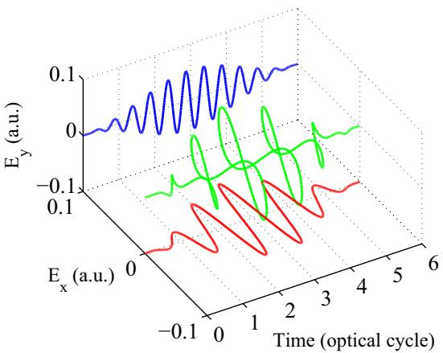
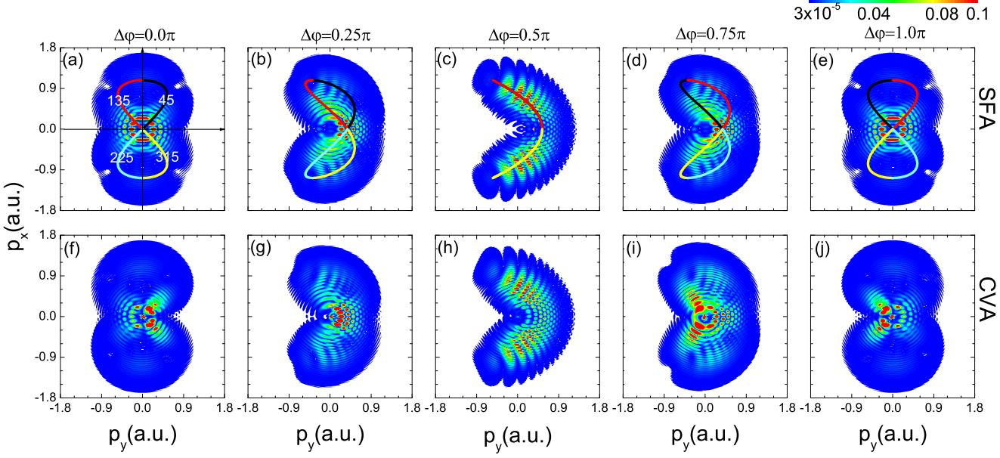
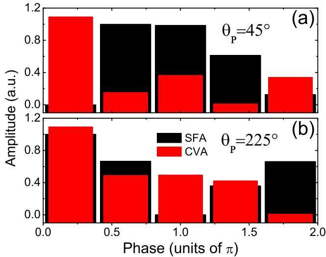
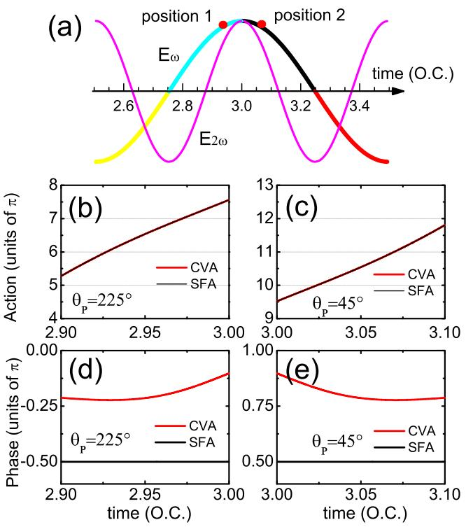
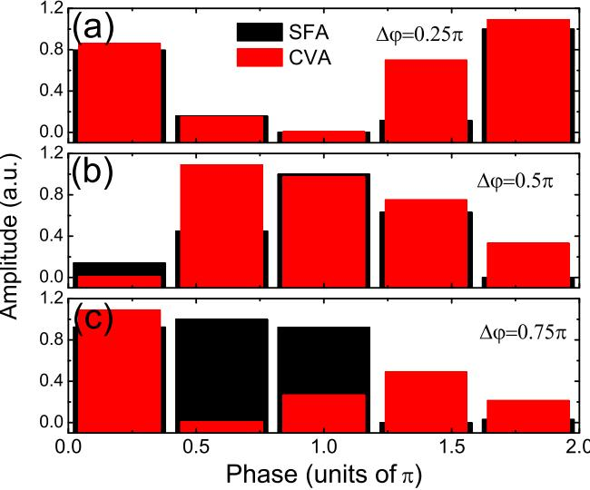

# **正交双色激光场中库仑效应对光电子动量分布的影响**

余少刚1,2 王彦岚1,2 赖宣阳1,* 黄一艺1,2 全威1 刘小军1,†  
1*中国科学院武汉物理与数学研究所，磁共振与原子分子物理国家重点实验室，武汉 430071*  
2*中国科学院大学，北京 100049*  
(2016年5月4日收稿；2016年9月21日发表)

我们采用库仑-沃尔科夫畸变波近似理论(CVA)研究了正交偏振双色脉冲作用下的电子动量分布，并通过对比CVA与强场近似(SFA)计算结果，重点分析了库仑势在电子动量分布中的作用。研究表明，相较于SFA模拟，CVA计算结果与实验观测及含时薛定谔方程(TDSE)数值解更为吻合。通过分析偶极矩相位发现，CVA中电子动量分布的变化可归因于不同相位库仑修正的差异：库仑势的存在一方面增强了前向再散射电子的贡献，另一方面削弱了直接电离电子的贡献。

DOI: [10.1103/PhysRevA.94.033418](http://dx.doi.org/10.1103/PhysRevA.94.033418)

#### **I. 引言**

飞秒强激光技术的重大进展为光与物质相互作用研究提供了全新视角。当原子或分子处于强激光场中时，其最外层束缚电子可能通过隧穿效应发生电离[1,2]。通过测量光电子动量分布，可在阿秒时间分辨率和埃空间分辨率下探索原子分子结构及动力学[3]。此外，不同隧穿电离时刻发射的电子波包会相互干涉[4]，在光电子动量分布中形成丰富的干涉图案。例如电子波包干涉产生的全息图[5,6]，可用于提取原子或分子介质的结构动力学信息。

近年来，通过激光场调制（如采用正交偏振双色场）实现原子电离控制的研究在强场物理领域备受关注。由基频激光场与其相位锁定的正交偏振二次谐波场构成的OTC脉冲[7]，可在二维偏振空间内解析和控制超快电子动力学。例如，OTC脉冲已被用于：切换短/长量子轨道[8]；通过分析高次谐波谱探测原子波函数[9]和分子轨道[10,11]；控制非序列双电离中的电子关联动力学[12,13]；产生单个阿秒脉冲[14,15]和椭圆偏振高次谐波[16]。最近，OTC脉冲还被提出用于调控光电子动量谱中的干涉条纹[17]。如Richter等[18]实验证明，通过改变OTC脉冲相对相位，可使不同时刻释放的电子波包轨迹沿相同（相反）方向偏转，从而导致电子动量分布中出现（消失）干涉条纹。

值得注意的是，传统OTC脉冲中二次谐波场强度通常远弱于基频场。因此原子电离率主要由基频场决定，而附加的二次谐波场仅温和调控二维偏振空间中的电子波包动力学。近年来，具有相等峰值强度的OTC场在强场电离研究中引起广泛关注。例如，张等[19]实验发现，等强度OTC脉冲产生的电子动量分布会随相对相位发生显著变化。谢[20]则通过理论分析动量分布中的丰富干涉图案，获得了原子价电子动力学的精确信息。最近，耿等[21]从理论上研究了强度相当的OTC脉冲中的非绝热亚周期电子动力学。

定性而言，等强度OTC脉冲产生的电子动量分布可用强场近似(SFA)理论解释，该理论忽略了离子库仑势对光致电离电子的影响[22,23]。但更细致的观察表明，在某些OTC相对相位下，SFA模拟与实验观测存在显著差异。例如，某相对相位下SFA模拟显示的X形中心结构，在实验和TDSE数值解中表现为特定V形结构[19]。根据半经典方法，这种差异源于库仑场对激光场中电子动力学的影响[19,24,25]。然而，库仑势如何导致OTC脉冲中光电子动量谱变化仍不清楚。

近期，一种改进的SFA理论——库仑-沃尔科夫畸变波近似(CVA)[26]被用于探索原子电离中的库仑效应。该理论采用包含库仑修正的库仑-沃尔科夫态（而非SFA中的沃尔科夫态）描述电离电子的连续态。例如，CVA成功模拟了二维光电子角分布阈值区花束状结构，与TDSE计算结果高度一致[27]，表明CVA中与光电子发射角相关的库仑修正至关重要。此外，横向电子动量分布中的尖点结构也在CVA模拟中得到很好再现[27]，

*xylai@wipm.ac.cn  
†xjliu@wipm.ac.cn  

这种效应归因于离子库仑势的吸引作用，也称为库仑聚焦。

本文通过CVA理论研究了等强度正交双色激光场（OTC）产生的电子动量分布，重点阐明了库仑势在电子动量分布中的作用。结果表明，与SFA模拟相比，CVA模拟的电子动量分布与实验观测和TDSE计算结果更为吻合。例如，OTC脉冲相对相位φ=0时，光电子动量分布中的V形结构在CVA模拟中得到准确再现[19]。通过分析偶极矩相位发现，CVA中电子动量分布的变化可归因于前向再散射电子与直接电子所经历的相位库仑修正差异[22,23]。这些相位库仑修正一方面增强了前向再散射电子的贡献，另一方面削弱了库仑势存在时直接电子的贡献。

论文结构如下：第二节简要介绍SFA和CVA理论；随后展示OTC脉冲不同相对相位下电子动量分布的SFA与CVA模拟，并通过偶极矩相位分析揭示库仑效应的影响机制；最后第四节给出结论。全文采用原子单位制（a.u.）除非特别说明。

#### **II. 理论方法**

#### **A. SFA理论**

在SFA理论中，束缚电子从初始态|ψ₀⟩跃迁至末态动量**p**的Volkov态|ψᵥ**p**⟩的跃迁振幅可表示为[28–31]：

$$M_{\mathbf{p}} = -i \int_{-\infty}^{\infty} dt \langle \psi_{\mathbf{p}}^{\mathrm{V}}(t) | \mathbf{r} \cdot \mathbf{E}(t) | \psi_{0}(t) \rangle \tag{1}$$

其中Volkov态波函数为：

$$\begin{split} \psi_{\mathbf{p}}^{\mathrm{V}}(t) &= \frac{\exp\left\{i[\mathbf{p} + \mathbf{A}(t)] \cdot \mathbf{r}\right\}}{(2\pi)^{3/2}} \\ &\times \exp\left\{-i \int_{t}^{\infty} dt' \frac{[\mathbf{p} + \mathbf{A}(t')]^2}{2}\right\}, \end{split} \tag{2}$$

**A**(t)表示激光场的矢势，**r**·**E**(t)为长度规范下的激光场-电子相互作用项。将式(2)代入式(1)，跃迁振幅可改写为：

$$M_{\mathbf{p}} = -i \int_{-\infty}^{\infty} dt \, \exp\left[i S(\mathbf{p}, t)\right] \langle \mathbf{p} + \mathbf{A}(t)|\mathbf{r} \cdot \mathbf{E}(t)|\psi_0(r)\rangle,\quad(3)$$

其中半经典作用量为：

$$S(\mathbf{p}, t) = -\frac{1}{2} \int_{t}^{\infty} dt' [\mathbf{p} + \mathbf{A}(t')]^2 + I_p t$$

$$= \left(\frac{\mathbf{p}^2}{2} + I_p\right) t - \mathbf{p} \cdot \int_{t}^{\infty} dt' \mathbf{A}(t')$$

$$-\frac{1}{2} \int_{t}^{\infty} dt' [\mathbf{A}(t')]^2 \tag{4}$$

Iₚ表示原子的电离势。本文研究氢原子在等强度OTC激光脉冲中的电离过程，其基态波函数ψ₀(r)=e⁻ʳ/√4π，Iₚ=0.5 a.u.。此时式(3)中的形状因子可表示为[32]：

$$i\langle \mathbf{p} + \mathbf{A}(t) | \mathbf{r} \cdot \mathbf{E}(t) | \psi_0(r) \rangle = -i \frac{2^{7/2} (2I_p)^{5/4} [\mathbf{p} + \mathbf{A}(t)] \cdot \mathbf{E}(t)}{\pi \{ [\mathbf{p} + \mathbf{A}(t)]^2 + 2I_p \}^3} \,. \tag{5}$$

需注意该形状因子为纯虚数。最终光电子在OTC驱动场偏振平面内的双微分动量分布为：

$$\frac{d^2P(p_x, p_y)}{dp_x dp_y} = |M_\mathbf{p}|^2,\tag{6}$$

其中pₓ和p_y分别表示基频场与二次谐波场偏振方向的末态动量。

## **B. CVA理论**

在CVA理论中[26]，用库仑-Volkov态取代式(1)中的Volkov态：

$$M_{\mathbf{p}}^{\rm CVA} = -i \int_{-\infty}^{\infty} dt \langle \psi_{\mathbf{p}}^{\rm CV}(t) | \mathbf{r} \cdot \mathbf{E}(t) | \psi_0(t) \rangle,\tag{7}$$

库仑-Volkov态由库仑波与Volkov型态相乘构成[33–35]：

$$\psi_{\mathbf{p}}^{\rm CV}(\mathbf{r},t) = D_c(Z_T, \mathbf{p}, \mathbf{r}) \times \frac{\exp\left\{i[\mathbf{p} + \mathbf{A}(t)] \cdot \mathbf{r}\right\}}{(2\pi)^{3/2}}$$

$$\times \exp\left\{-i \int_t^\infty dt' \frac{[\mathbf{p} + \mathbf{A}(t')]^2}{2}\right\}. \qquad (8)$$

出射库仑波定义为：

$$D_c(Z_T, \mathbf{p}, \mathbf{r}) = N_T^-(p)_1 F_1(-iZ_T, 1, -ipr - i\mathbf{p} \cdot \mathbf{r}), \quad (9)$$

其中N⁻_T(p)=exp(πZ_T/2p)Γ(1+iZ_T/p)为包含欧拉Γ函数的库仑归一化因子，₁F₁表示合流超几何函数，Z_T为原子核电荷数。当Z_T=0时，式(8)的库仑-Volkov态退化为式(2)的Volkov函数。将式(8)代入式(7)，CVA跃迁振幅可改写为：

$$M_{\mathbf{p}}^{\rm CVA} = -i \int_{-\infty}^{\infty} dt \, \exp\left[i S(\mathbf{p}, t)\right] F(\mathbf{p}, t), \qquad (10)$$

形状因子F(**p**,t)=⟨**p**+**A**(t)|D_c(Z_T,**p**,**r**)×**r**·**E**(t)|ψ₀(r)⟩。值得注意的是，CVA与SFA的作用量表达式相同，但CVA通过引入库仑波改进了形状因子。

计算中采用正弦平方包络的OTC脉冲电场：

$$\mathbf{E}(t) = E_0 \sin^2\left(\frac{\omega t}{2N_C}\right) [\cos\omega t \mathbf{\hat{e}}_x + \cos(2\omega t + \Delta\varphi) \mathbf{\hat{e}}_y], \tag{11}$$

其中E₀为峰值强度，ω为基频激光中心频率，Δφ为OTC脉冲相对相位，N_C表示从t=0到T=(2π/ω)N_C时间内激光脉冲包含的光学周期数，**ê**_x和**ê**_y分别为基频场与二次谐波场的单位偏振矢量。图1展示了根据式(11)绘制的相对相位φ=0.5π时OTC激光脉冲电场示意图，其中红色与蓝色曲线分别表示基频场及其二次谐波场，绿色曲线为三维形式的总电场。

图1. 根据式(11)绘制的相对相位φ=0.5π时OTC激光脉冲电场示意图。红色与蓝色曲线分别表示基频场及其二次谐波场，绿色三维曲线表示合成总电场。C激光脉冲参数：*ϕ* = 0.5π，*NC* = 6，*ω* = 0.05 a.u.，*E*0 = 0.054 a.u.

### **III. 结果与讨论**

图2(a)-(e)展示了氢原子在SFA模拟中的二维光电子动量分布，其分布形态随等强度OTC脉冲相对相位*ϕ*的变化而显著改变。例如，当*ϕ*=0时，电子动量分布呈现X形中心结构；随着相对相位增大，动量分布逐渐畸变并在*ϕ*=0.5π时分裂为两部分；当*ϕ*增至0.75π时，其分布与*ϕ*=0.25π时相同；而*ϕ*=π时动量分布再次呈现X形中心结构。这些电子动量分布随相对相位的变化趋势与"简人模型"**p** = −**A**(*t*)的预测[19]（各子图中彩色曲线所示）定性吻合。

另一方面，图2(f)-(j)展示了对应相位下考虑库仑势的CVA模拟结果。定性来看，CVA与SFA模拟的光电子动量分布具有相似性，但更细致的观察发现：当考虑库仑势作用时，某些相对相位下的分布会出现显著变化。例如*ϕ*=0时，SFA中的X形中心结构在CVA中转变为特定V形结构；*ϕ*=0.75π时动量分布左侧出现明显V形结构；*ϕ*=π时的分布虽与*ϕ*=0时形态相同，但V形结构转移至左侧。这些CVA模拟结果与文献[19]的实验观测及TDSE模拟高度一致，证实了库仑势在原子电离过程中的重要作用。

显然，CVA与SFA模拟结果的差异直接源于跃迁振幅的不同。为理解库仑势对动量分布的影响机制，我们分别对两种理论中的跃迁振幅进行分析。根据公式(1)和(7)，跃迁振幅包含对偶极矩*D*(**p***,t*)的时间积分，其物理本质是不同电离时刻电子波包的相干叠加[2]。我们首先以0.15 a.u.动量的电子为例（发射方向分别为相对于*py*轴45°和225°，参见图2(a)中标注），展示了*ϕ*=0时OTC脉冲下两类电子的偶极矩相位空间分布（图3）。与SFA相比，CVA中45°方向电子的偶极矩分布更集中于0.2π相位附近，而225°方向电子的分布则略微弥散。这种差异导致45°方向电子波包的相干叠加增强，而225°方向贡献受到抑制，与图2(f)的CVA模拟结果一致。类似现象也存在于315°与135°方向电子中，最终使得SFA中的X形结构在CVA中转变为V形结构。

为深入探究库仑势对两类电子跃迁振幅的不同影响，我们进一步解构偶极矩*D*(**p***,t*)（公式(10)）的作用量*S*(**p***,t*)和形状因子*F*(**p***,t*)分量。根据"简人模型"[22,23]，225°方向电子主要来源于位置1附近电离的波包（图4(a)），而45°方向电子则主要来自位置2附近。因此我们分别选取2.9-3光学周期和3-3.1光学周期的时间区间来分析两类电子的偶极矩特性（图4(b)和4(c)）。

图2. 等强度OTC激光脉冲偏振平面内氢原子的二维光电子动量分布，相对相位分别为*ϕ* = 0, 0.25π, 0.5π, 0.75π, π。(a)-(e) SFA模拟，(f)-(j) CVA模拟。(a)-(e)中彩色曲线表示不同基频激光场周期下的矢量势，图(a)中数字表示电子相对于*py*轴的发射方向。

图3. *ϕ*=0时OTC脉冲下偶极矩在[0,2π]相位空间的分布：(a) *p*=0.15 a.u.，*θp*=45°的光电子；(b) *p*=0.15 a.u.，*θp*=225°的光电子。红色与黑色柱状图分别对应CVA和SFA结果，振幅已归一化处理。在图表[4(c)](#page-4-0)中，我们展示了两个电子（最终动量p=0.15原子单位，分别沿与py轴成225°和45°方向）的作用量S(p,t)随时间变化曲线。显然，作用量值随时间持续增长，这是因为S(p,t)≈(p²/2+Ip)t[见公式(4)]。由于CVA与SFA理论中作用量公式相同，两条曲线完全重合。另一方面，图[4(d)](#page-4-0)和[4(e)](#page-4-0)还展示了两个电子的形状因子相位随时间变化：SFA理论中公式(5)的形状因子为纯虚数，相位恒定；而CVA模拟中的相位显著偏离SFA结果，且关键的是其相位变化具有时间依赖性。这一现象源于不同电离时间的电子轨迹在库仑势场中积累了不同相位贡献[36]。

图4. (a)相对相位φ=0的OTC脉冲电场。为便于观察，将两个正交分量平行绘制。彩色曲线表示基频激光场不同象限对应的脉冲电场。(b,c)分别对应θp=225°和θp=45°电子（动量p=0.15原子单位）的作用量S(p,t)随时间变化。注意SFA（黑线）与CVA（红线）曲线完全重合。(d,e)两个电子形状因子相位随时间变化。

进一步观察发现，当时间接近3个光学周期时，CVA中形状因子相位变化更为显著。这可能是因为随着激光电场幅值增大[图4(a)]，强场中电子的隧穿出口更接近原子核[1]，导致相位库仑修正增强。因此，对于θp=225°的电子，由于相位库仑修正，其偶极矩最终相位（作用量与形状因子相位之和）随时间加速增长；而θp=45°电子的偶极矩相位变化相对平缓。这导致前者的相空间分布更为弥散，后者更为集中，与图[3](#page-3-0)的模拟结果定性一致。值得注意的是，根据简曼模型[22,23]，θp=45°电子属于前向再散射电子（被探测器检测前会返回核区），而θp=225°电子为直接电离电子。因此我们的工作表明：库仑势存在时，前向再散射贡献增强而直接电离贡献减弱，这与传统OTC脉冲[17]和长脉冲[36]中不同理论模型的计算结果一致。

图5. 与图[3](#page-3-0)条件相同，但针对沿py轴120°方向、动量p=0.5原子单位的电子。OTC脉冲相对相位分别为φ=0.25π(a)、0.5π(b)、0.75π(c)。

此外，图5(a)-5(c)还展示了φ=0.25π、0.5π和0.75π时OTC脉冲的相空间偶极矩分布。以120°方向的0.5原子单位光电子为例：图5(c)显示当φ=0.75π时，CVA中偶极矩分布（相位约0.2π附近）比SFA更集中。这是因为该电子属于前向再散射电子[22,23]，库仑势对偶极矩相位的修正使其分布集中，导致电离幅度增大。图[2(i)](#page-2-0)中电子动量分布左侧出现的明显V型结构，与实验观测和TDSE模拟[19]高度吻合。而对于φ=0.25π和0.5π的情况，简曼模型表明这两个电子轨迹直接飞向探测器，因此考虑库仑相位修正后，CVA的相空间分布相对弥散（图5(a)(b)），导致图[2(g)](#page-2-0)和[2(h)](#page-2-0)中电离幅度轻微下降。

## **四、结论**

我们通过CVA理论研究了等强度OTC脉冲产生的电子动量分布，重点分析了库仑势的作用。结果表明：相较于SFA模拟，CVA计算结果与实验观测及TDSE模拟更吻合。通过分析偶极矩相位发现，动量分布的变化源于不同的相位库仑修正——这导致库仑势存在时前向再散射电子贡献增强而直接电离电子贡献减弱。本研究为强场原子过程中库仑效应的定性描述提供了一种无需求解TDSE的便捷方法。

## **致谢**

感谢陈静和边学斌的有益讨论。本研究得到国家基础研究...（后续内容未完整提供）中国国家重点基础研究发展计划（973计划项目编号2013CB922201）和国家自然科学基金（项目编号11334009、11374329、11304365、11474321）资助。

- [1] L. V. Keldysh, Zh. Eksp. Teor. Fiz. **47**, 1945 (1964) [Sov. Phys. JETP **20**, 1307 (1965)].
- [2] W. Becker, F. Grasbon, R. Kopold, D. B. Milošević, G. G. Paulus, 和 H. Walther, [Adv. At. Mol. Phys.](http://dx.doi.org/10.1016/S1049-250X(02)80006-4) **[48](http://dx.doi.org/10.1016/S1049-250X(02)80006-4)**, [35](http://dx.doi.org/10.1016/S1049-250X(02)80006-4) [(2002)](http://dx.doi.org/10.1016/S1049-250X(02)80006-4).
- [3] M. Meckel等, [Science](http://dx.doi.org/10.1126/science.1157980) **[320](http://dx.doi.org/10.1126/science.1157980)**, [1478](http://dx.doi.org/10.1126/science.1157980) [(2008)](http://dx.doi.org/10.1126/science.1157980).
- [4] F. Lindner等, [Phys. Rev. Lett.](http://dx.doi.org/10.1103/PhysRevLett.95.040401) **[95](http://dx.doi.org/10.1103/PhysRevLett.95.040401)**, [040401](http://dx.doi.org/10.1103/PhysRevLett.95.040401) [(2005)](http://dx.doi.org/10.1103/PhysRevLett.95.040401).
- [5] Y. Huismans等, [Science](http://dx.doi.org/10.1126/science.1198450) **[331](http://dx.doi.org/10.1126/science.1198450)**, [61](http://dx.doi.org/10.1126/science.1198450) [(2011)](http://dx.doi.org/10.1126/science.1198450).
- [6] X. B. Bian 和 A. D. Bandrauk, [Phys. Rev. Lett.](http://dx.doi.org/10.1103/PhysRevLett.108.263003) **[108](http://dx.doi.org/10.1103/PhysRevLett.108.263003)**, [263003](http://dx.doi.org/10.1103/PhysRevLett.108.263003) [(2012)](http://dx.doi.org/10.1103/PhysRevLett.108.263003).
- [7] M. Kitzler 和 M. Lezius, [Phys. Rev. Lett.](http://dx.doi.org/10.1103/PhysRevLett.95.253001) **[95](http://dx.doi.org/10.1103/PhysRevLett.95.253001)**, [253001](http://dx.doi.org/10.1103/PhysRevLett.95.253001) [(2005)](http://dx.doi.org/10.1103/PhysRevLett.95.253001).
- [8] L. Brugnera等, [Phys. Rev. Lett.](http://dx.doi.org/10.1103/PhysRevLett.107.153902) **[107](http://dx.doi.org/10.1103/PhysRevLett.107.153902)**, [153902](http://dx.doi.org/10.1103/PhysRevLett.107.153902) [(2011)](http://dx.doi.org/10.1103/PhysRevLett.107.153902).
- [9] D. Shafir等, [Nat. Phys.](http://dx.doi.org/10.1038/nphys1251) **[5](http://dx.doi.org/10.1038/nphys1251)**, [412](http://dx.doi.org/10.1038/nphys1251) [(2009)](http://dx.doi.org/10.1038/nphys1251).
- [10] H. Niikura等, [Phys. Rev. Lett.](http://dx.doi.org/10.1103/PhysRevLett.105.053003) **[105](http://dx.doi.org/10.1103/PhysRevLett.105.053003)**, [053003](http://dx.doi.org/10.1103/PhysRevLett.105.053003) [(2010)](http://dx.doi.org/10.1103/PhysRevLett.105.053003); H. Niikura等, *[ibid.](http://dx.doi.org/10.1103/PhysRevLett.107.093004)* **[107](http://dx.doi.org/10.1103/PhysRevLett.107.093004)**, [093004](http://dx.doi.org/10.1103/PhysRevLett.107.093004) [(2011)](http://dx.doi.org/10.1103/PhysRevLett.107.093004).
- [11] H. Yun等, [Phys. Rev. Lett.](http://dx.doi.org/10.1103/PhysRevLett.114.153901) **[114](http://dx.doi.org/10.1103/PhysRevLett.114.153901)**, [153901](http://dx.doi.org/10.1103/PhysRevLett.114.153901) [(2015)](http://dx.doi.org/10.1103/PhysRevLett.114.153901).
- [12] Y. M. Zhou等, [Opt. Express](http://dx.doi.org/10.1364/OE.19.002301) **[19](http://dx.doi.org/10.1364/OE.19.002301)**, [2301](http://dx.doi.org/10.1364/OE.19.002301) [(2011)](http://dx.doi.org/10.1364/OE.19.002301).
- [13] L. Zhang等, [Phys. Rev. Lett.](http://dx.doi.org/10.1103/PhysRevLett.112.193002) **[112](http://dx.doi.org/10.1103/PhysRevLett.112.193002)**, [193002](http://dx.doi.org/10.1103/PhysRevLett.112.193002) [(2014)](http://dx.doi.org/10.1103/PhysRevLett.112.193002).
- [14] C. M. Kim, I. J. Kim, 和 C. H. Nam, [Phys. Rev. A](http://dx.doi.org/10.1103/PhysRevA.72.033817) **[72](http://dx.doi.org/10.1103/PhysRevA.72.033817)**, [033817](http://dx.doi.org/10.1103/PhysRevA.72.033817) [(2005)](http://dx.doi.org/10.1103/PhysRevA.72.033817).
- [15] Y. L. Yu等, [Opt. Express](http://dx.doi.org/10.1364/OE.16.000686) **[16](http://dx.doi.org/10.1364/OE.16.000686)**, [686](http://dx.doi.org/10.1364/OE.16.000686) [(2008)](http://dx.doi.org/10.1364/OE.16.000686).
- [16] G. Lambert等, [Nat. Commun.](http://dx.doi.org/10.1038/ncomms7167) **[6](http://dx.doi.org/10.1038/ncomms7167)**, [6167](http://dx.doi.org/10.1038/ncomms7167) [(2015)](http://dx.doi.org/10.1038/ncomms7167).
- [17] M. Li等, [Phys. Rev. A](http://dx.doi.org/10.1103/PhysRevA.92.013416) **[92](http://dx.doi.org/10.1103/PhysRevA.92.013416)**, [013416](http://dx.doi.org/10.1103/PhysRevA.92.013416) [(2015)](http://dx.doi.org/10.1103/PhysRevA.92.013416).
- [18] M. Richter等, [Phys. Rev. Lett.](http://dx.doi.org/10.1103/PhysRevLett.114.143001) **[114](http://dx.doi.org/10.1103/PhysRevLett.114.143001)**, [143001](http://dx.doi.org/10.1103/PhysRevLett.114.143001) [(2015)](http://dx.doi.org/10.1103/PhysRevLett.114.143001).
- [19] L. Zhang等, [Phys. Rev. A](http://dx.doi.org/10.1103/PhysRevA.90.061401) **[90](http://dx.doi.org/10.1103/PhysRevA.90.061401)**, [061401(R)](http://dx.doi.org/10.1103/PhysRevA.90.061401) [(2014)](http://dx.doi.org/10.1103/PhysRevA.90.061401).
- [20] X. H. Xie, [Phys. Rev. Lett.](http://dx.doi.org/10.1103/PhysRevLett.114.173003) **[114](http://dx.doi.org/10.1103/PhysRevLett.114.173003)**, [173003](http://dx.doi.org/10.1103/PhysRevLett.114.173003) [(2015)](http://dx.doi.org/10.1103/PhysRevLett.114.173003).
- [21] J. W. Geng等, [Phys. Rev. Lett.](http://dx.doi.org/10.1103/PhysRevLett.115.193001) **[115](http://dx.doi.org/10.1103/PhysRevLett.115.193001)**, [193001](http://dx.doi.org/10.1103/PhysRevLett.115.193001) [(2015)](http://dx.doi.org/10.1103/PhysRevLett.115.193001).