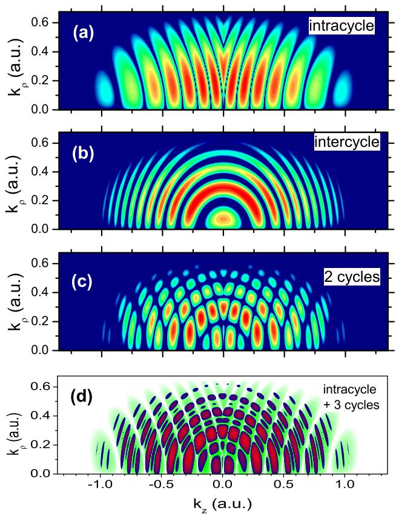
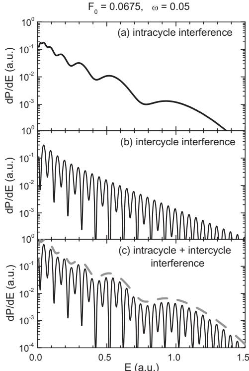
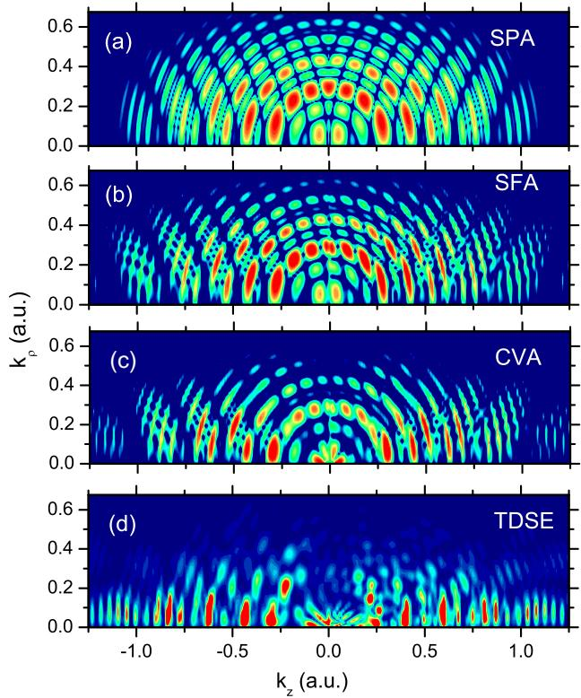
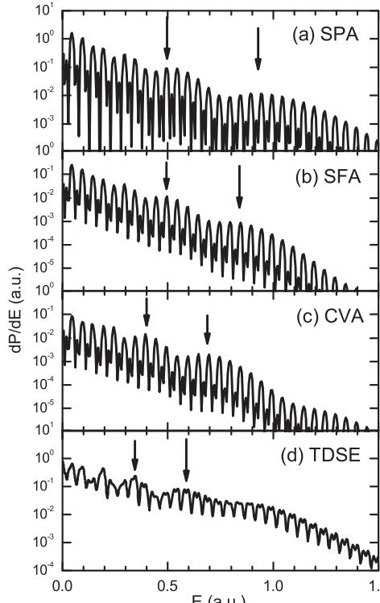
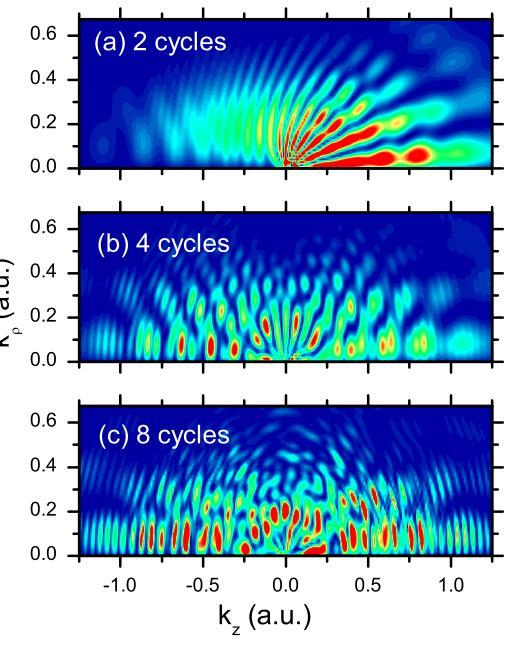
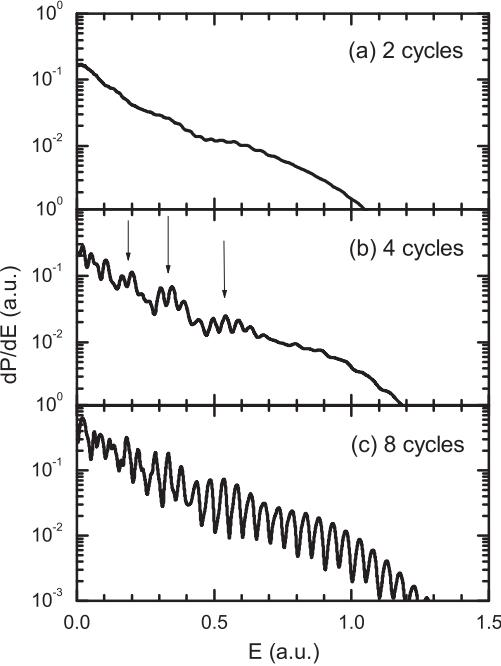

Contents lists available at [SciVerse ScienceDirect](http://www.sciencedirect.com/science/journal/0168583X)

Nuclear Instruments and Methods in Physics Research B

journal homepage: [www.elsevier.com/locate/nimb](http://www.elsevier.com/locate/nimb)

# Doubly differential diffraction at a time grating in above-threshold ionization: Intracycle and intercycle interferences

Diego G. Arbó a,⇑ , Kenichi L. Ishikawa b , Emil Persson c , Joachim Burgdörfer c

a Institute for Astronomy and Space Physics, IAFE (CONICET-UBA), CC 67, Suc. 28 (1428) Buenos Aires, Argentina

b Photon Science Center, Graduate School of Engineering, University of Tokyo, Hongo 7-3-1, Bunkyo-ku, Tokyo 113-8656, Japan

c Institute for Theoretical Physics, Vienna University of Technology, Wiedner Hauptstraß e 8-10/136, A-1040 Vienna, Austria

# article info

Article history: Available online 17 November 2011

Keywords: Intracycle interference Short-laser pulse Above-threshold ionization

## abstract

We analyze the doubly differential electron distribution in atomic above-threshold ionization by a linearly-polarized short-laser pulse. We generalize the one-dimensional (1D) simple man's model (SMM) of Arbó et al. [\[19\],](#page-6-0) to a three dimensional (3D) description by using the saddle-point approximation (SPA). We prove that the factorization of the photoelectron spectrum_calculator in terms of intracycle and intercycle interference patterns can be extended to the doubly differential momentum distribution. Intercycle interference corresponds to the well-known ATI peaks of the photoelectron spectrum_calculator arising from the superposition of electron trajectories released at complex times during different optical cycles, whereas intracycle interference comes from the coherent superposition of trajectories released within the same optical cycle. We verify the SPA predictions by comparison with time-dependent distorted wave calculations and the solutions of the full 3D time-dependent Schrödinger equation (TDSE). An analytical expression for the complete interference pattern within the SPA is presented showing excellent agreement with the numerical calculations. We show that the recently proposed semiclassical description based on the SMM in terms of a diffraction process at a time grating remains unchanged when considering the full 3D problem within the SPA.

> -2011 Elsevier B.V. All rights reserved.

## 1. Introduction

According to the three-step model, photoelectrons can be classified into direct and rescattered electrons [\[1–3\].](#page-6-0) Electrons are emitted by tunneling through the potential barrier formed by the combination of the atomic potential and the external strong field. Tunneling occurs within each optical cycle predominantly around the maxima of the absolute value of the electric field. After ionization, direct electrons can escape without being strongly affected by the residual core potential. The classical cutoff energy for this process is 2Up. After being accelerated back by the laser field, a small portion of electrons are rescattered by the parent ion and can achieve a kinetic energy E of up to 10Up. Trajectories that correspond to direct ionization ðE < 2UpÞ are crucial in the formation of interference patterns in photoelectron spectra. Quantum interference within an optical cycle was first reported (as far as we know) in Ref. [\[4\]](#page-6-0) and theoretically analyzed and experimentally observed by Paulus et al. in [\[5\]](#page-6-0) both for negative ions. A thorough saddle-point analysis with the strong field approximation can be found in Becker's review [\[6\]](#page-6-0). Non-equidistant peaks in the photoelectron spectrum_calculator was first calculated for neutral atoms by Chirila et al. [\[7\]](#page-6-0). A temporal double-slit interference pattern has been studied in near-single cycle pulses both experimentally [\[8,9\]](#page-6-0) and theoretically [\[6,10\]](#page-6-0). A time-energy analysis of above-threshold ionization has recently been presented [\[11\]](#page-6-0). Near threshold oscillations in angular distribution were explained as interferences of electron trajectories [\[12\]](#page-6-0) and recently measured by [\[13\].](#page-6-0) Diffraction fringes have been experimentally observed in photoionization of He atoms [\[9\]](#page-6-0) and photodetachment in H and [\[14,15\]](#page-6-0) F ions by femtosecond pulses for fixed frequency [\[16\]](#page-6-0) and theoretically analyzed [\[17\].](#page-6-0) Diffraction patterns were also found in spectra of laser-assisted Auger decay, whose gross structure of sidebands were explained as the interference between electrons emitted within one period [\[18\].](#page-6-0) The interference pattern in multi-cycle photoelectron spectra can be identified as a diffraction pattern at a time grating composed of intracycle and intercycle interferences [\[17,19\]](#page-6-0). While the latter gives rise to the well-known ATI peaks [\[20–22\],](#page-6-0) the former leads to a modulation of the ATI spectrum_calculator offering information on the sub-cycle ionization dynamics. This analysis was based on a 1D semiclassical model closely following the ''simple man's model'' (SMM). As a thorough study of the full doubly differential distributions is not possible within a 1D model, a theory which considers the full spatial dimensions of the atomic photoionization is needed to identify the different interference processes involved.

In the present communication, we extend our previous analysis to three-dimensional momentum distribution. We show that the description in terms of a time grating remains valid for the doubly differential momentum distribution of ejected electrons by using the saddle-point approximation (SPA) where complex release times replace the SMM real release times. An analytical expression for the doubly differential momentum distribution within the SPA is found, extending the previous semiclassical 1D SMM expression [\[19\]](#page-6-0) to 3D. We gauge the SPA results by comparison with numerical results of the 3D time-dependent distorted wave Coulomb–Volkov approximation (CVA), its strong field approximation (SFA) [\[3,7,23,25,26\]](#page-6-0) and solutions of the full time-dependent Schrödinger equation (TDSE). In addition to flat-top pulses providing us with a clear physical picture, we also analyze the cases of more realistic pulse shapes from an experimental viewpoint.

The paper is organized as follows. In Section 2 we extend the previously presented semiclassical analysis [\[19\]](#page-6-0) and show that the separation of intracycle and intercycle interferences and, thus, the interpretation of the interference pattern in terms of a diffraction at a time grating remains intact when studying the doubly differential distributions within the SPA. In Section [3,](#page-3-0) we compare quantum mechanical methods, i.e., SFA, CVA, and the exact numerical solution of the full time-dependent Schrödinger equation (TDSE) with the prediction of the SPA and discuss similarities and differences, paying special attention on the effect of the ionic Coulomb potential of the core on the momentum distribution of the escaping electron.

#### 2. Theory

We consider an atom in the single active electron approximation interacting with a linearly polarized laser field ~FðtÞ. The Hamiltonian of the system in the length gauge is

$$H = \frac{\vec{p}^2}{2} + V(\mathbf{r}) + \vec{r} \cdot \vec{F}(\mathbf{t}),\tag{1}$$

where VðrÞ is the atomic central potential and ~p and ~r are the momentum and position of the electron, respectively. The term ~r ~F ðtÞ couples the initial state j/ii to the continuum final state j/fi with momentum ~k and energy E ¼ k 2 =2. The TDSE for the Hamiltonian of Eq. (1) governs the evolution of the electronic state j wðtÞi. We calculate the photoelectron momentum distributions as

$$\frac{d\mathbf{P}}{d\vec{k}} = |\;T_{\vec{y}}\|^2,\tag{2}$$

where Tif is the T-matrix element corresponding to the transition /i ! /f .

While a small fraction of photoelectrons undergoes rescattering by the remaining ion, here we consider only direct photoelectrons (with energies E < 2Up), which dominate the total ionization yield. To deal with interference signatures within the strong field approximation, we closely follow the ''saddle-point approximation'' (SPA) [\[7,24,26,3\]](#page-6-0).

A starting point is the saddle-point approximation of the SFA, which leads to a transition amplitude from the initial state of energy -Ip to the continuum state [\[3\]](#page-6-0)

$$T_{\vec{\mathbb{M}}}(\vec{k}) = -\sum_{i=1}^{M} \mathcal{G}\left(\mathbf{t}_{r}^{(i)}, \vec{k}\right) \ \mathbf{e}^{i\mathcal{S}\left(\mathbf{t}_{r}^{(i)}\right)}.\tag{3}$$

Here, M is the number of trajectories born at ionization times t ðiÞ r and reaching a given final momentum ~k, and Gðt ðiÞ r ; ~kÞ is the ionization amplitude,

$$\mathbf{G}\left(\mathbf{t}_r^{(i)},\vec{k}\right) = \left[\frac{2\pi i \mathbf{F}\left(\mathbf{t}_r^{(i)}\right)}{\left|\vec{k} + \vec{\mathcal{A}}\left(\mathbf{t}_r^{(i)}\right)\right|}\right]^{1/2} \mathbf{d}^*\left(\vec{k} + \vec{\mathcal{A}}\left(\mathbf{t}_r^{(i)}\right)\right),\tag{4}$$

where d ð~vÞ is the dipole element of the bound-continuum transition. In Eq. (3), S is given by the Volkov action [\[27\]](#page-6-0)

$$S(\mathbf{t}) = -\int_{t}^{\infty} d\mathbf{t}' \left[ \frac{(\vec{\mathbf{k}} + \vec{\mathbf{A}}(\mathbf{t}'))^2}{2} + I_P \right]. \tag{5}$$

where ~AðtÞ¼- R t -1 dt0 ~Fðt 0 Þ is the vector potential of the laser field divided by the speed of light. In Eqs. (3) and (5) the influence of the atomic core potential on the continuum state of the receding electron is neglected and, therefore, the momentum distribution is a constant of motion after conclusion of the laser pulse. It is well known that the SFA fails to describe ionization for moderately weak fields as well as the slow electron yield even for strong fields [\[28,29\]](#page-6-0). Since the action does not contain contributions from the long-range Coulomb forces the ejected electron is subject to.

The release time t ðiÞ r of trajectory i is determined by the saddlepoint equation,

$$\frac{\partial \mathbf{S}(t')}{\partial t'}\Big|_{t'=t_r^{(i)}} = \frac{\left[\vec{k} + \vec{\mathcal{A}}(t_r^{(i)})\right]^2}{2} + I_p = \mathbf{0}.\tag{6}$$

yielding complex values since Ip > 0. The condition for different trajectories to interfere is to reach the same final momentum ~k to satisfy Eq. (6) with release times t ðiÞ r ði ¼ 1; 2; ... ; MÞ. In previous approaches like the SMM [\[19\],](#page-6-0) we approximated them by real values by setting Ip ¼ 0, arriving at ~k þ ~A tðiÞ r ¼ 0. In turn, in the present formulation (SPA) we will work with the complex times which are solution of Eq. (6). Whereas the interference condition involves the vector potential ~A, the electron trajectory is governed by the electrical field ~F. We now consider an infinite long periodic laser linearly polarized along the z axis whose laser field is

$$\vec{F}(\mathbf{t}) = F_0 \hat{\mathbf{z}} \sin(\alpha \mathbf{t}),\tag{7}$$

where F0 is the field amplitude. Accordingly, the vector potential is given by

$$
\vec{A}(\mathbf{t}) = \frac{F_0}{\alpha} \hat{\mathbf{z}} \cos(\alpha \mathbf{t}). \tag{8}
$$

As explained in Ref. [\[19\],](#page-6-0) there are two solutions of Eq. (6) per optical cycle. The first solution in the j-th cycle is given by

$$\mathbf{t}_r^{(j,1)} = \frac{2\pi(j-1)}{\alpha\nu} + \frac{1}{\alpha} \operatorname{arccos}[-\tilde{\kappa}],\tag{9}$$

where j~ denotes the complex final momentum defined by

$$
\tilde{\kappa} = \kappa_{\tilde{\pi}} + \dot{\mathfrak{l}}\sqrt{\gamma^2 + \kappa_{\rho}^2} \tag{10}
$$

and jz and jq are the cylindrical components of the dimensionless scaled final momentum of the electron ~j ¼ x~k=F0. In Eq. (10) c ¼ ffiffiffiffiffiffiffi 2Ip p x=F0 is the Keldysh parameter. The second solution fulfills

$$\mathbf{t}_r^{(j,2)} = \begin{cases} \frac{4\pi}{\alpha} \left( \dot{\mathbf{j}} - \frac{1}{2} \right) - \mathbf{t}_r^{(j,1)} & \text{if} \quad \kappa_z \gg \mathbf{0} \\\frac{4\pi}{\alpha} (\dot{\mathbf{j}} - \mathbf{1}) - \mathbf{t}_r^{(j,1)} & \text{if} \quad \kappa_z < \mathbf{0}. \end{cases} \tag{11}$$

The complex conjugates of release times of Eqs. (9) and (11) also satisfy Eq. (6). However the use of either t ðj;aÞ r or its complex conjugates ðt ðj;aÞ r Þ will result in the same interference pattern. Complex SPA release times of Eqs. (9) and (11) become the real release times fulfilling cosðxt ðj;aÞ r Þ¼j if we approximate j~ by jz (i.e., c ! 0 and jq ¼ 0) [\[19\].](#page-6-0) In Eqs. (9) and (11), t ðj;aÞ r with a ¼ 1ð2Þ denotes the early (late) release times within the j-th cycle. Real SMM release times are shown in [Fig. 1](#page-2-0). For finite pulse length and hence imperfect translation symmetry, the choice of the unit cell is not arbitrary. If we want to reproduce ionization from an infinite long pulse, we should preserve the __forward–backward symmetry of the momentum distribution. We have chosen the unit cell different for positive and negative longitudinal momenta kz. This is directly mirrored by

Fig. 1. Electric field F(t) (left axis) and vector potential A(t) (right axis) of a sine pulse. The electron emission times for a given final momentum k are marked by circles ðt ðj;1Þ r Þ and triangles ðt ðj;2Þ r Þ. Each optical cycle can be viewed as ''unit cell'' of the time lattice. To obtain a symmetric outcome, the ''unit cell'' is different for positive and negative values of the vector potential. Each pair of circle and triangle determines the structure factor F(k) and leads to intracycle interference while the periodic train of such pairs gives rise to intercycle interference.

Eq. [(11)](#page-1-0) and Fig. 1. Another possibility is to choose a unique family of unit cells whose edges coincide with the zeros of the vector potential. In turn, if we extend the sum [Eq. [(3)\]](#page-1-0) to M ! 1, the choice of the unit cell becomes arbitrary.

For a given value of ~k, the field strength for ionization at t ðj;aÞ r is independent of j and a, then F tðj;aÞ r ¼ F0 ffiffiffiffiffiffiffiffiffiffiffiffiffiffi 1 j~2 p . The ionization rate Cð ~kÞ ¼ G tðj;aÞ r ; ~k - 2 is identical for all subsequent ionization bursts (or trajectories) and, therefore, only a function of the time-independent final momentum ~k provided the ground-state depletion is negligible. As there are two interfering trajectories per cycle, the total number of interfering trajectories with final momentum ~k is M ¼ 2N, with N being the number of cycles involved in the laser pulse. Hence, the sum over interfering trajectories [Eq. [(3)](#page-1-0)] can be decomposed into those associated with two release times within the same cycle and those associated with release times in different cycles [\[19\].](#page-6-0) Consequently, the momentum distribution [Eq. [(2)\]](#page-1-0) can be written within the SPA as

$$\frac{d\boldsymbol{P}^{\rm SP}}{d\vec{k}} = \Gamma(\vec{k}) \left| \sum_{j=1}^{N} \sum_{x=1}^{2} \mathbf{e}^{i\mathbf{S}^{\rm SP}(t_r^{j(x)})} \right|^2,\tag{12}$$

where the second factor on the right hand side of Eq. (12) describes the interference of 2N trajectories with final momentum ~k, where t ðj;aÞ r is a function of ~k through Eqs. [(9) and (11)](#page-1-0).

The semi-classical action along one electron trajectory with release time t ðj;aÞ r can be calculated within the SPA from Eq. [(5)](#page-1-0) up to a constant,

$$\mathcal{L}^{\text{SP}}(\mathbf{t}_r^{(j,\pi)}) = 2\mathcal{U}_p \left[ \left( |\,\,\check{\kappa}|^2 + \frac{1}{2} \right) \mathbf{t}_r^{(j,\pi)} + \frac{\sin \left( 2\alpha \mathbf{t}_r^{(j,\pi)} \right)}{\mathbf{4}\alpha} + 2 \frac{\kappa_\pi}{\alpha} \sin \left( \alpha \mathbf{t}_r^{(j,\pi)} \right) \right], \tag{13}$$

where the ponderomotive energy is given by Up ¼ F2 0=4x2, and j j~j 2 ¼j ~jj 2 þ c2 [see Eq. [(10)](#page-1-0)]. The sum in Eq. (12) can be written as

$$\sum_{j=1}^{N} \sum_{x=1}^{2} \mathbf{e}^{j\mathbf{S}^{\mathbf{S}^{\mathbf{P}}}(t_r^{(\mathbf{s})})} = 2 \sum_{j=1}^{N} \mathbf{e}^{j\mathbf{S}_j^{\mathbf{S}^{\mathbf{P}}}} \cos\left(\frac{\Delta \mathbf{S}_j^{\mathbf{S}^{\mathbf{P}}}}{2}\right),\tag{14}$$

where SSP j ¼ SSP t ðj;1Þ r þ SSP t ðj;2Þ r h i=2 is the average action of the two trajectories released in cycle j, and DSSP j ¼ SSP t ðj;1Þ r - SSP t ðj;2Þ r is the accumulated action between the two release times t ðj;1Þ r and t ðj;2Þ r within the same j-th cycle. The underlying time structure is schematically illustrated in Fig. 1 within the SMM. There are two solutions of Eq. [(6)](#page-1-0) per optical cycle: the early release time t ðj;1Þ r , within the first half of the j-th cycle (marked with circles in Fig. 1), and the late release time t ðj;2Þ r , within the second half of the j-th cycle (marked with triangles in Fig. 1). The generalization to the SPA is straight_forward albeit its visualization is more difficult since all release times t ðj;aÞ r are complex. Within the SPA (and also the SMM [\[19\])](#page-6-0), the average action depends linearly on the cycle number j,

$$
\overline{\mathcal{S}}_j^{\text{op}} = \mathcal{S}_0 + j\overline{\mathcal{S}}, \tag{15}
$$

where S0 is a constant which will drop out when the absolute value of Eq. (14) is taken, and eS ¼ ð2p=xÞðE þ Up þ IpÞ. In turn, due to discrete translation invariance in the time domain ðt ! t þ 2jp=xÞ, the difference of the action DSSP j is a constant independent of the cycle number j, which can be expressed (dropping the subindex j) as

$$\Delta \mathbf{S}^{\rm SP} = \frac{-2\mathcal{U}_p}{\alpha \nu} \left[ (\mathbf{1} + \mathbf{2} |\bar{\kappa}|^2) \text{sgn}(\kappa_\mathbf{z}) \text{arcccos}(\text{sgn}(\kappa_\mathbf{z})|\bar{\kappa}) - (\mathbf{4}\kappa_\mathbf{z} - \bar{\kappa}) \sqrt{\mathbf{1} - \bar{\kappa}^2} \right], \tag{16}$$

where sgn denotes the sign function that accounts for positive and negative longitudinal momentum kz, as discussed before. Eq. (16) is a generalization of the SMM accumulated classical action of [\[19\]](#page-6-0) including now the electron momentum transverse to the polarization direction kq, within the SPA.

After some algebra, Eq. (12) can be rewritten as an equation of a diffraction grating of the form

$$\frac{d\mathbf{P}^{\rm sp}}{d\tilde{k}} = \mathbf{4} \,\Gamma(\tilde{k}) \underbrace{\cos^2\left(\frac{\Delta\mathbf{S}^{\rm sp}}{2}\right)}_{F(\tilde{k})} \underbrace{\left[\frac{\sin(N\bar{\mathbf{S}}/2)}{\sin(\bar{\mathbf{S}}/2)}\right]^2}_{B(k)},\tag{17}$$

where the interference pattern can be factorized into two contributions: (i) the interference stemming from a pair of trajectories within the same cycle (intracycle interference), governed by Fð ~kÞ, and (ii) the interference stemming from trajectories released at different cycles (intercycle interference) resulting in the well-known ATI peaks given by B(k) (see Ref. [\[30\]](#page-6-0)). The intracycle interference arises from the superposition of pairs of trajectories separated by a time slit Dt ¼ t ðj;1Þ r t ðj;2Þ r of the order of less than half a period of the laser pulse (see Fig. 1), i.e., RðDtÞ < p=x, giving access to emission time resolution of K1 fs (for near IR pulses), while the difference between t ðj;aÞ r and t ðjþ1;aÞ r is 2p=x, i.e., the optical period of the laser. It is worth to note that whereas the intracycle factor Fð ~kÞ depends on the angle of emission, the intercycle factor B(k) depends only on the absolute value of the final momentum (or energy). Eq. (17) is structurally equivalent to the intensity for crystal diffraction: the factor Fð ~kÞ represents the form (or structure) factor accounting for interference modulations due to the internal structure within the unit cell while the factor B(k) gives rise to Bragg peaks due to the periodicity of the crystal. Therefore, B(k) in Eq. (17) may be viewed as a diffraction grating in the time domain consisting of N slits, whereas Fð ~kÞ is the diffraction factor for each slit.

We will analyze in the following how the interplay between B(k) and Fð ~kÞ controls the doubly differential distribution of direct ATI electrons. First, we analyze the intracycle interference arising from the superposition of two trajectories released within the same optical cycle, i.e., a ¼ 1; 2 and N ¼ 1 in Eq. (12) or, equivalently, 4Cð ~kÞFð ~kÞ, since BðkÞ ¼ 1 in this case. We plot the doubly differential momentum distribution in [Fig. 2](#page-3-0)(a). The intracycle interference pattern gives approximately vertical stripes which bend as the transverse momentum grows. The stripes with higher longitudinal momenta are wider than the ones with lower longitudinal momenta. In order to analyze the intercycle interference, we isolate this interference pattern by setting the intracycle factor to be Fð ~kÞ ¼ 1 and N ¼ 2 in Eq. (17). The factor B(k) reduces to the two-slit Young interference expression BðkÞ ¼ 4 cos2½p=xðEþ Up þ IpÞ whose

Fig. 2. SPA doubly differential momentum distribution of Eq. [(17).](#page-2-0) (a) Intracycle interference: 4Cð ~kÞFð ~kÞ, (b) intercycle interference: 4Cð ~kÞBð ~kÞ for N ¼ 2, (c) total interference (intra- and intercycle interference): 4Cð ~kÞFð ~kÞBð ~kÞ for N ¼ 2, and (d) total interference for N ¼ 3 in dark gray (red and blue) superimposed to the intracycle interference pattern of (a) in light gray (green). The laser parameters are F0 ¼ 0:0675 and x ¼ 0:05. (For interpretation of the references to colour in this figure legend, the reader is referred to the web version of this article.)

maxima are centered at the ATI energies En ¼ nx - Up - Ip in agreement with the conservation of energy in the absorption of n photons. We plot the corresponding doubly differential momentum distribution in Fig. 2(b), where we can observe concentric rings with radii of kn ¼ ffiffiffiffiffiffiffiffi 2En p . The complete pattern stemming from all four interfering trajectories in a two-cycle pulse, the composition of the intracycle and intercycle interference patterns of Fig. 2(a and b) gives the momentum distribution of Fig. 2(c). The intercycle rings are modulated by the intracycle pattern (or vice versa). If we consider longer pulses, the intercycle factor B(k) will increase in contrast as N increases. For example, the ATI rings will become narrower and N - 2 secondary rings will appear between two consecutive principal ATI rings. This effect can be observed in Fig. 2(d) for N ¼ 3 cycles, where a secondary ring N - 2 ¼ 1 is visible. On the other side, the intracycle factor Fð ~kÞ is independent of the number of cycles N involved in the laser pulse and, in consequence, the intracycle interference pattern remains unchanged. This is observed in Fig. 2(d), where we have superimposed the doubly differential momentum distribution for N ¼ 3 cycles with the intracycle pattern of Fig. 2(a), showing that the intracycle modulation is the same for N = 1,2, and 3 cycles.

One of the questions that arises is how the interference pattern is mirrored in the photoelectron spectrum_calculator. In other words, does the factorization into intra- and intercycle interference survive in the energy distribution? From Ref. [\[19\]](#page-6-0) we know that within the 1D SMM the answer is affirmative. In order to calculate the photoelectron spectrum_calculator from our three-dimensional SPA, we need to integrate over the angle of emission h,

$$\frac{d\mathbf{P}}{d\mathbf{E}} = 2\pi\sqrt{2E} \int_{-1}^{1} \left(\frac{d\mathbf{P}}{d\vec{k}}\right) d(\cos\theta) = 8\pi\sqrt{2E}B(k) \int_{-1}^{1} \Gamma(\vec{k})\Gamma(\vec{k})d(\cos\theta). \tag{18}$$

In the last equation we have used Eq. [(17)](#page-2-0) and the fact that B(k) is only a function of the absolute value of the momentum ~k and becomes a constant factor outside the angular integral. The intercycle factor B(k) responsible for the ATI peaks will be modulated by the integral of Eq. (18). In Fig. 3(a) we show the photoelectron spectrum_calculator due to the interference of only two trajectories released within the same unit cell. In this case, only intracycle interference is present ðBðkÞ ¼ 1Þ. If we want to isolate the intercycle interference, we set Fð ~kÞ ¼ 1 in Eq. (18), which is shown in Fig. 3(b) for the case N ¼ 2. Thus, the factorization partially survives in the 3D SPA: whereas the intercycle interference is completely factorized in Eq. (18), the intracycle interference represented by the factor Fð ~kÞ is modulated by the ionization rate Cð ~kÞ. The whole photoelectron spectrum_calculator given by Eq. (18) is displayed in Fig. 3(c). We observe that the ATI peaks stemming from the intercycle interference is modulated by the intracycle interference pattern of Fig. 3(a). It is worth to point out that in low-energy resolution experiments ATI peaks will be mostly washed out and only the intracycle interference pattern will survive.

### 3. Probing the SPA

In order to probe the predictions of the SPA, we perform quantum calculations employing the time-dependent distorted wave theory in two variants: the Coulomb–Volkov approximation (CVA) and the strong field approximation (SFA) [\[23,25,3,7\]](#page-6-0) and also the numerical solution of the full TDSE for identical laser field parameters.

Fig. 3. SPA photoelectron spectrum_calculator of Eq. (18) showing (a) Intracycle interference: setting Bð ~kÞ ¼ 1, (b) intercycle interference: setting Fð ~kÞ ¼ 1, for N ¼ 2 cycles, and (c) total (intra- and intercycle) interference. In (c) we add the intracycle modulation (multiplied by 4) of (a).

Briefly, within the time-dependent distorted wave theory [\[31\],](#page-6-0) the transition amplitude in the post form is expressed as

$$T_{\circ} = -\mathrm{i} \int_{-\infty}^{+\infty} \mathrm{d}\mathbf{t} \,\left\langle \chi_{\bar{f}}^{-}(\mathbf{t}) | \mathbf{z}F(\mathbf{t}) \mid \phi_{i}(\mathbf{t}) \right\rangle,\tag{19}$$

where v- f ðtÞ is the final distorted-wave function and the initial state /iðtÞ is an eigenstate of the atomic Hamiltonian without external perturbation. The CVA results from combining the atomic eigenstate of the continuum /- ~k with the solution of a free electron in the time-dependent electric field vðVÞ- ~k ð~r;tÞ. For a hydrogenic atom with nucleus charge ZT , this results in the Coulomb–Volkov final state [\[32,33,35,34,36–38\]](#page-6-0)

$$\mathcal{X}_{\vec{k}}^{(\text{CV})-}(\vec{\mathbf{r}},\mathbf{t}) = \mathcal{X}_{\vec{k}}^{(\text{V})-}(\vec{\mathbf{r}},\mathbf{t}) \ \mathcal{D}_{\mathbb{C}}(\mathbf{Z}_{\mathbb{T}}, \vec{k}, \vec{\mathbf{r}}), \tag{20}$$

where DC ðZT ; ~k;~rÞ ¼ N- T ðkÞ1F1ðiZT =k; 1; ik r i ~k ~rÞ, the Coulomb normalization factor is equal to N- T ðkÞ ¼ expðpZT =2kÞCð1 þ iZT =kÞ, and 1F1 denotes the confluent hypergeometric function. In Eq. (20), vðVÞ- ~k ð~r;tÞ is given by [\[27\]](#page-6-0)

$$\chi_{\vec{k}}^{(V)-} (\vec{r}, t) = \frac{\exp[i(\vec{k} + \vec{A}) \cdot \vec{r}]}{\left(2\pi\right)^{3/2}} \exp[i\mathbf{S}(t)],\tag{21}$$

where S(t) is the action of Eq. [(5).](#page-1-0) In the CVA, the simultaneous interactions of the released electron with the residual ionic core and the external field are taken into account non-perturbatively, yet approximately. From Eq. (20), the SFA can be derived as the limit of weak Coulomb potential, i.e., vðCVÞ- ~k ! vðVÞ- ~k of Eq. (21) as ZT ! 0. Within the SFA, the influence of the atomic core potential on the continuum state of the receding electron is neglected and, therefore, the momentum distribution is a constant of motion after conclusion of the laser pulse. We also solve the full TDSE numerically without any approximation for the hydrogen atom [\[39,29,40,41\]](#page-6-0). The numerical solution of the TDSE is considered to be exact within numerical accuracy.

In order to calculate the electron yield within the SFA, CVA, and the TDSE, we must consider a finite pulse. We include an envelope function f(t) and a carrier-envelope phase /CE in the definition of the laser field

$$F(\mathbf{t}) = f(\mathbf{t}) \cdot \sin(\alpha \mathbf{t} + \phi_{\rm CE}). \tag{22}$$

For the pulse of Eq. (22), we use an N-cycle flat-top pulse with m- and m0 -cycle linear ramp-on and -off, respectively,

$$f(\mathbf{t}) = F_0 \begin{cases} \left(\frac{\alpha t}{2\pi m} + 1\right) & \text{if } \quad \frac{-2m\pi}{\alpha} \leqslant \mathbf{t} < \mathbf{0} \\ 1 & \text{if } \quad \mathbf{0} \leqslant \mathbf{t} < \frac{2\aleph\pi}{\alpha} \\ \frac{2(N+m')\pi - \alpha\mathbf{t}}{2\pi m'} & \text{if } \quad \frac{2\aleph\pi}{\alpha} \leqslant \mathbf{t} < \frac{2(N+m')\pi}{\alpha} \end{cases} \tag{23}$$

The important point to note is that for N an integer, /CE ¼ 0, and m and m0 integer or half-integer numbers, fðtÞ ¼ F0 [see Eq. (23)] and the vector potential is given by Eq. [(8)](#page-1-0) in the flat-top region. Consequently, in this case the complex ionization times within the SPA can be calculated from Eqs. [(9) and (11).](#page-1-0) The envelope function introduced in Eq. (23) assures that the intracycle interferences characteristic for many cycles are independent of the number of cycles the envelope covers in the flat top region.

In Fig. 4 we plot the SFA, CVA, and TDSE doubly differential momentum distributions of ejected electrons from hydrogen atoms ðZT ¼ 1Þ due to a laser field given by Eqs. (22) and (23) for N ¼ 3. Hereinafter, in order to minimize the contribution of the ionization during the ramp on and off, we consider m ¼ m0 ¼ 1=2. We compare them with the analytical solution of the SPA [Fig. 4(a)], which exhibits the characteristic multiphoton iso-energy rings corresponding to ATI peaks in the photoelectron spectrum_calculator and also one secondary ring between two consecutive main rings given by the principal and secondary maxima of B(k) in Eq. [(17).](#page-2-0) The multiphoton rings are modulated by the intracycle

Fig. 4. Doubly differential momentum distributions calculated within (a) the SPA, (b) SFA, (c) CVA, and (d) TDSE. Same laser parameters as [Fig. 2](#page-3-0). In (b)–(d) there is m ¼ 1=2 cycle involved in the ramp on and m0 ¼ 1=2 in the ramp off.

pattern given by the factor Fð ~kÞ in Eq. [(17).](#page-2-0) For the quantal distorted wave SFA we observe in Fig. 4(b) that not only the both interference inter- and intracycle patterns are present but also the position of the intercycle rings and intracycle modulations are the same as in the SPA. This fact proves the power of the present SPA to reproduce the ionization process of direct electrons. When we compare the SPA and SFA with the CVA of Fig. 4(c), we observe few changes due to the effect of the Coulomb potential of the remaining ion on the escaping electron. First, the whole distribution is more concentrated near the polarization axis ðkq ¼ 0Þ due to Coulomb focusing. Second, we observe the emergence of a bouquet-shape structure near threshold which is a direct consequence of the quantum interference of electron trajectories following hyperbolic trajectories explained as generalized Ramsauer– Townsend diffraction [\[12\].](#page-6-0) Third and most importantly, the intracycle pattern is shifted toward the origin. On the other hand, the position of the intercycle ring pattern is shown to be insensitive to the action of the Coulomb potential. If we compare the approximate theories SPA, SFA, and CVA with the exact solution of the TDSE in Fig. 4(d), we observe that the intercycle rings are still visible. We can see the intracycle interference pattern at 0 < kq < 0:2, though blurred, and it agrees well with the CVA.

We also compare the photoelectron spectrum_calculator [see Eq. [(18)\]](#page-3-0) calculated within the SPA in [Fig. 5(](#page-5-0)a) with the corresponding result for the SFA in [Fig. 5](#page-5-0)(b). As in Fig. 4, one secondary peak between two consecutive principal ATI peaks corresponding to the intercycle factor B(k) appears. Multiphoton peaks are modulated by the intracycle interference pattern of [Fig. 3](#page-3-0)(a). As the ionization rate is different in SFA and SPA, the fall of ionization probability as the energy increases is different as well and, therefore, the position of the peaks of the intracycle modulation differs (some of them marked with vertical arrows). The additional shift observed in

Fig. 5. Photoelectron spectrum_calculator calculated within the (a) SPA, (b) SFA, (c) CVA, and (d) TDSE. The vertical arrows indicate the top of the intracycle modulations. Same laser parameters as [Fig. 4](#page-4-0).

the CVA (Fig. 5c) stems from the effect of the Coulomb potential of the nuclear charge on the intracycle interference pattern, i.e., the Coulomb potential shifts the intracycle modulations towards lower kinetic energies. In Fig. 5(d), each ATI intercycle peak in the TDSE photoelectron spectrum_calculator displays a double-peak structure. This ATI peaks splitting is a consequence of Rabi oscillations among bound field-dressed states known as Autler–Townes doublets [\[42,43\]](#page-6-0).

At this stage, one question naturally arise: would the intracycle pattern superimposed to the intercycle pattern be observable when using more realistic pulses? In order to answer this question we consider in Eq. [(22)](#page-4-0) a smooth envelope function of the form:

$$f(\mathbf{t}) = F_0 \sin^2 \left(\frac{\pi \mathbf{t}}{\tau}\right); \mathbf{0} \ll \mathbf{t} \ll \tau,\tag{24}$$

and zero elsewhere. In Eq. [(22)](#page-4-0), the carrier-envelope phase is chosen to be uCE ¼ p=2, so that we deal with cosine-like pulses.

We investigate on how the modulations from the intracycle interferences are expected to vary with the pulse length, i.e., the total number of cycles involved. In this line, in Fig. 6 we show the TDSE calculations for the doubly-differential momentum distribution with a (a) two-, (b) four-, and (c) eight-cycle cosine-like pulse of Eqs. (24) and (22). In Fig. 6(a) we observe two types of interferences: whereas in the kz > 0 region Ramsauer–Townsend radial fringes are observed [\[12\],](#page-6-0) in the kz < 0 region a set of rather vertical intracycle fringes are observed [\[10\]](#page-6-0). This rich angular pattern in the two-dimensional electron momentum distribution is not mirrored in the photoelectron spectrum_calculator of Fig. 7(a) where a smooth energy dependence appears. This is due mainly to the large central peak of the electric field as seen in the inset of [Fig. 3](#page-3-0) of [\[10\].](#page-6-0) When we increase the pulse duration to a total number of cycles equal to four a more symmetric momentum distribution (around kq ¼ 0) is observed. In this case, intracycle fringes are observed

Fig. 6. TDSE doubly differential momentum distributions for the electric field of Eqs. [(22) and (24)](#page-4-0) (a) two, (b) four, and (c) eight. Same laser parameters as [Fig. 2.](#page-3-0)

Fig. 7. TDSE photoelectron spectrum_calculator calculated for the electric field of Eqs. [(22) and](#page-4-0) [(24)](#page-4-0) (a) two, (b) four, and (c) eight. Same laser parameters as [Fig. 2](#page-3-0). The vertical arrows in (b) indicate the top of the intracycle modulations. Same laser parameters as Fig. 6.

for positive and negative kq. Essentially the same pattern is present in Fig. 6(c) for an eight-cycle pulse. In this last case the intercycle rings are more visible. When we observe the corresponding photoelectron spectra in Fig. 7(b) we observe not very clear intercycle peaks modulated with the intracycle pattern pointed out with vertical arrows. The position of the intercycle modulations do not change for the eight-cycle pulse in Fig. 7(c), but the contrast of the intercycle peaks is much higher. In this way we can conclude that also for pulses with smooth envelopes the intracycle pattern is rather independent of the pulse length. Sine-like pulses produce similar results (not shown) except for very short pulses, i.e., two cycles [10]. We must point out that in the TDSE calculations also other effects like the interference with rescattering electron wave packets and the contribution from Rydberg states are present, making the study of the electron yield in terms of a diffraction grating with both intra- and intercycle interference more difficult to visualize.

#### 4. Conclusions

We have presented a study of interference effects observed in the direct ionization of atoms subject to multi-cycle laser pulses. In the framework of the SPA we have generalized a previous study [19] restricted to a 1D SMM model to describe the full differential electron distribution. We identify the interplay between the intra- and intercycle interferences of electron trajectories in photoelectron 3D momentum distribution by multicycle laser pulses. Intercycle interference arises from the superposition of wave packets released during different optical cycles and corresponds to isoenergy ATI rings in the doubly differential momentum distributions whereas intracycle interference comes from the coherent superposition of electron wave packets released within the same optical cycle. An analytical expression for the complete doubly differential interference pattern is presented showing an excellent agreement with the numerical calculations. The intracycle interference modulation is independent of the total number of optical cycles involved in the laser pulse but is affected by the long-range atomic Coulomb potential as CVA results show. The observation of sub-cycle ionization dynamics should become accessible for multi-cycle pulses and in low-resolution spectra.

#### Acknowledgements

This work was supported by CONICET PIP 552, UBACyT 169 (Argentina), SFB 016 ADLIS and P15025-N08 of FWF (Austria). K.L.I. gratefully acknowledges support by the Advanced Photon Science Alliance project of the Ministry of Education, Culture, Sports, Science and Technology of Japan, and KAKENHI (23656043 and 23104708).

#### References

- [1] K.C. Kulander, K.J. Schafer, in: D.K. Evans, K.C. Kulander, J. Cooper, K.J. Schafer (Eds.), Proc. Int. Conf. Multi Photon Processes IV, World Scientific, (Singapore, 1993), Phys. Rev. A 51 (1995) 561.
- [2] G.G. Paulus, W. Niecklich, H. Xu, P. Lambropoulos, H. Walther, Eurphys. Lett. 27 (1994) 267.
- [3] M. Lewenstein, K.C. Kulander, K.J. Schafer, P.H. Bucksbaum, Phys. Rev. A 51 (1995) 1495;

M. Lewenstein, Ph. Balcou, M. Yu. Ivanov, A. L'Huillier, P.B. Corkum, Phys. Rev. A 49 (1994) 2117.

- [4] G.F. Gribakin, M. Yu Kuchiev, Phys. Rev. A 55 (1997) 3760.
- [5] G.G. Paulus, F. Zacher, H. Walther, A. Lohr, W. Becker, M. Kleber, Phys. Rev. Lett. 80 (1998) 484.
- [6] W. Becker, F. Grasbon, D.B. Miloševic´, G.G. Paulus, H. Walther, Adv. At. Mol. Phys. 48 (2002) 36.
- [7] C.C. Chirila, R.M. Potvliege, Phys. Rev. A71 (2005) 021402(R).
- [8] F. Lindner, M.G. Schätzel, H. Walther, A. Baltuška, E. Goulielmakis, F. Krausz, D.B. Miloševic´, D. Bauer, W. Becker, G.G. Paulus, Phys. Rev. Lett. 95 (2005) 040401.
- [9] R. Gopal et al., Phys. Rev. Lett. 103 (2009) 053001.
- [10] D.G. Arbó, E. Persson, J. Burgdörfer, Phys. Rev. A 74 (2006) 063407; D.G. Arbó, S. Yoshida, E. Persson, K.I. Dimitriou, J. Burgdörfer, J. Phys.: Conf. Ser. 88 (2007) 012054.
- [11] L. Guo, S.S. Han, J. Chen, Opt. Express 18 (2010) 1240.
- [12] D.G. Arbó, S. Yoshida, E. Persson, K.I. Dimitriou, J. Burgdörfer, Phys. Rev. Lett. 96 (2006) 143003;
- D.G. Arbó, K.I. Dimitriou, E. Persson, J. Burgdörfer, Phys. Rev. A 78 (2008) 013406.
- [13] T. Marchenko, H.G. Muller, K.J. Schafer, M.J.J. Vrakking, J. Phys. B 43 (2010) 095601.
- [14] R. Reichle, H. Helm, I.Y. Kiyan, Phys. Rev. Lett. 87 (2001) 243001.
- [15] D.B. Miloševic´, A.G. Busaladzic, W. Becker, Phys. Rev. A 68 (2003) 050702.
- [16] B. Bergues, Z. Ansari, D. Hanstorp, I.Y. Kiyan, Phys. Rev. A 75 (2007) 063415. [17] S. Bivona, G. Bonanno, R. Burlon, D. Gurrera, C. Leone, Phys. Rev. A 77 (2008) 051404;

S. Bivona, G. Bonanno, R. Burlon, C. Leone, Phys. Rev. A 79 (2009) 035403. [18] A.K. Kazansky, N.M. Kabachnik, J. Phys. B 43 (2010) 035601.

- [19] D.G. Arbó, K.L. Ishikawa, K. Schiessl, E. Persson, J. Burgdörfer, Phys. Rev. A 81 (2010) 021403;
D.G. Arbó, K.L. Ishikawa, K. Schiessl, E. Persson, J. Burgdörfer, Phys. Rev. A 82 (2010) 043426.

- [20] P. Agostini, F. Fabre, G. Mainfray, G. Petite, N. Rahman, Phys. Rev. Lett. 42 (1979) 1127.
- [21] M. Protopapas, C.H. Keitel, P.L. Knight, Rep. Prog. Phys. 60 (1997) 389.
- [22] C.J. Jochain, M. Dörr, N.J. Kylstra, Adv. At. Mol. Phys. 42 (2000) 225.
- [23] P.A. Macri, J.E. Miraglia, M.S. Gravielle, J. Opt. Soc. Am. B 20 (2003) 1801.
	- [24] P.B. Corkum, N.H. Burnett, M.Y. Ivanov, Opt. Lett. 19 (1994) 1870.
	- [25] V.D. Rodriguez, E. Cormier, R. Gayet, Phys. Rev. A 69 (2004) 053402; V.D. Rodriguez, P.A. Macri, D.G. Arbó, Nucl. Instr. Meth. B 267 (2009) 334.
	- [26] M. Ivanov, P.B. Corkum, T. Zuo, A. Bandrauk, Phys. Rev. Lett. 74 (1995) 2933.
	- [27] D.M. Volkov, Z. Phys. 94 (1995) 250.
	- [28] C.I. Blaga, F. Catoire, P. Colosimo, G.G. Paulus, H.G. Muller, P. Agostini, L.F. Dimauro, Nat. Phys. 5 (2009) 335.
	- [29] D.G. Arbó, J.E. Miraglia, M.S. Gravielle, K. Schiessl, E. Persson, J. Burgdörfer, Phys. Rev. A 77 (2008) 013401.
	- [30] F.H.M. Faisal, G. Schlegel, J. Phys. B 38 (2005) L223.
	- [31] D.P. Dewangan, J. Eichler, Phys. Rep. 247 (1997) 59.
	- [32] F.H.M. Faisal, J. Phys. B 6 (1973) L89.
	- [33] H.R. Reiss, Phys. Rev. A 22 (1980) 1786.
	- [34] A. Basile, F. Trombetta, G. Ferrante, R. Burlon, C. Leone, Phys. Rev. A 37 (1988) 1050.
	- [35] J.Z. Kaminski, A. Jaron, F. Ehlotzky, Phys. Rev. A 53 (1996) 1756.
	- [36] D.V. Miloševic´, F. Ehlotzky, Phys. Rev. A 58 (1998) 3124.
	- [37] A. Jaron, J.Z. Kaminski, F. Ehlotzky, Phys. Rev. A 61 (2000) 023404.
	- [38] C. Figueira de Morrison Faria, H. Schomerus, W. Becker, Phys. Rev. A 66 (2002) 043413.
	- [39] X.-M. Tong, S. Chu, Chem. Phys. 217 (1997) 119.
	- [40] T.N. Rescigno, C.W. McCurdy, Phys. Rev. A 62 (2000) 032706.
	- [41] B.I. Schneider, L.A. Collins, J. Non-Cryst. Solids 351 (2005) 1551.
	- [42] S.H. Autler, C.H. Townes, Phys. Rev. 100 (1955) 703.
	- [43] V.D. Rodrı´guez, Nucl. Instr. Meth. Phys. Res. B 247 (2006) 107.