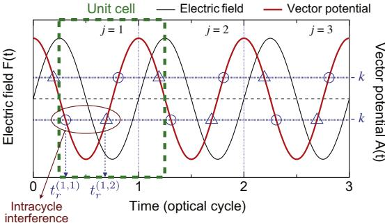
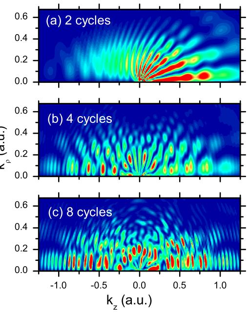

目录列表可在[SciVerse ScienceDirect](http://www.sciencedirect.com/science/journal/0168583X)获取

核仪器与物理研究方法B

期刊主页：[www.elsevier.com/locate/nimb](http://www.elsevier.com/locate/nimb)

# 时间光栅在超阈值电离中的双微分衍射：周期内与周期间干涉

Diego G. Arbó a,⇑ , Kenichi L. Ishikawa b , Emil Persson c , Joachim Burgdörfer c

a 天文与空间物理研究所，IAFE (CONICET-UBA)，CC 67, Suc. 28 (1428) 布宜诺斯艾利斯，阿根廷

b 光子科学中心，东京大学工学研究科，本乡7-3-1，文京区，东京113-8656，日本

c 理论物理研究所，维也纳科技大学，Wiedner Hauptstraße 8-10/136, A-1040 维也纳，奥地利

# 文章信息

文章历史：2011年11月17日在线提供

关键词：周期内干涉 短激光脉冲 超阈值电离摘要

我们分析了由线性偏振短激光脉冲引起的==原子阈值==<!--2U_p是电子**脱离原子后**，在激光场中额外获得的动。即使电子已电离（克服 ），其动能仍受激光场加速过程的限制。-->上电离中的==双微分电子分布==。通过使用==鞍点近似（SPA）==，我们将Arbó等人[\[19\]]的一维（1D）==简单人模型（SMM）==推广到三维（3D）描述。 我们证明了光电子谱的周期内和周期间干涉图案的因式分解可以扩展到双微分动量分布。 ><u>周期间</u>干涉对应于光电子谱中众所周知的<u>ATI峰</u>，这些峰源于在不同光学周期内释放的电子轨迹的叠加，而周期内干涉则来自同一光学周期内释放的轨迹的相干叠加。我们通过与时间相关扭曲波计算和完整3D时间相关薛定谔方程的解的比较，验证了SPA的预测。薛定谔方程（TDSE）。在SPA框架内，我们提出了一个完整的干涉图案的解析表达式，该表达式与数值计算结果显示出极佳的一致性。我们证明了，基于==SMM的最近提出的半经典描述==，即时间光栅上的衍射过程，在考虑SPA内的完整3D问题时保持不变。
<!--双微分动量分布：P表示光电子动量分布的概率密度-->
$$
d\vec k = k_\rho dk_\rho dk_z d\theta
$$
**也即体积微元**
此时：
$$
\frac{dP}{d\vec k} = \frac{dP}{k_\rho dk_\rho dk_z d\theta}
$$

这才是严格形式孩子。

![[./proof_process/SMM]]

## 1. 引言

根据三步模型，光电子可以分为直接电子和再散射电子[\[1–3\].](#page-6-0)。电子通过隧穿由原子势和外部强场共同形成的势垒而发射。隧穿主要在每个光学周期的电场绝对值最大值附近发生。电离后，直接电子可以逃脱而不受残余核心势的强烈影响。此过程的经典截止能量为$2U_p$ <!--所谓三步模型里面的若电子在电场最大值附近电离，其最终动能达到最大值 （通过积分牛顿运动方程得出）。-->。在被激光场加速返回后，一小部分电子被母离子重新散射，可以获得高达$10U_p$的动能E。对应于直接电离（$E < 2U_p$）的轨迹在光电子光谱中干涉图案的形成中至关重要 <!--就是正常一次被散射的-->。量子干涉在一个光学周期内首次被报道（据我们所知）在文献[\[4\]](#page-6-0)中，并由Paulus等人在文献[\[5\]](#page-6-0)中对负离子进行了理论分析和实验观察。Becker的综述[\[6\]](#page-6-0)中提供了使用强场近似进行的详细鞍点分析。Chirila等人首次计算了中性原子的非等距峰光电子光谱[\[7\]](#page-6-0)。时间双缝干涉图案在近单周期脉冲中已被实验[\[8,9\]](#page-6-0)和理论[\[6,10\]](#page-6-0)研究。对超阈值电离的时间-能量分析最近，关于角分布中的近阈值振荡现象已被解释为电子轨迹的干涉效应[[12]](#page-6-0)，并且这一现象最近已被实验测量[[13]](#page-6-0)。在固定频率的飞秒脉冲作用下，氦原子光电离[[9]](#page-6-0)以及氢和氟离子光剥离[[14,15]](#page-6-0)过程中，衍射条纹已被实验观察到[[16]](#page-6-0)，并进行了理论分析[[17]](#page-6-0)。此外，在激光辅助俄歇衰变的光谱中也发现了衍射图案，其边带的总体结构被解释为一个周期内发射电子之间的干涉[[18]](#page-6-0)。<!--讲了半天历史，应该不用细究。--> <u>多周期光电子光谱中的干涉图案可以被识别为由周期内和周期间干涉组成的时间光栅上的衍射图案[[17,19]](#page-6-0)</u>。虽然后者产生了众所周知的ATI峰[[20–22]](#page-6-0)，但前者导致ATI频谱的调制，提供有关亚周期电离动力学的信息。该分析基于一维半经典模型，紧密遵循“简单人模型”（SMM）。由于在一维模型内无法全面研究全双微分分布，因此需要一个考虑原子光电离全空间维度的理论来识别所涉及的不同干涉过程。

在本通讯中，我们将之前的分析扩展到三维动量分布。我们展示了通过使用鞍点近似（SPA），其中==复数释放时间==取代了SMM的实数释放时间，==时间光栅==的描述对于喷射电子的双微分动量分布仍然有效。在SPA内找到了双微分动量分布的解析表达式，扩展了之前的半经典一维SMM表达式 [\[19\]](#page-6-0) 扩展到三维。我们通过与三维时间依赖的扭曲波库仑-沃尔科夫近似（CVA）、其强场近似（SFA）[\[3,7,23,25,26\]](#page-6-0) 以及全时间依赖薛定谔方程（TDSE）的数值解进行比较来评估SPA的结果。除了平顶脉冲为我们提供了清晰的物理图像外，我们还从实验角度分析了更现实的脉冲形状的情况。

本文的组织结构如下。在第2节中，我们扩展了之前提出的半经典分析[\[19\]](#page-6-0)，并展示了在SPA内研究双微分分布时，周期内和周期间干涉的分离以及由此产生的干涉图案作为时间光栅衍射的解释仍然有效。在第[3节](#page-3-0)中，我们比较了量子力学方法，即SFA、CVA以及全时间依赖薛定谔方程的精确数值解。

>总结：
>SMM扩展到SPA，并使用数值解验证结果。
>创新点：
>- 光电子谱的周期内和周期间干涉图案的因式分解可以扩展到双微分动量分布。并分析：多周期光电子光谱中的干涉图案可以被识别为由周期内和周期间干涉组成的时间光栅上的衍射图案。
>- 改实数为复数施放时间。

## 2. 理论<!--基于SPA近似给出双微分动量分布和光电子谱表达式。-->

我们考虑在单活性电子近似下的原子与线性偏振激光场 $\vec{F}(t)$ 的相互作用。系统在长度规范下的哈密顿量为

$$
H = \frac{\vec{p}^2}{2} + V(\mathbf{r}) + \vec{r} \cdot \vec{F}(t),\tag{1}
$$

其中 $V(\mathbf{r})$ 是原子的中心势，$\vec{p}$ 和 $\vec{r}$ 分别是电子的动量和位置。项 $\vec{r} \cdot \vec{F}(t)$ 将初始态 $|\psi_i\rangle$ 与具有动量 $\vec{k}$ 和能量 $E = \frac{k^2}{2}$ 的连续末态 $|\psi_f\rangle$ 耦合起来。方程 (1) 的哈密顿量的时间依赖薛定谔方程 (TDSE) 控制着电子态 $|\psi(t)\rangle$ 的演化。我们通过以下公式计算==光电子的动量分布==：<!--不同于光电子谱，但是有关-->

$$
\frac{d\mathbf{P}}{d\vec{k}} = |T_{if}|^2,\tag{2}
$$

其中 $T_{if}$ 是 T 矩阵。对应于从初态 $i$ 到末态 $f$ 的跃迁元素。
虽然一小部分光电子会经历剩余离子的再散射，但在这里我们只考虑直接光电子（能量 $E < 2U_p$），它们在总电离产额中占主导地位。为了处理强场近似中的干涉特征，我们严格遵循“鞍点近似”（SPA）[\[7,24,26,3\]](#page-6-0)。

==起点是SFA的鞍点近似==，它导致从能量为 $-I_p$ 的初态到连续态的跃迁振幅[\[3\]](#page-6-0)：

$$T_{if}(\vec{k}) = -\sum_{i=1}^{M} \mathcal{G}\left(\mathbf{t}_{r}^{(i)}, \vec{k}\right) \ \mathbf{e}^{i\mathcal{S}\left(\mathbf{t}_{r}^{(i)}\right)}.\tag{3}$$

这里，==\(M\) 是在电离时间 $t_{r}^{(i)}$ 产生并达到给定最终动量 $\vec{k}$ 的轨迹数量==，$\mathcal{G}\left(t_{r}^{(i)}, \vec{k}\right)$是==电离振幅==，

$$
\mathbf{G}\left(\mathbf{t}_r^{(i)},\vec{k}\right) = \left[\frac{2\pi}{i \partial^2 \mathcal{S}(t_r^{(i)}) / \partial t_r^{(i)2}}\right]^{1/2} \langle \vec{k} + \vec{A}(t_r^{(i)}) | \hat{d} | \psi_0 \rangle \exp\left[-\frac{i}{2} \int_{t_r^{(i)}}^{\infty} [\vec{k} + \vec{A}(\tau)]^2 d\tau \right],
$$

其中 $\hat{d}$ 是偶极矩算符，$\vec{A}(t)$ 是矢势，$\psi_0$ 是初态波函数。其中，$\mathbf{d}(\vec{v})$ 是束缚态-连续态跃迁的偶极元。在公式 (3) 中，$S$==由 Volkov 作用量给出== [\[27\]](#page-6-0)：

$$
S(\mathbf{t}) = -\int_{t}^{\infty} d\mathbf{t}' \left[ \frac{(\vec{\mathbf{k}} + \vec{\mathbf{A}}(\mathbf{t}'))^2}{2} + I_P \right]. \tag{5}
$$

==其中，$\vec{A}(t) = -\int_{-\infty}^{t} dt' \vec{F}(t')$ 是激光场的矢势除以光速 ==。在公式 (3) 和 (5) 中，忽略了原子核势对远离电子的连续态的影响，因此，在激光脉冲结束后，动量分布是运动的一个常数。众所周知，SFA 无法描述中等弱场下的电离，也无法描述强场下的慢电子产率 [\[28,29\]](#page-6-0). 由于作用量不包含长程库仑力的贡献，因此被喷射出的电子会受到这些力的影响。
![[./proof_process/规范问题]]

轨迹i的释放时间$t_r^{(i)}$由鞍点方程确定，  <!--电离并进入激光场的时间。-->

$$
\frac{\partial \mathbf{S}(t')}{\partial t'}\Big|_{t'=t_r^{(i)}} = \frac{\left[\vec{k} + \vec{\mathcal{A}}(t_r^{(i)})\right]^2}{2} + I_p = \mathbf{0}.\tag{6}
$$

由于$I_p > 0$，该方程的解为复数值。不同轨迹干涉的条件是达到相同的最终动量$\vec k$，以满足方程(6)的释放时间$t_r^{(i)}（i = 1, 2, ..., M）$。在之前的方法中，如SMM [\[19\],](#page-6-0)，我们通过设置 $I_p = 0$ 将其近似为实数值，得到$\vec k + ~A t_r^{(i)} = 0$。而在当前的公式（SPA）中，我们将使用方程(6)的复数时间解。虽然干涉条件涉及矢量势$\vec A$，但电子轨迹由电场 $\vec F$ 决定。我们现在考虑一个无限长的周期...激光沿z轴线性偏振，其激光场为

$$
\vec{F}(\mathbf{t}) = F_0 \hat{\mathbf{z}} \sin(\alpha \mathbf{t}),\tag{7}
$$

其中$F_0$是场振幅。相应地，矢量势由下式给出：

$$
\vec{A}(\mathbf{t}) = \frac{F_0}{\alpha} \hat{\mathbf{z}} \cos(\alpha \mathbf{t}). \tag{8}
$$

如参考文献[\[19\],](#page-6-0)所述，每个光学周期内方程(6)有两个解。==第j个周期内的第一个解==由下式给出：

$$
\mathbf{t}_r^{(j,1)} = \frac{2\pi(j-1)}{\alpha\nu} + \frac{1}{\alpha} \operatorname{arccos}[-\tilde{\kappa}],\tag{9}
$$

其中$\tilde{\kappa}$表示由下式定义的==复终动量==：

$$
\tilde{\kappa} = \kappa_{\tilde{\pi}} + \dot{\mathfrak{l}}\sqrt{\gamma^2 + \kappa_{\rho}^2} \tag{10}
$$

而$j_z$和$j_q$是电子无量纲缩放终动量$\tilde{j} = \tilde{k}/F_0$的柱面分量。在方程(10)中，$\gamma = \sqrt{2I_p} x/F_0$是Keldysh参数。==第二个解==满足：

$$
\mathbf{t}_r^{(j,2)} = \begin{cases} \frac{4\pi}{\alpha} \left( \dot{\mathbf{j}} - \frac{1}{2} \right) - \mathbf{t}_r^{(j,1)} & \text{如果} \quad \kappa_z \gg \mathbf{0} \\\frac{4\pi}{\alpha} (\dot{\mathbf{j}} - \mathbf{1}) - \mathbf{t}_r^{(j,1)} & \text{如果} \quad \kappa_z < \mathbf{0}. \end{cases} \tag{11}
$$

方程（9）和（11）的释放时间的复共轭也满足方程（6）。然而，使用$t_r^{(j,\alpha)}$ 或其复共轭$({t_r^{(j,\alpha)}})^*$将产生相同的干涉图案。如果我们把$\tilde{\kappa}$直接近似为$\kappa_z$(也即$\gamma\rightarrow 0$, $k_\rho\rightarrow 0$)，方程（9）和（11）的复数SPA释放时间将变为满足$\cos(wt_r^{(j,\alpha)})=-\kappa$ 的实数释放时间[\[19\].](#page-6-0)。在方程（9）和（11）中，$t_r^{(j,\alpha)}$==其中$\alpha=1$(2)表示第j个周期内的早期（晚期）释放时间== <!--前/后半个周期的电离,不过好像是半周期。-->。实数SMM释放时间如[图1](#page-2-0)所示。对于有限的脉冲长度，因此不完美的平移对称性，单位元的选择不是任意的。如果我们想要重现来自一个无限周期系统的电离，我们需要选择一个单位元，使得在脉冲的持续时间内，系统尽可能接近周期性。在长脉冲的情况下，我们应该保持动量分布的前后对称性。==我们为正向和负向纵向动量 $k_z$ 选择了不同的单位元== <!--上下半周期，主要为了排除起始点影响-->。这一点直接反映在

>图1. 正弦脉冲的电场F(t)（左轴）和矢量势A(t)（右轴）。对于给定的最终动量k，电子发射时间用圆圈$t_r^{(j,1)}$和三角形$t_r^{(j,2)}$标记。每个光学周期可以被视为时间晶格的“单位元”。为了获得对称的结果，对于矢量势的正负值，“单位元”是不同的。每对圆圈和三角形决定了结构因子F(k)，并导致周期内干涉，而这样的周期对序列则引起周期间干涉。

方程[(11)](#page-1-0)和图1。另一种可能性是选择一组独特的单元格，其边缘与矢量电位的零点重合。<!--图上就是-->反过来，如果我们将求和[方程[(3)\]](#page-1-0)扩展到$M\rightarrow +\infty$，单位元胞的选择就变得任意了。<!--显然无限时间有限周期干涉图案与起始点无关。-->

对于给定的$\vec k$值，电离在$t_r^{(j,\alpha)}$时的场强与j和$\alpha$无关<!--周期性如图-->，因此$|F(t_r^{(j,\alpha)})|=F_0|\sqrt{1-\kappa^2}|$。电离率$\Gamma(\vec k) = |G(t_r^{(j,\alpha)},\vec k)|^2$对于所有后续的电离爆发（或轨迹）都是相同的，因此，只要基态耗尽可以忽略不计，它就只是时间无关的最终动量$\vec k$的函数。由于每个周期有两条干涉轨迹，具有最终动量 $\vec k$ 的总干涉轨迹数为 $M=2N$，其中N是激光脉冲中涉及的周期数。因此，干涉轨迹的求和[方程[(3)](#page-1-0)]可以分解为与同一周期内两个释放时间相关的轨迹和与不同周期内释放时间相关的轨迹[\[19\].](#page-6-0)。因此，动量分布 [Eq. [(2)\]](#page-1-0) 在 SPA 框架下可以表示为

$$\frac{d\boldsymbol{P}^{\rm SP}}{d\vec{k}} = \Gamma(\vec{k}) \left| \sum_{j=1}^{N} \sum_{x=1}^{2} \mathbf{e}^{i\mathbf{S}^{\rm SP}(t_r^{j, \alpha})} \right|^2,\tag{12}$$

其中，方程 (12) 右边的第二个因子描述了具有最终动量 $\vec k$ 的 2N 条轨迹的干涉，其中$t_r^{(j, \alpha)}$是通过方程 [(9) 和 (11)](#page-1-0) 作为 $\vec k$ 的函数。

在 SPA 框架下，沿着一条电子轨迹的半经典作用量，其释放时间为 $t_r^{j, \alpha}$，可以从方程 [(5)](#page-1-0) 计算得出，直到一个常数，

$$S^{\text{SP}}(\mathbf{t}_r^{(j,\alpha)}) = 2\mathcal{U}_p \left[ \left( |\,\,\check{\kappa}|^2 + \frac{1}{2} \right) \mathbf{t}_r^{(j,\alpha)} + \frac{\sin \left( 2\alpha \mathbf{t}_r^{(j,\alpha)} \right)}{\mathbf{4}\omega} + 2 \frac{\kappa_z}{\omega} \sin \left( \alpha \mathbf{t}_r^{(j,\alpha)} \right) \right], \tag{13}$$

其中，有质动力的能量由 $U_p = F_0^2/4\omega^2$ 给出，$|\overline k| = |\vec k| + \gamma^2$ [参见方程 [(10)](#page-1-0)]。方程 (12) 中的和可以写成

$$\sum_{j=1}^{N} \sum_{x=1}^{2} \mathbf{e}^{j\mathbf{S}^{\mathbf{SP}}(t_r^{(\mathbf{j, \alpha})})} = 2 \sum_{j=1}^{N} \mathbf{e}^{j\overline{\mathbf{S}}_j^{\mathbf{SP}}} \cos\left(\frac{\Delta \mathbf{S}_j^{\mathbf{SP}}}{2}\right),\tag{14}$$

其中 $\overline{S}_j = [{S_j}^{SP}(t_r^{j, 1})+{S_j}^{SP}(t_r^{j, 2})]/2$ 是在第 j 个周期内释放的两条轨迹的平均作用，$\Delta \mathbf{S}_j^{\mathbf{SP}}=[{S_j}^{SP}(t_r^{j, 1})-{S_j}^{SP}(t_r^{j, 2})]/2$ 是在同一第 j 个周期内两个释放时间 $t_r^{j, 1}$ 和 $t_r^{j, 2}$ 之间累积的作用。基本的时间结构在图 1 中通过 SMM 进行了示意性说明。每个光学周期有两个方程 [(6)](#page-1-0) 的解：早期释放时间 $t_r^{j, 1}$ ，在第 j 个周期的前半部分（在图 1 中用圆圈标记），以及晚期释放时间 $t_r^{j, 2}$ ，在第 j 个周期的后半部分（在图 1 中用三角形标记）。对于SPA（简单相位近似）的推广是直接的，尽管其可视化更为困难，因为所有的释放时间  $t^{(j,a)}_r$ 都是复数。在SPA（以及SMM [\[19\]]）中，平均作用量线性依赖于周期数 $j$，

$$
\overline{\mathcal{S}}_j^{\text{op}} = \mathcal{S}_0 + j\overline{\mathcal{S}}, \tag{15}
$$

其中 $\mathcal{S}_0$ 是一个常数，当取方程 (14) 的绝对值时，它将消失，且 $\overline{\mathcal{S}} = \frac{2\pi}{\omega}(E + U_p + I_p)$。由于时间域中的离散平移不变性 $t \rightarrow t + \frac{2j\pi}{\omega}$，作用量差 $\Delta \mathbf{S}^{\rm SP}_j$ 是一个与周期数 \( j \) 无关的常数，可以表示为（去掉下标 \( j \)）

$$
\Delta \mathbf{S}^{\rm SP} = \frac{-2\mathcal{U}_p}{\omega} \left[ (1 + 2|\bar{\kappa}|^2) \text{sgn}(\kappa_z) \arccos(\text{sgn}(\kappa_z)|\bar{\kappa}|) - (4\kappa_z - \bar{\kappa}) \sqrt{1 - \bar{\kappa}^2} \right], \tag{16}
$$

其中 $\text{sgn}$ 是符号函数，$\arccos$ 是反余弦函数，$\kappa_z$ 和 $\bar{\kappa}$ 是相关的参数。gn表示符号函数，它考虑了正负纵向动量$k_z$，如前所述。方程（16）是[\[19\]](#page-6-0)中SMM累积经典作用量的推广，现在在SPA框架内包括了电子动量垂直于极化方向的分量kq。

经过一些代数运算，方程（12）可以重写为衍射光栅形式的方程：

$$\frac{d\mathbf{P}^{\rm sp}}{d\tilde{k}} = \mathbf{4} \,\Gamma(\tilde{k}) \underbrace{\cos^2\left(\frac{\Delta\mathbf{S}^{\rm sp}}{2}\right)}_{F(\tilde{k})} \underbrace{\left[\frac{\sin(N\bar{\mathbf{S}}/2)}{\sin(\bar{\mathbf{S}}/2)}\right]^2}_{B(k)},\tag{17}$$

<!--\alpha在F中，N在B中-->
其中干涉图案可以分解为两个贡献：(i) 来自同一周期内一对轨迹的干涉（周期内干涉），由 $F(\vec k)$ 控制，以及(ii) 来自不同周期释放的轨迹的干涉（周期间干涉），这导致了众所周知的...已知的ATI峰由$B(k)$给出（参见参考文献[\[30\]](#page-6-0)）。周期内干涉源于由时间间隔 $Dt = t^{(j,1)}_r - t^{(j,2)}_r$ 分开的轨迹对叠加，该时间间隔小于激光脉冲周期的一半（见图1），即$R(\Delta t) < π/ω$，从而提供了1飞秒（对于近红外脉冲）的发射时间分辨率，而$t^{(j,\alpha)}_r$与$t^{(j+1,a)}_r$之间的差异为$\frac{2\pi}{w}$，即激光的光学周期。值得注意的是，虽然周期内因子 $F(\vec k)$ 依赖于发射角度，但周期间因子B(k)仅依赖于最终动量（或能量）的绝对值。方程(17)在结构上等同于晶体衍射的强度：因子F($\vec k$)代表形式（或结构）因子，解释了由于晶胞内部结构引起的干涉调制，而因子 $B(\vec k)$ 则由于晶体的周期性产生了布拉格峰。因此，方程(17)中的B(k)可以将其视为时域中由N个狭缝组成的衍射光栅，而
$F(\vec k)$ 则是每个狭缝的衍射因子。

接下来，我们将分析B(k)与$F(\vec k)$之间的相互作用如何控制直接ATI电子的双微分分布。首先，我们分析由同一光学周期内释放的两条轨迹叠加产生的周期内干涉，即在方程(12)中$\alpha =1, 2$ 且 $N=1$，或者等价地，$4\Gamma(\vec k)F(\vec k)$，因为在这种情况下$B(k)=1$。我们在[图2](#page-3-0)(a)中绘制了双微分动量分布。周期内干涉图案呈现出近似垂直的条纹，随着横向动量的增加而弯曲。具有较高纵向动量的条纹比具有较低纵向动量的条纹更宽。为了分析周期间干涉，我们通过将周期内因子设为$F(k)=1$并在方程(17)中设$N=2$来隔离这种干涉图案。因子B(k)简化为 $B(k) = 4 \cos²[π/x(E + Up + Ip)]$，其

>图2. 方程[(17)](#page-2-0)的SPA双微分动量分布。(a) 周期内干涉：$4\Gamma(k)F(\vec k)$ N=1，(b) 周期间干涉：$4\Gamma(\vec k)B(\vec k)$ 对于 N = 2，(c) 总干涉（周期内和周期间干涉）：$4\Gamma(k)F(k)B(\vec k)$ 对于 N = 2，以及(d) 对于 N = 3 的总干涉以深灰色（红色和蓝色）叠加在(a)中的周期内干涉图案上，浅灰色（绿色）。激光参数为 $F0 = 0.0675$ 和 $x = 0.05$。（关于图例中颜色的解释，请读者参考本文的网络版本。）<!--z为偏振方向，x,y方向对称。激光传播方向没有影响。-->

最大值集中在ATI能量 $E_n = n_x - U_p - I_p$ 处，这与吸收n个光子时的能量守恒一致。我们在图2(b)中绘制了相应的双微分动量分布，可以观察到同心环，kn的半径等于√(2En)。在双周期脉冲中，所有四个干涉轨迹产生的完整图案，即图2(a)和(b)中周期内和周期间干涉图案的组合，给出了图2(c)的动量分布。周期间环被周期内图案调制（或反之亦然）。如果我们考虑更长的脉冲，随着N的增加，周期间因子B(k)的对比度将增加。例如，ATI环将变得更窄，并且在两个连续的主ATI环之间会出现N-2个次级环。这种效应可以在图2(d)中观察到，其中N=3个周期时，一个次级环N-2=1是可见的。另一方面，周期内因子$F(\vec k)$与激光脉冲中涉及的周期数N无关，因此周期内干涉图案保持不变。这在图2(d)中观察到，其中我们叠加了N=3个周期的双微分动量分布。与图2(a)中的周期内模式一致，表明对于N=1、2和3个周期，周期内调制是相同的。

由此产生的一个问题是，干涉模式是如何在光电子谱中反映出来的。换句话说，==能量分布中是否保留了周期内和周期间干涉的因子分解？==根据参考文献[\[19\]](#page-6-0)，我们知道在一维SMM模型中答案是肯定的。为了从我们的三维SPA计算光电子谱，我们需要对发射角度h进行积分，

$$\frac{d\mathbf{P}}{d\mathbf{E}} = 2\pi\sqrt{2E} \int_{-1}^{1} \left(\frac{d\mathbf{P}}{d\vec{k}}\right) d(\cos\theta) = 8\pi\sqrt{2E}B(k) \int_{-1}^{1} \Gamma(\vec{k})F(\vec{k})d(\cos\theta) \tag{18}$$

在最后一个等式中，我们使用了方程[(17)](#page-2-0)以及 $B(k)$ 仅是动量 $k$ 绝对值的函数这一事实，并且在角度积分之外成为一个常数因子。周期间因子B(k) 负责ATI峰值的因素将由方程(18)的积分进行调制。在图3(a)中，我们展示了仅由同一单位元内释放的两条轨迹干涉产生的光电子谱。在这种情况下，只有周期内干涉存在($B(k) = 1$)。如果我们想要隔离周期间干涉，我们在方程(18)中设置$F(\vec k) = 1$，这在图3(b)中针对$N = 2$的情况进行了展示。因此，在3D SPA中，因子分解部分得以保留：虽然周期间干涉在方程(18)中完全因子分解，但由因子 $F(\vec k)$ 表示的周期内干涉受到电离率 $C(\vec k)$ 的调制。由方程(18)给出的整个光电子谱在图3(c)中展示。我们观察到，源自周期间干涉的ATI峰值受到图3(a)中周期内干涉图案的调制。值得指出的是，在低能量分辨率实验中，ATI峰值大多会被抹去，只有周期内干涉图案会保留下来。
### 3. 探测SPA

为了探测SPA的预测，我们采用两种变体的时间依赖扭曲波理论进行量子计算：库仑-沃尔科夫近似（CVA）和强场近似（SFA）[\[23,25,3,7\]](#page-6-0)，并对相同的激光场参数进行全时间依赖薛定谔方程（TDSE）的数值求解。

图3. 方程(18)的SPA光电子谱显示：(a) 周期内干涉：设定$B(k)=1$，(b) 周期间干涉：设定$F(k)=1$，对于$N=2$个周期，以及(c) 总（周期内和周期间）干涉。在(c)中，我们添加了(a)中的周期内调制（乘以4）。<!--乘以四表述太抽象，应该是忽略的4\Gamma-->

简而言之，在时间依赖扭曲波理论中[\[31\],](#page-6-0)，后形式的跃迁振幅表示为

$$
T_{if} = -\mathrm{i} \int_{-\infty}^{+\infty} dt \langle \chi_f^-(t)|zf(t)|\phi_i(t)\rangle ,
$$

其中，$\chi_f(\mathbf{t})$ 是最终的畸变波函数，初始态 $\phi_i(\mathbf{t})$ 是无外部扰动时原子哈密顿量的本征态。CVA（库仑-沃尔科夫近似）通过将连续谱的原子本征态 $\phi_{-\vec{k}}$ 与时间依赖电场中自由电子的解 $v^{(V)}_{-\vec{k}}(\vec{r}, t)$ 结合得到。对于核电荷为 $Z_T$ 的类氢原子，这导致了库仑-沃尔科夫末态的形成[\[32,33,35,34,36–38\]](#page-6-0)：
$$
\mathcal{X}_{\vec{k}}^{(\text{CV})-}(\vec{\mathbf{r}}, \mathbf{t}) = \mathcal{X}_{\vec{k}}^{(\text{V})-}(\vec{\mathbf{r}}, \mathbf{t}) \ \mathcal{D}_{\mathbb{C}}(\mathbf{Z}_{\mathbb{T}}, \vec{k}, \vec{\mathbf{r}}), \tag{20}
$$

其中，$D_C(Z_T; \vec{k}, \vec{r}) = N_T(k) \ _1F_1(iZ_T/k; 1; ikr - i\vec{k} \cdot \vec{r})$，库仑归一化因子为 $N_T(k) = \exp(\pi Z_T / 2k) \Gamma(1 + iZ_T / k)$，而 \( 1F_1 \) 表示合流超几何函数。在方程(20)中，$v^{(V)}_{-\vec{k}}(\vec{r}, t)$ 由[\[27\]](#pag)给出。$$\chi_{\vec{k}}^{(V)-} (\vec{r}, t) = \frac{\exp[i(\vec{k} + \vec{A}) \cdot \vec{r}]}{\left(2\pi\right)^{3/2}} \exp[i\mathbf{S}(t)],\tag{21}$$
其中 \( S(t) \) 是方程 [(5)](#page-1-0) 的作用量。在 CVA（库仑-伏尔泰近似）中，释放的电子与残余离子核心及外部场的相互作用被非微扰地但近似地考虑进去。从方程 (20) 可以推导出 SFA（强场近似），即弱库仑势的极限，即当 ( $ZT \to 0$ ) 时，$v^{(CV)-}_{\vec{k}} \to v^{(V)-}_{\vec{k}}$ 的方程 (21)。在 SFA 中，原子核心势对远离电子的连续态的影响被忽略，因此，在激光脉冲结束后，动量分布是运动的一个常数。我们还对氢原子进行了全 TDSE（时间依赖薛定谔方程）的数值求解，没有任何近似 [\[39,29,40,41\]](#page-6-0)。TDSE 的数值解在数值精度范围内被认为是精确的。

为了在 SFA, CVA和TDSE（时间依赖薛定谔方程） 中计算电子产额，我们必须考虑一个有限的脉冲。我们在激光场的定义中包括一个包络函数f(t)和一个载波包络相位/CE
$$F(\mathbf{t}) = f(\mathbf{t}) \cdot \sin(\alpha \mathbf{t} + \phi_{\rm CE}). \tag{22}$$

对于方程(22)的脉冲，我们使用一个N周期的平顶脉冲，分别带有m和m'周期的线性上升和下降，

$$f(\mathbf{t}) = F_0 \begin{cases} \left(\frac{\alpha t}{2\pi m} + 1\right) & \text{如果 } \quad \frac{-2m\pi}{\alpha} \leqslant \mathbf{t} < \mathbf{0} \\ 1 & \text{如果 } \quad \mathbf{0} \leqslant \mathbf{t} < \frac{2\aleph\pi}{\alpha} \\ \frac{2(N+m')\pi - \alpha\mathbf{t}}{2\pi m'} & \text{如果 } \quad \frac{2\aleph\pi}{\alpha} \leqslant \mathbf{t} < \frac{2(N+m')\pi}{\alpha} \end{cases} \tag{23}$$

需要注意的是，当N为整数，$\phi_{CE} = 0$，且m和m0为整数或半整数时，$f(t) = F0$ [见方程(23)]，在平顶区域，矢量势由方程[(8)](#page-1-0)给出。因此，在这种情况下，通过方程[(9)和(11)](#page-1-0)，可以在SPA（强场近似）内计算出复杂的电离时间。方程(23)中引入的包络函数确保了多周期特征的内周期干涉与包络在平顶区域覆盖的周期数无关。

在图4中，我们绘制了由于由方程(22)和(23)给出的激光场（N=3）导致的氢原子（ZT=1）的SFA（强场近似）、CVA（经典轨迹近似）和TDSE（时间依赖薛定谔方程）的双重微分动量分布。为了最小化在激光场上升和下降期间电离的贡献，我们考虑m=m'=1/2。我们将这些结果与SPA的解析解[图4(a)]进行了比较，后者展示了对应于光电子谱中ATI（多光子电离）峰的特征多光子等能环，以及由方程[(17)](#page-2-0)中B(k)的主极大和次极大给出的两个连续主环之间的一个次级环。多光子环被调制...由周期内

> 图4. 在(a) SPA, (b) SFA, (c) CVA, 和(d) TDSE中计算的双重微分动量分布。激光参数与[图2](#page-3-0)相同。在(b)–(d)中，上升沿涉及$m = 1/2$周期，下降沿涉及$m' = 1/2$周期。

由方程[(17)](#page-2-0)中的因子$F(\vec k)$给出的模式。对于量子畸变波SFA，我们在图4(b)中观察到不仅存在周期间和周期内的干涉模式，而且周期间环和周期内调制的位置与SPA中的相同。这一事实证明了当前SPA在再现直接电子电离过程中的强大能力。当我们将SPA和SFA与图4(c)中的CVA进行比较时，我们观察到由于剩余离子的库仑势对逃逸电子的影响，有少许变化。首先，由于库仑聚焦，整个分布更集中在偏振轴（$k_\rho = 0$）附近。其次，我们观察在阈值附近出现花束状结构，这是电子轨迹遵循双曲线轨迹的量子干涉直接结果，被解释为广义的Ramsauer-Townsend衍射[\[12\].](#page-6-0)。第三点也是最重要的一点，周期内图案向原点移动。另一方面，周期间环状图案的位置显示出对库仑势的作用不敏感。如果我们将近似理论SPA、SFA和CVA与图4(d)中的TDSE精确解进行比较，我们会发现周期间环仍然可见。我们可以在$0 < k_q < 0.2$处看到周期内干涉图案，尽管模糊，但它与CVA吻合得很好。

我们还将SPA计算的光电子谱[见方程[(18)\]](#page-3-0)与图5(a)中的结果与SFA在图5(b)中的相应结果进行了比较。如图4所示，两个主要峰之间的一个次级峰...对应于循环间因子B(k)的主要ATI峰出现。多光子峰受到[图3](#page-3-0)(a)中循环内干涉模式的调制。由于SFA和SPA中的电离速率不同，随着能量的增加，电离概率的下降也不同，因此，循环内调制的峰位置也有所不同（其中一些用垂直箭头标记）。在CVA中观察到的额外偏移（图5c）源于核电荷的库仑势对循环内干涉模式的影响，即库仑势将循环内调制向低动能方向偏移。在图5(d)中，TDSE光电子谱中的每个ATI循环间峰ctron 谱显示出双峰结构。这种 ATI 峰分裂是由于束缚态场修饰态之间的拉比振荡引起的，这种现象被称为奥特勒-汤斯双峰 [\[42,43\]](#page-6-0)。

在这个阶段，一个自然的问题是：当使用更现实的脉冲时，叠加在周期间模式上的周期内模式是否仍然可观测到？为了回答这个问题，我们在方程 [(22)](#page-4-0) 中考虑了一个==平滑的包络函数==，形式如下：

$$f(\mathbf{t}) = F_0 \sin^2 \left(\frac{\pi \mathbf{t}}{\tau}\right); \mathbf{0} \ll \mathbf{t} \ll \tau,\tag{24}$$

在其他地方为零。在方程 [(22)](#page-4-0) 中，载波包络相位选择为 uCE = π/2，因此我们处理的是类似余弦的脉冲。

我们研究了周期内干涉的调制如何随着脉冲长度（即涉及的总周期数）而变化。为此，在图 6 中，我们展示了双微分动量分布的 TDSE 计算结果。h a (a) 两周期、(b) 四周期和 (c) 八周期的余弦型脉冲，如方程 (24) 和 (22) 所示。在图 6(a) 中，我们观察到两种类型的干涉：在 kz > 0 区域观察到 Ramsauer–Townsend 径向条纹 [\[12\],](#page-6-0)，而在 kz < 0 区域观察到一组较为垂直的周期内条纹 [\[10\]](#page-6-0)。这种二维电子动量分布中的丰富角向模式并未反映在图 7(a) 的光电子能谱中，后者显示出平滑的能量依赖性。这主要是由于电场的中心峰值较大，如 [\[10\]](#page-6-0) 中 [图 3](#page-3-0) 的插图所示。当我们将脉冲持续时间增加到总周期数等于四时，观察到更对称的动量分布（围绕 kq = 0）。在这种情况下，观察到周期内条纹

> 图 6. 方程 [(22) 和 (24)](#page-4-0) 所描述电场的 TDSE 双微分动量分布：(a) 两周期、(b) 四周期r, 和 (c) 八个周期。激光参数与[图2](#page-3-0)相同。

> 图7. 使用方程[(22)和](#page-4-0) [(24)](#page-4-0)计算的电场下的TDSE光电子谱，分别对应(a)两个周期，(b)四个周期，和(c)八个周期。激光参数与[图2](#page-3-0)相同。(b)中的垂直箭头指示了周期内调制的顶部。激光参数与图6相同。

对于正负$k_\rho$，基本上相同的模式出现在图6(c)中，对应一个八周期脉冲。在最后一种情况下，周期间的环更加明显。当我们观察图7(b)中相应的光电子谱时，我们观察到不太清晰的周期间峰，这些峰被周期内模式调制，并用垂直箭头指出。在图7(c)中，八周期脉冲的周期间调制位置没有变化，但周期间峰的对比度要高得多。通过这种方式，我们可以得出结论，即使对于具有平滑包络的脉冲，周期内模式与脉冲长度相对独立。类似正弦波的脉冲产生的结果相似（未显示），除了非常短的脉冲，即两个周期[10]。我们必须指出，在TDSE计算中，还存在其他效应，如与再散射电子波包的干涉和里德堡态的贡献，这使得通过具有周期内和周期间干涉的衍射光栅来研究电子产率更加难以可视化。

#### 4. 结论

我们展示了一项关于在多周期激光脉冲作用下原子直接电离中观察到的干涉效应的研究。在SPA框架内，我们推广了之前仅限于1D SMM模型的研究[19]，以描述完整的微分电子分布。我们通过多周期激光脉冲在光电子3D动量分布中识别了电子轨迹的周期内和周期间干涉的相互作用。周期间干涉干涉现象源于不同光学周期内释放的波包叠加，对应于双微分动量分布中的等能ATI环，而周期内干涉则来自同一光学周期内释放的电子波包的相干叠加。本文提出了完整的双微分干涉图案的解析表达式，与数值计算结果表现出极佳的一致性。周期内干涉调制与激光脉冲涉及的总光学周期数无关，但如CVA结果所示，它受到长程原子库仑势的影响。对于多周期脉冲和低分辨率光谱，观察亚周期电离动力学应成为可能。

#### 致谢

本工作得到了CONICET PIP 552、UBACyT 169（阿根廷）、SFB 016 ADLIS和FWF（奥地利）P15025-N08的支持。K.L.I.衷心感谢Advanced P的支持。日本文部科学省的光子科学联盟项目，以及KAKENHI（23656043和23104708）。

#### 参考文献

- [1] K.C. Kulander, K.J. Schafer, 载于：D.K. Evans, K.C. Kulander, J. Cooper, K.J. Schafer (编), 第四届国际多光子过程会议论文集, 世界科学出版社, (新加坡, 1993), 《物理评论A》51 (1995) 561.
- [2] G.G. Paulus, W. Niecklich, H. Xu, P. Lambropoulos, H. Walther, 《欧洲物理快报》27 (1994) 267.
- [3] M. Lewenstein, K.C. Kulander, K.J. Schafer, P.H. Bucksbaum, 《物理评论A》51 (1995) 1495;
- [ ] M. Lewenstein, Ph. Balcou, M. Yu. Ivanov, A. L'Huillier, P.B. Corkum, 《物理评论A》49 (1994) 2117.
- [4] G.F. Gribakin, M. Yu Kuchiev, 《物理评论A》55 (1997) 3760.
- [5] G.G. Paulus, F. Zacher, H. Walther, A. Lohr, W. Becker, M. Kleber, 《物理评论快报》80 (1998) 484.
- [6] W. Becker, F. Grasbon, D.B. Miloševic´, G.G. Paulus, H. Walther, 《原子与分子物理进展》48 (2002) 36.
- [7] C.C. Chirila, R.M. Potvliege, 《物理评论A》71 (2005)021402(R).
- [8] F. Lindner, M.G. Schätzel, H. Walther, A. Baltuška, E. Goulielmakis, F. Krausz, D.B. Miloševic´, D. Bauer, W. Becker, G.G. Paulus, 物理评论快报 95 (2005) 040401.
- [9] R. Gopal 等, 物理评论快报 103 (2009) 053001.
- [ ] [10] D.G. Arbó, E. Persson, J. Burgdörfer, 物理评论 A 74 (2006) 063407; D.G. Arbó, S. Yoshida, E. Persson, K.I. Dimitriou, J. Burgdörfer, 物理学报: 会议系列 88 (2007) 012054.
- [ ] [11] L. Guo, S.S. Han, J. Chen, 光学快报 18 (2010) 1240.
- [ ] [12] D.G. Arbó, S. Yoshida, E. Persson, K.I. Dimitriou, J. Burgdörfer, 物理评论快报 96 (2006) 143003;
- [ ] D.G. Arbó, K.I. Dimitriou, E. Persson, J. Burgdörfer, 物理评论 A 78 (2008) 013406.
- [ ] [13] T. Marchenko, H.G. Muller, K.J. Schafer, M.J.J. Vrakking, 物理学报 B 43 (2010) 095601.
- [ ] [14] R. Reichle, H. Helm, I.Y. Kiyan, 物理评论快报 87 (2001) 243001.
- [ ] [15] D.B. Miloševic´, A.G. Busaladzic, W. Becker, 物理评论 A 68 (2003) 050702.
- [ ] [16] B. Bergues, Z. Ansari, D. Hanstorp, I.Y. Kiyan, 物理评论A 75 (2007) 063415. [17] S. Bivona, G. Bonanno, R. Burlon, D. Gurrera, C. Leone, Phys. Rev. A 77 (2008) 051404;
- [ ] S. Bivona, G. Bonanno, R. Burlon, C. Leone, Phys. Rev. A 79 (2009) 035403. [18] A.K. Kazansky, N.M. Kabachnik, J. Phys. B 43 (2010) 035601.
- [ ] [19] D.G. Arbó, K.L. Ishikawa, K. Schiessl, E. Persson, J. Burgdörfer, Phys. Rev. A 81 (2010) 021403;
- [ ] D.G. Arbó, K.L. Ishikawa, K. Schiessl, E. Persson, J. Burgdörfer, Phys. Rev. A 82 (2010) 043426.
- [ ] [20] P. Agostini, F. Fabre, G. Mainfray, G. Petite, N. Rahman, Phys. Rev. Lett. 42 (1979) 1127.
- [ ] [21] M. Protopapas, C.H. Keitel, P.L. Knight, Rep. Prog. Phys. 60 (1997) 389.
- [ ] [22] C.J. Jochain, M. Dörr, N.J. Kylstra, Adv. At. Mol. Phys. 42 (2000) 225.
- [ ] [23] P.A. Macri, J.E. Miraglia, M.S. Gravielle, J. Opt. Soc. Am. B 20 (2003) 1801.
- [ ] [24] P.B. Corkum, N.H. Burnett, M.Y. Ivanov, Opt. Lett. 19 (1994) 1870.
- [ ] [25] V.D. Rodriguez, E. Cormier, R. Gayet, Phys. Rev. A 69 (2004) 053402; V.D. Rodriguez, P.A. Macri, D.G. Arbó, Nucl. Instr. Meth. B 267 (2009) 334
- [ ] [26] M. Ivanov, P.B. Corkum, T. Zuo, A. Bandrauk, 物理评论快报 74 (1995) 2933.
	- [27] D.M. Volkov, 物理学报 94 (1995) 250.
	- [28] C.I. Blaga, F. Catoire, P. Colosimo, G.G. Paulus, H.G. Muller, P. Agostini, L.F. Dimauro, 自然物理学 5 (2009) 335.
	- [29] D.G. Arbó, J.E. Miraglia, M.S. Gravielle, K. Schiessl, E. Persson, J. Burgdörfer, 物理评论 A 77 (2008) 013401.
	- [30] F.H.M. Faisal, G. Schlegel, 物理学 B 38 (2005) L223.
	- [31] D.P. Dewangan, J. Eichler, 物理报告 247 (1997) 59.
	- [32] F.H.M. Faisal, 物理学 B 6 (1973) L89.
	- [33] H.R. Reiss, 物理评论 A 22 (1980) 1786.
	- [34] A. Basile, F. Trombetta, G. Ferrante, R. Burlon, C. Leone, 物理评论 A 37 (1988) 1050.
	- [35] J.Z. Kaminski, A. Jaron, F. Ehlotzky, 物理评论 A 53 (1996) 1756.
	- [36] D.V. Miloševic´, F. Ehlotzky, 物理评论 A 58 (1998) 3124.
	- [37] A. Jaron, J.Z. Kaminski, F. Ehlotzky, 物理评论 A 61 (2000) 023404.
	- [38] C. Figueira de Morrison Faria, H. Schomerus, W. Becker,